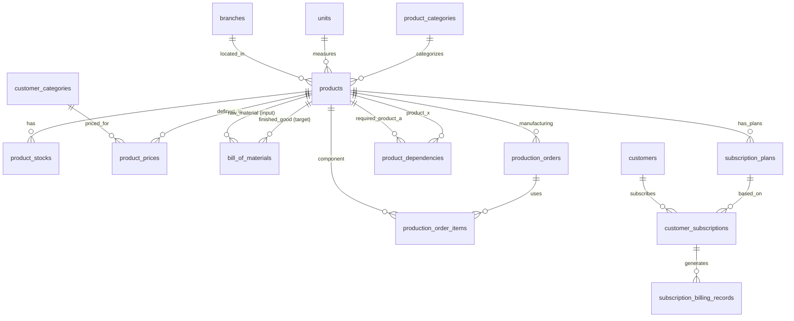
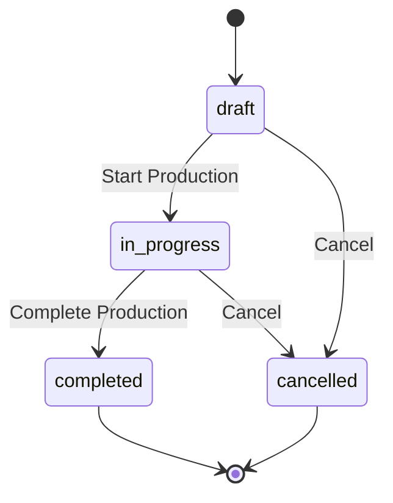

# Desain Database: Produk, Layanan, dan Produksi

Dokumen ini menjelaskan struktur database untuk modul Produk, Layanan, Produksi (Manufacturing), dan Langganan (Subscription) dalam sistem ERP. Fokus utama: katalog produk, manajemen stok & harga, produksi (BOM & Production Order), dan penagihan berulang (subscription).

## 1. Gambaran Umum

### Filosofi Desain

Sistem dirancang untuk menangani berbagai tipe produk — mulai dari bahan baku, barang jadi, hingga jasa — dengan model bisnis penjualan langsung maupun langganan. Seluruh produk disimpan dalam satu tabel master (`products`) dengan kolom `type` untuk membedakan peran dan kolom `billing_model` untuk membedakan model penagihan.

### Komponen Utama
*   **Katalog Produk**: Mengelola master data produk, kategori, dan satuan (units).
*   **Manajemen Stok & Harga**: Mengelola stok per cabang dan skema harga bertingkat (tiered pricing).
*   **Produksi (Manufacturing)**: Mengelola resep barang (BOM) dan proses manufaktur (Production Orders).
*   **Langganan (Subscription)**: Mengelola penagihan berulang (recurring billing) untuk layanan atau produk.

### Integrasi dengan Master Data yang Sudah Ada
*   **Kategori**: `product_categories` — pengelompokan produk.
*   **Satuan**: `units` — satuan ukur produk.
*   **Cabang**: `branches` — untuk stok per cabang.
*   **Pelanggan**: `customers`, `customer_categories` — untuk harga bertingkat dan langganan.
*   **Supplier**: `suppliers` — untuk produk yang dibeli.
*   **Akuntansi**: `accounts`, `journal_entries` — untuk posting COGS, revenue, dsb.

### Prinsip Desain
1.  **Single Source**: Semua tipe produk (barang & jasa) disimpan di satu tabel `products` untuk kemudahan query dan konsistensi.
2.  **Multi-Branch Stock**: Stok dikelola per cabang di `product_stocks` untuk mendukung operasi multi-lokasi.
3.  **Flexible Pricing**: Harga bisa berbeda per kategori pelanggan dan memiliki masa berlaku (efektif dari/sampai).
4.  **BOM-Based Manufacturing**: Produksi berbasis Bill of Materials yang menghubungkan finished good dengan raw materials.
5.  **Subscription Ready**: Model langganan built-in untuk bisnis recurring revenue.

---

## 2. Diagram Hubungan Entitas (ERD)

---

## 3. Detail Tabel

### A. Katalog Produk & Stok

#### 1. `products`
Tabel utama yang menyimpan semua jenis barang dan jasa.

| Kolom | Tipe Data | Keterangan |
| :--- | :--- | :--- |
| `id` | BigInt | Primary Key |
| `code` | String | Kode produk (unique, mis. PRD-000001) |
| `name` | String | Nama produk |
| `product_category_id` | BigInt | FK -> `product_categories` |
| `unit_id` | BigInt | FK -> `units` |
| `branch_id` | BigInt | FK -> `branches` (nullable, cabang default) |
| `type` | Enum | `raw_material`, `work_in_progress`, `finished_good`, `purchased_good`, `service` |
| `billing_model` | Enum | `one_time`, `subscription`, `both` (default: `one_time`) |
| `cost` | Decimal(15,2) | Harga pokok / biaya (default 0) |
| `selling_price` | Decimal(15,2) | Harga jual default (default 0) |
| `status` | Enum | `active`, `inactive`, `discontinued` (default: `active`) |
| `description` | Text | Deskripsi produk (nullable) |
| `notes` | Text | Catatan (nullable) |
| `created_at` | Timestamp | |
| `updated_at` | Timestamp | |

**Index (disarankan):** `code` (unique), `type`, `status`, `product_category_id`, `branch_id`

##### Penjelasan `type`

| Tipe | Penjelasan | Contoh |
| :--- | :--- | :--- |
| **`raw_material`** | Bahan baku yang digunakan dalam proses produksi. | Kertas A4, Tinta, Karet. |
| **`work_in_progress`** | Barang setengah jadi yang masih dalam proses produksi. | Rangka kursi belum dicat. |
| **`finished_good`** | Barang jadi hasil produksi yang siap dijual. | Meja kantor, Kursi ergonomis. |
| **`purchased_good`** | Barang yang dibeli langsung untuk dijual kembali (bukan diproduksi). | Laptop Dell, Printer HP. |
| **`service`** | Jasa atau layanan tanpa stok fisik. | Jasa Konsultasi, Maintenance IT. |

##### Penjelasan `billing_model`

| Model | Penjelasan | Contoh |
| :--- | :--- | :--- |
| **`one_time`** | Dijual dengan pembayaran sekali (jual putus). | Pembelian laptop, meja kantor. |
| **`subscription`** | Dijual dengan penagihan berulang (langganan). | Paket internet bulanan, SaaS license. |
| **`both`** | Mendukung kedua model penjualan. | Software dengan lisensi + support langganan. |

#### 2. `product_stocks`
Mengelola persediaan produk di setiap cabang (`branches`).

| Kolom | Tipe Data | Keterangan |
| :--- | :--- | :--- |
| `id` | BigInt | Primary Key |
| `product_id` | BigInt | FK -> `products` |
| `branch_id` | BigInt | FK -> `branches` |
| `quantity_on_hand` | Decimal(15,2) | Stok fisik saat ini (default 0) |
| `quantity_reserved` | Decimal(15,2) | Stok yang sudah dipesan/dialokasikan (default 0) |
| `average_cost` | Decimal(15,2) | Rata-rata biaya per unit (weighted average, default 0) |
| `created_at` | Timestamp | |
| `updated_at` | Timestamp | |

**Unique Constraint (disarankan):** `(product_id, branch_id)`

**Index (disarankan):** `product_id`, `branch_id`

> [!NOTE]
> `quantity_on_hand` adalah stok fisik aktual. `quantity_reserved` adalah stok yang sudah dialokasikan (untuk produksi atau penjualan) tapi belum keluar gudang. Tersedia stok (`available_quantity`) dihitung: `quantity_on_hand - quantity_reserved`.

> [!TIP]
> `average_cost` dihitung ulang setiap kali ada penerimaan barang (Goods Receipt) menggunakan metode rata-rata tertimbang (weighted average). Rumus: `(old_qty × old_avg + received_qty × unit_price) / (old_qty + received_qty)`.

#### 3. `product_prices`
Sistem harga fleksibel berdasarkan kategori pelanggan dan periode waktu.

| Kolom | Tipe Data | Keterangan |
| :--- | :--- | :--- |
| `id` | BigInt | Primary Key |
| `product_id` | BigInt | FK -> `products` |
| `customer_category_id` | BigInt | FK -> `customer_categories` (nullable, NULL = harga default semua kategori) |
| `price` | Decimal(15,2) | Harga jual untuk kategori ini |
| `effective_from` | Date | Tanggal mulai berlaku |
| `effective_until` | Date | Tanggal berakhir (nullable, NULL = berlaku selamanya) |
| `created_at` | Timestamp | |
| `updated_at` | Timestamp | |

**Index (disarankan):** `product_id`, `customer_category_id`, `(effective_from, effective_until)`

> [!NOTE]
> Saat menentukan harga jual, sistem mencari di `product_prices` berdasarkan `customer_category_id` pembeli dan tanggal transaksi dalam rentang `effective_from`–`effective_until`. Jika tidak ditemukan, gunakan `products.selling_price` sebagai fallback.

---

### B. Manufaktur (Produksi)

#### 4. `bill_of_materials`
Daftar bahan yang dibutuhkan untuk membuat 1 unit produk jadi (BOM). Menghubungkan `finished_product_id` dengan satu atau lebih `raw_material_id`.

| Kolom | Tipe Data | Keterangan |
| :--- | :--- | :--- |
| `id` | BigInt | Primary Key |
| `finished_product_id` | BigInt | FK -> `products` (produk jadi) |
| `raw_material_id` | BigInt | FK -> `products` (bahan baku) |
| `unit_id` | BigInt | FK -> `units` |
| `quantity` | Decimal(15,4) | Jumlah bahan baku per 1 unit produk jadi |
| `waste_percentage` | Decimal(5,2) | Persentase waste/toleransi (default 0) |
| `notes` | Text | Catatan (nullable) |
| `created_at` | Timestamp | |
| `updated_at` | Timestamp | |

**Unique Constraint (disarankan):** `(finished_product_id, raw_material_id)`

> [!IMPORTANT]
> `finished_product_id` harus merujuk ke produk dengan `type = finished_good` atau `work_in_progress`. `raw_material_id` bisa merujuk ke `raw_material`, `purchased_good`, atau `work_in_progress` (untuk multi-level BOM).

#### 5. `production_orders`
Instruksi kerja untuk memproduksi barang. Melacak status dan biaya produksi.

| Kolom | Tipe Data | Keterangan |
| :--- | :--- | :--- |
| `id` | BigInt | Primary Key |
| `order_number` | String | Nomor produksi (unique, mis. MO-2026-000001) |
| `product_id` | BigInt | FK -> `products` (produk yang diproduksi) |
| `branch_id` | BigInt | FK -> `branches` |
| `quantity` | Decimal(15,2) | Jumlah yang diproduksi |
| `unit_id` | BigInt | FK -> `units` |
| `planned_start_date` | Date | Tanggal mulai rencana (nullable) |
| `planned_end_date` | Date | Tanggal selesai rencana (nullable) |
| `actual_start_date` | Date | Tanggal mulai aktual (nullable) |
| `actual_end_date` | Date | Tanggal selesai aktual (nullable) |
| `status` | Enum | `draft`, `in_progress`, `completed`, `cancelled` |
| `total_cost` | Decimal(15,2) | Total biaya produksi — cache dari SUM(items.cost) (default 0) |
| `notes` | Text | Catatan (nullable) |
| `created_by` | BigInt | FK -> `users` (nullable) |
| `created_at` | Timestamp | |
| `updated_at` | Timestamp | |

**Index (disarankan):** `order_number` (unique), `status`, `product_id`, `branch_id`

#### 6. `production_order_items`
Pencatatan aktual bahan baku yang digunakan dalam satu perintah produksi beserta biayanya.

| Kolom | Tipe Data | Keterangan |
| :--- | :--- | :--- |
| `id` | BigInt | Primary Key |
| `production_order_id` | BigInt | FK -> `production_orders` |
| `product_id` | BigInt | FK -> `products` (bahan baku/komponen) |
| `unit_id` | BigInt | FK -> `units` |
| `quantity_planned` | Decimal(15,2) | Jumlah rencana (dari BOM) |
| `quantity_used` | Decimal(15,2) | Jumlah aktual terpakai (default 0) |
| `unit_cost` | Decimal(15,2) | Biaya satuan saat pemakaian |
| `cost` | Decimal(15,2) | Total biaya (quantity_used × unit_cost, cache) |
| `notes` | Text | Catatan (nullable) |
| `created_at` | Timestamp | |
| `updated_at` | Timestamp | |

**Unique Constraint (disarankan):** `(production_order_id, product_id)`

---

### C. Relasi & Dependensi

#### 7. `product_dependencies`
Mengatur logika keterkaitan antar produk untuk rekomendasi, prasyarat, dan alternatif.

| Kolom | Tipe Data | Keterangan |
| :--- | :--- | :--- |
| `id` | BigInt | Primary Key |
| `product_id` | BigInt | FK -> `products` (produk utama) |
| `related_product_id` | BigInt | FK -> `products` (produk terkait) |
| `type` | Enum | `prerequisite`, `recommended`, `add_on`, `alternative` |
| `notes` | Text | Catatan (nullable) |
| `created_at` | Timestamp | |
| `updated_at` | Timestamp | |

**Unique Constraint (disarankan):** `(product_id, related_product_id, type)`

##### Penjelasan `type`

| Tipe | Penjelasan | Contoh |
| :--- | :--- | :--- |
| **`prerequisite`** | Produk A **wajib** dibeli sebelum bisa membeli Produk B. | Beli "Modul Dasar" sebelum bisa beli "Modul Advanced". |
| **`recommended`** | Saran produk tambahan yang **disarankan** bersama Produk A. | Beli laptop → sarankan tas laptop. |
| **`add_on`** | Produk pelengkap yang **opsional**. | Beli printer → tawarkan tinta ekstra. |
| **`alternative`** | Pengganti jika stok Produk A habis. | Laptop Dell habis → tawarkan Laptop Lenovo. |

---

### D. Sistem Langganan (Subscriptions)

#### 8. `subscription_plans`
Definisi paket langganan untuk sebuah produk. Mendukung berbagai interval penagihan dan masa percobaan.

| Kolom | Tipe Data | Keterangan |
| :--- | :--- | :--- |
| `id` | BigInt | Primary Key |
| `product_id` | BigInt | FK -> `products` |
| `name` | String | Nama paket (mis. "Paket Basic Bulanan") |
| `billing_interval` | Enum | `daily`, `weekly`, `monthly`, `quarterly`, `semi_annual`, `annual` |
| `price` | Decimal(15,2) | Harga per interval |
| `setup_fee` | Decimal(15,2) | Biaya aktivasi awal (default 0) |
| `trial_period_days` | Integer | Masa percobaan gratis (default 0, 0 = tanpa trial) |
| `is_active` | Boolean | Apakah paket aktif (default: true) |
| `created_at` | Timestamp | |
| `updated_at` | Timestamp | |

**Index (disarankan):** `product_id`, `is_active`

#### 9. `customer_subscriptions`
Kontrak aktif antara pelanggan dan rencana langganan. Melacak siklus hidup langganan.

| Kolom | Tipe Data | Keterangan |
| :--- | :--- | :--- |
| `id` | BigInt | Primary Key |
| `customer_id` | BigInt | FK -> `customers` |
| `subscription_plan_id` | BigInt | FK -> `subscription_plans` |
| `start_date` | Date | Tanggal mulai langganan |
| `end_date` | Date | Tanggal berakhir (nullable, NULL = ongoing) |
| `next_billing_date` | Date | Tanggal penagihan berikutnya |
| `status` | Enum | `trial`, `active`, `past_due`, `cancelled`, `expired` |
| `notes` | Text | Catatan (nullable) |
| `created_at` | Timestamp | |
| `updated_at` | Timestamp | |

**Index (disarankan):** `customer_id`, `subscription_plan_id`, `status`, `next_billing_date`

##### Penjelasan Status Langganan

| Status | Penjelasan |
| :--- | :--- |
| **`trial`** | Dalam masa percobaan gratis. |
| **`active`** | Aktif dan pembayaran lancar. |
| **`past_due`** | Pembayaran terlambat / belum dibayar. |
| **`cancelled`** | Dibatalkan oleh pelanggan atau admin. |
| **`expired`** | Masa langganan berakhir. |

#### 10. `subscription_billing_records`
Riwayat penagihan dan status pembayaran (invoicing) per periode.

| Kolom | Tipe Data | Keterangan |
| :--- | :--- | :--- |
| `id` | BigInt | Primary Key |
| `customer_subscription_id` | BigInt | FK -> `customer_subscriptions` |
| `billing_period_start` | Date | Awal periode penagihan |
| `billing_period_end` | Date | Akhir periode penagihan |
| `amount` | Decimal(15,2) | Nominal tagihan |
| `tax_amount` | Decimal(15,2) | Pajak (default 0) |
| `discount_amount` | Decimal(15,2) | Diskon (default 0) |
| `total` | Decimal(15,2) | Total tagihan (cache) |
| `status` | Enum | `pending`, `paid`, `overdue`, `cancelled` |
| `paid_at` | Timestamp | Waktu pembayaran (nullable) |
| `created_at` | Timestamp | |
| `updated_at` | Timestamp | |

**Index (disarankan):** `customer_subscription_id`, `status`, `(billing_period_start, billing_period_end)`

---

## 4. Aturan Bisnis (Ringkas)

### Perhitungan Harga (Pricing Logic)
Sistem mencari harga di `product_prices` berdasarkan `customer_category_id` pembeli dan tanggal transaksi. Urutan prioritas:
1.  Harga spesifik per kategori pelanggan di `product_prices` (dalam rentang tanggal berlaku).
2.  Harga default (tanpa kategori) di `product_prices` (dalam rentang tanggal berlaku).
3.  `products.selling_price` sebagai fallback terakhir.

### Manajemen Stok (Inventory Logic)
*   Tersedia stok (`available_quantity`) = `quantity_on_hand - quantity_reserved`.
*   Stok dikelola per cabang di `product_stocks`.
*   Average cost dihitung ulang setiap penerimaan barang (Goods Receipt).

### Siklus Produksi
1.  Tentukan BOM untuk produk jadi di `bill_of_materials`.
2.  Buat `production_order` → status: `draft`.
3.  Saat dimulai (`in_progress`), bahan baku di `product_stocks` dialokasikan ke `quantity_reserved`.
4.  Saat selesai (`completed`): stok bahan baku berkurang (`quantity_on_hand` -= `quantity_used`), stok produk jadi bertambah.
5.  Total biaya produksi dihitung dari `production_order_items`.

### Siklus Langganan
1.  Pelanggan memilih `subscription_plan` → dibuat `customer_subscription` (status: `trial` atau `active`).
2.  Setiap interval billing, sistem membuat `subscription_billing_record` (status: `pending`).
3.  Jika pembayaran diterima → status `paid`. Jika melewati batas → status `overdue`, subscription → `past_due`.
4.  Implementasi: menggunakan scheduled job (Laravel Scheduler / Queue).

> [!NOTE]
> Seluruh tabel dilengkapi dengan `timestamps`. Indeks telah ditambahkan pada kolom-kolom pencarian utama untuk optimasi performa. Tabel `products`, `product_stocks`, dan `customer_subscriptions` disarankan menggunakan `softDeletes` untuk keamanan data.

---

## 5. Rekomendasi Menu & Tabel Terlibat

### A. Master Data (Setup)

#### 1) Product Categories
Tujuan: mengelola kategori produk.

Jenis menu: Complex CRUD
Agent skill: `feature-crud-complex`

Tabel terlibat:
* `product_categories`

Fitur khusus:
* Kolom tambahan: `description` (opsional).
* Filter: search name.

#### 2) Units
Tujuan: mengelola satuan ukur produk.

Jenis menu: Complex CRUD
Agent skill: `feature-crud-complex`

Tabel terlibat:
* `units`

Fitur khusus:
* Kolom tambahan: `symbol` (mis. "kg", "pcs", "ltr").
* Filter: search name.

---

### B. Operasional Produk

#### 3) Products (List & Form)
Tujuan: mengelola master data produk, baik barang maupun jasa.

Jenis menu: Complex CRUD
Agent skill: `feature-crud-complex`

Tabel terlibat:
* `products`
* `product_categories`
* `units`
* `branches`

Fitur khusus:
* Filter: type, status, category, branch.
* Sortable columns: Code, Name, Type, Category, Cost, Price, Status.
* View dialog menampilkan detail produk.

#### 4) Product Prices
Tujuan: mengelola harga bertingkat per kategori pelanggan.

Jenis menu: Complex CRUD (atau sub-form di Product Detail)
Agent skill: `feature-crud-complex`

Tabel terlibat:
* `product_prices`
* `products`
* `customer_categories`

Fitur khusus:
* Pengelolaan harga promo (effective_from/until).
* Filter: product, customer_category, date range.

#### 5) Product Stocks (Monitor)
Tujuan: memonitor stok per produk per cabang.

Jenis menu: Non-CRUD (read-only, update via GR/Production)
Agent skill: `feature-non-crud`

Tabel terlibat:
* `product_stocks`
* `products`
* `branches`

Fitur khusus:
* Summary: total stok per branch, low stock alert.
* Filter: product, branch, low stock threshold.

---

### C. Manufaktur (Produksi)

#### 6) Bill of Materials
Tujuan: mengelola resep/komposisi produk jadi.

Jenis menu: Complex CRUD (biasanya sub-form di Product Detail)
Agent skill: `feature-crud-complex`

Tabel terlibat:
* `bill_of_materials`
* `products` (finished good & raw materials)
* `units`

Fitur khusus:
* Inline editing items.
* Kalkulasi total biaya bahan per 1 unit produk jadi.
* Filter: finished product.

#### 7) Production Orders
Tujuan: membuat perintah produksi dan melacak progress.

Jenis menu: Complex CRUD
Agent skill: `feature-crud-complex`

Tabel terlibat:
* `production_orders`
* `production_order_items`
* `products`
* `units`
* `branches`
* `product_stocks` (update stok saat complete)
* `users` (kolom `created_by`)

Fitur khusus:
* Auto-populate items dari BOM saat produk dipilih.
* Tracking progress: planned vs actual qty.
* Filter: status, product, branch, date range.

---

### D. Langganan (Subscription)

#### 8) Subscription Plans
Tujuan: mengelola paket langganan per produk.

Jenis menu: Complex CRUD
Agent skill: `feature-crud-complex`

Tabel terlibat:
* `subscription_plans`
* `products`

#### 9) Customer Subscriptions
Tujuan: mengelola kontrak langganan pelanggan.

Jenis menu: Complex CRUD
Agent skill: `feature-crud-complex`

Tabel terlibat:
* `customer_subscriptions`
* `subscription_plans`
* `customers`

#### 10) Billing Records
Tujuan: memonitor riwayat penagihan dan status pembayaran.

Jenis menu: Non-CRUD (read-only, generate otomatis)
Agent skill: `feature-non-crud`

Tabel terlibat:
* `subscription_billing_records`
* `customer_subscriptions`
* `subscription_plans`
* `customers`

---

### E. Relasi Produk

#### 11) Product Dependencies
Tujuan: mengelola keterkaitan antar produk (prerequisite, recommended, add-on, alternative).

Jenis menu: Complex CRUD (biasanya sub-form di Product Detail)
Agent skill: `feature-crud-complex`

Tabel terlibat:
* `product_dependencies`
* `products`

---

### F. Laporan (Opsional tapi umum)

#### 12) Inventory Report
Tujuan: laporan stok per produk per cabang.

Jenis menu: Non-CRUD
Agent skill: `feature-non-crud`

Tabel terlibat:
* `product_stocks`
* `products`
* `product_categories`
* `branches`

#### 13) Production Report
Tujuan: laporan produksi per periode, per produk.

Jenis menu: Non-CRUD
Agent skill: `feature-non-crud`

Tabel terlibat:
* `production_orders`
* `production_order_items`
* `products`
* `branches`

#### 14) Subscription Report
Tujuan: laporan langganan aktif, churn rate, revenue recurring.

Jenis menu: Non-CRUD
Agent skill: `feature-non-crud`

Tabel terlibat:
* `customer_subscriptions`
* `subscription_plans`
* `subscription_billing_records`
* `customers`
* `products`

---

## 6. Integrasi dengan Pipeline & Approval System

### Production Order Lifecycle (via Pipeline)

**Pipeline:** `production_order_lifecycle`
- entity_type: `App\Models\ProductionOrder`
- Transisi `Start Production` men-trigger alokasi bahan baku ke `quantity_reserved`.
- Transisi `Complete Production` men-trigger update stok (bahan baku berkurang, produk jadi bertambah).

> [!NOTE]
> Production Order yang sudah `completed` tidak bisa dibatalkan. Jika ada koreksi, gunakan production order baru dengan catatan adjustment.
