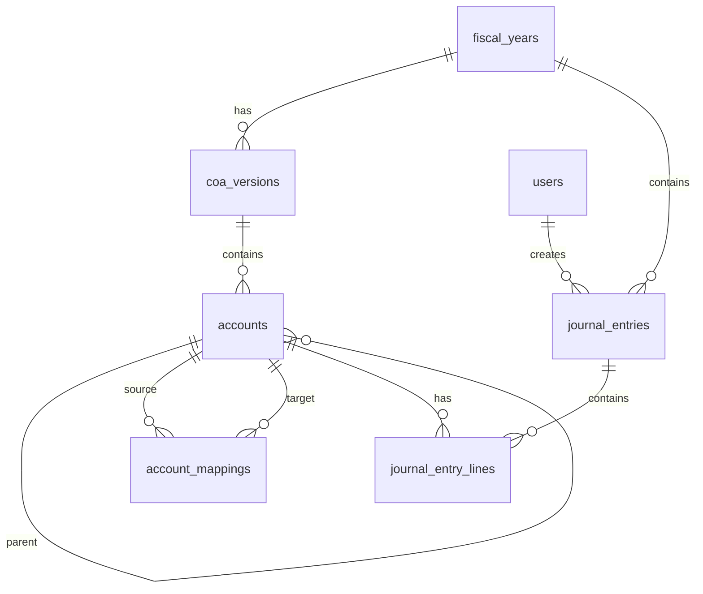
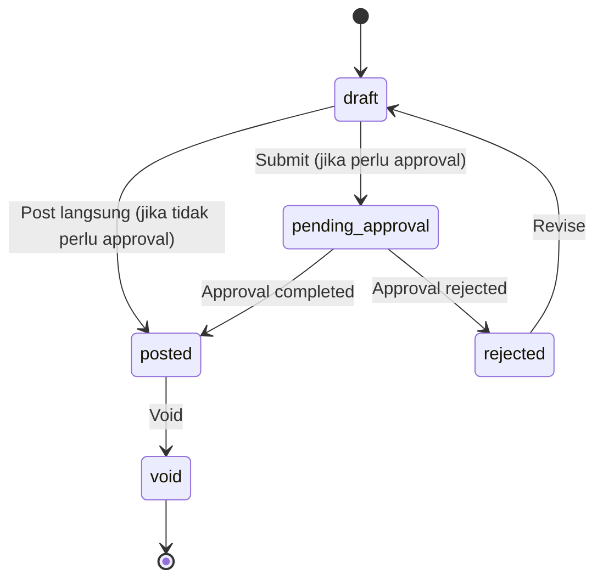

# Desain Database: Chart of Accounts (COA) dengan Versioning

Dokumen ini menjelaskan struktur database untuk modul Chart of Accounts (COA) atau Daftar Akun yang mendukung versioning dan jurnal umum. Fokus utama: tahun fiskal, versi COA, hierarki akun, pemetaan antar versi, dan pencatatan jurnal umum.

## 1. Gambaran Umum

### Filosofi Desain

Setiap tahun fiskal (Fiscal Year) atau periode tertentu dapat memiliki versi COA yang berbeda. Saat tahun fiskal baru dibuat, struktur akun dari tahun sebelumnya akan diduplikasi (cloned) ke versi baru. Ini memastikan bahwa perubahan pada nama akun, hierarki, atau penambahan akun baru di tahun berjalan tidak merusak data historis tahun sebelumnya.

### Komponen Utama
*   **Tahun Fiskal**: Periode akuntansi perusahaan (mis. 1 Jan – 31 Des).
*   **Versi COA**: Snapshot struktur akun per periode. Memungkinkan perubahan struktur tanpa merusak data historis.
*   **Daftar Akun**: Hierarki akun (tree) dengan klasifikasi tipe, sub-tipe, dan saldo normal.
*   **Pemetaan Akun**: "Kamus penerjemah" antar versi COA untuk perubahan kode akun yang drastis.
*   **Jurnal Umum**: Pencatatan transaksi keuangan (header + detail baris debit/kredit).

### Integrasi dengan Master Data yang Sudah Ada
*   **Pengguna**: `users` — pembuat dan penanggung jawab posting jurnal.
*   **Aset**: `assets`, `asset_depreciation_runs` — posting depresiasi ke jurnal.
*   **Purchasing**: `goods_receipts`, `supplier_returns` — posting AP dan stok ke jurnal.

### Prinsip Desain
1.  **Versioned COA**: Setiap perubahan struktur akun menghasilkan versi baru, menjaga integritas data historis.
2.  **Self-Referencing Hierarchy**: Akun menggunakan `parent_id` untuk membentuk tree multi-level.
3.  **Code-Based Mapping**: Perbandingan antar versi menggunakan `code` sebagai kunci utama, dengan `account_mappings` untuk perubahan kode yang drastis.
4.  **Double-Entry Bookkeeping**: Setiap jurnal harus balance (Total Debit = Total Kredit).
5.  **Status-Protected**: Tahun fiskal yang sudah `closed`/`locked` dan jurnal yang sudah `posted` tidak bisa diedit.

---

## 2. Diagram Hubungan Entitas (ERD)



---

## 3. Detail Tabel

### A. Periode Akuntansi

#### 1. `fiscal_years`
Menyimpan periode akuntansi perusahaan.

| Kolom | Tipe Data | Keterangan |
| :--- | :--- | :--- |
| `id` | BigInt | Primary Key |
| `name` | String | Nama tahun fiskal (mis. "2025", "FY 2026") |
| `start_date` | Date | Tanggal mulai (mis. 2025-01-01) |
| `end_date` | Date | Tanggal selesai (mis. 2025-12-31) |
| `status` | Enum | `open`, `closed`, `locked` |
| `created_at` | Timestamp | |
| `updated_at` | Timestamp | |

**Index (disarankan):** `status`, `(start_date, end_date)`

##### Penjelasan Status

| Status | Penjelasan |
| :--- | :--- |
| **`open`** | Tahun fiskal aktif, transaksi dapat diinput. |
| **`closed`** | Tahun fiskal ditutup, tidak ada transaksi baru. |
| **`locked`** | Tahun fiskal dikunci permanen, tidak bisa dibuka kembali. |

> [!CAUTION]
> Status `locked` bersifat permanen dan tidak bisa di-revert. Gunakan hanya setelah audit selesai dan laporan keuangan sudah final.

---

### B. Versi COA

#### 2. `coa_versions`
Menyimpan snapshot atau versi dari struktur akun. Biasanya satu tahun fiskal memiliki satu versi aktif.

| Kolom | Tipe Data | Keterangan |
| :--- | :--- | :--- |
| `id` | BigInt | Primary Key |
| `name` | String | Nama versi (mis. "COA 2025 Standard") |
| `fiscal_year_id` | BigInt | FK -> `fiscal_years` (nullable untuk template master) |
| `status` | Enum | `draft`, `active`, `archived` |
| `created_at` | Timestamp | |
| `updated_at` | Timestamp | |

**Index (disarankan):** `fiscal_year_id`, `status`

##### Penjelasan Status

| Status | Penjelasan |
| :--- | :--- |
| **`draft`** | Versi dalam penyusunan, belum digunakan. |
| **`active`** | Versi yang sedang digunakan saat ini. |
| **`archived`** | Versi lama yang tidak lagi digunakan. |

> [!IMPORTANT]
> Hanya boleh ada satu versi COA dengan status `active` per tahun fiskal. Validasi ini dilakukan di **application level**.

---

### C. Daftar Akun

#### 3. `accounts`
Menyimpan detail akun untuk setiap versi. Mendukung hierarki (tree) dengan `parent_id`.

| Kolom | Tipe Data | Keterangan |
| :--- | :--- | :--- |
| `id` | BigInt | Primary Key |
| `coa_version_id` | BigInt | FK -> `coa_versions` |
| `parent_id` | BigInt | Self-referencing FK -> `accounts` (nullable, untuk hierarki) |
| `code` | String | Kode akun (mis. "110-001"). **Kunci utama untuk perbandingan antar versi.** |
| `name` | String | Nama akun (mis. "Kas Besar") |
| `type` | Enum | `asset`, `liability`, `equity`, `revenue`, `expense` |
| `sub_type` | String | Kategori lebih detail (mis. `current_asset`, `long_term_liability`) |
| `normal_balance` | Enum | `debit`, `credit` |
| `level` | Integer | Level kedalaman hierarki (0 = root, 1 = sub, dst.) |
| `is_active` | Boolean | Status aktif/tidak (default: true) |
| `is_cash_flow` | Boolean | Termasuk dalam Laporan Arus Kas (default: false) |
| `description` | Text | Deskripsi akun (nullable) |
| `created_at` | Timestamp | |
| `updated_at` | Timestamp | |

**Unique Constraint (disarankan):** `(coa_version_id, code)` — kode akun unik per versi

**Index (disarankan):** `coa_version_id`, `parent_id`, `type`, `is_active`

##### Penjelasan Kolom Detail

###### `type`
Mengelompokkan akun ke dalam kategori utama laporan keuangan (Neraca atau Laba Rugi).

| Nilai | Penjelasan | Contoh |
| :--- | :--- | :--- |
| **`asset`** | Harta perusahaan. | Kas Besar, Bank BCA, Gedung Kantor. |
| **`liability`** | Kewajiban / hutang. | Hutang Dagang, Hutang Bank. |
| **`equity`** | Modal / ekuitas pemilik. | Modal Disetor, Laba Ditahan. |
| **`revenue`** | Pendapatan. | Penjualan Barang, Jasa Konsultasi. |
| **`expense`** | Beban / biaya. | Gaji Karyawan, Beban Listrik. |

###### `sub_type`
Klasifikasi spesifik dari `type` untuk penyajian laporan yang lebih terstruktur.

| Type | Contoh Sub Type | Penjelasan |
| :--- | :--- | :--- |
| `asset` | `current_asset` | Aset lancar (Kas, Bank, Piutang). |
| `asset` | `fixed_asset` | Aset tetap (Gedung, Kendaraan). |
| `liability` | `current_liability` | Hutang jangka pendek. |
| `liability` | `long_term_liability` | Hutang jangka panjang. |
| `expense` | `operating_expense` | Beban operasional. |
| `expense` | `non_operating_expense` | Beban di luar operasional. |

###### `normal_balance`
Menentukan posisi normal saldo akun agar bernilai positif.

| Nilai | Penjelasan | Contoh Akun |
| :--- | :--- | :--- |
| **`debit`** | Saldo bertambah di Debit. Digunakan untuk Asset & Expense. | Kas (Asset), Beban Gaji (Expense). |
| **`credit`** | Saldo bertambah di Kredit. Digunakan untuk Liability, Equity & Revenue. | Hutang (Liability), Penjualan (Revenue). |

###### `level`
Menunjukkan kedalaman hierarki akun dalam struktur pohon (tree) untuk indentasi laporan.

*   **Level 0**: Aset (Header Utama)
    *   **Level 1**: Aset Lancar (Header Kategori)
        *   **Level 2**: Kas & Bank (Header Group)
            *   **Level 3**: **Bank BCA** (Akun Transaksi)

###### `is_active`
Menandai akun yang boleh digunakan untuk transaksi baru. Akun lama dengan saldo **tidak boleh dihapus**, hanya dinonaktifkan.

> [!TIP]
> Contoh: Bank Mandiri (lama) diganti Bank Jago (baru). Set `is_active = false` pada Bank Mandiri agar tidak muncul di pilihan jurnal baru, namun histori tetap terjaga.

###### `is_cash_flow`
Menandai akun yang menjadi komponen Laporan Arus Kas (Operating, Investing, Financing).

| Contoh | `is_cash_flow` | Penjelasan |
| :--- | :--- | :--- |
| Penjualan Tunai | `true` | Masuk aktivitas operasional. |
| Pembelian Mesin | `true` | Masuk aktivitas investasi. |
| Beban Penyusutan | `false` | Beban non-tunai, diabaikan di metode langsung. |

##### Contoh Data Baris

| Column | Akun: Kas Bank BCA | Akun: Hutang Usaha | Akun: Penjualan Jasa |
| :--- | :--- | :--- | :--- |
| **code** | `1110-001` | `2100-001` | `4100-001` |
| **name** | Bank BCA IDR | Hutang Supplier Lokal | Jasa Konsultasi IT |
| **type** | `asset` | `liability` | `revenue` |
| **sub_type** | `current_asset` | `current_liability` | `operating_revenue` |
| **normal_balance** | `debit` | `credit` | `credit` |
| **level** | `3` | `3` | `3` |
| **is_active** | `true` | `true` | `true` |
| **is_cash_flow** | `true` | `false` | `true` |

---

### D. Pemetaan Akun

#### 4. `account_mappings`
Tabel untuk menangani perubahan kode akun yang drastis antar versi. Berfungsi sebagai "kamus penerjemah" antar versi COA, krusial untuk laporan komparatif saat struktur akun berubah.

| Kolom | Tipe Data | Keterangan |
| :--- | :--- | :--- |
| `id` | BigInt | Primary Key |
| `source_account_id` | BigInt | FK -> `accounts` (akun di versi lama) |
| `target_account_id` | BigInt | FK -> `accounts` (akun di versi baru) |
| `type` | Enum | `merge`, `split`, `rename` |
| `notes` | Text | Catatan perubahan (nullable) |
| `created_at` | Timestamp | |
| `updated_at` | Timestamp | |

**Index (disarankan):** `source_account_id`, `target_account_id`, `type`

##### Penjelasan Tipe Mapping

| Tipe | Penjelasan | Contoh |
| :--- | :--- | :--- |
| **`rename`** | Satu akun lama digantikan satu akun baru (1-to-1), kode berbeda drastis. | 2025: `1100-00` (Kas Umum) → 2026: `11100` (Kas Besar). Saldo lama ditampilkan sebagai pembanding. |
| **`merge`** | Beberapa akun lama disederhanakan menjadi satu akun baru (Many-to-1). | 2025: `6101` (Beban Listrik) & `6102` (Beban Air) → 2026: `6100` (Beban Utilitas). Saldo pembanding = total akun lama. |
| **`split`** | Satu akun lama dipecah menjadi beberapa akun baru (1-to-Many). | 2025: `5200` (Perjalanan Dinas) → 2026: `5210` (Tiket Pesawat) & `5220` (Akomodasi Hotel). |

> [!NOTE]
> Untuk perubahan kode yang tidak drastis (kode sama), sistem otomatis mencocokkan akun antar versi berdasarkan kolom `code` tanpa perlu mapping manual.

---

### E. Jurnal Umum

#### 5. `journal_entries`
Menyimpan header jurnal umum. Bekerja berpasangan dengan `journal_entry_lines` (Header-Detail) untuk mencatat setiap transaksi keuangan.

| Kolom | Tipe Data | Keterangan |
| :--- | :--- | :--- |
| `id` | BigInt | Primary Key |
| `fiscal_year_id` | BigInt | FK -> `fiscal_years` |
| `entry_number` | String | Nomor jurnal unik (mis. "JV-2026-00001") |
| `entry_date` | Date | Tanggal transaksi (bukan tanggal input) |
| `reference` | String | Nomor bukti eksternal (nullable) |
| `description` | String | Deskripsi transaksi |
| `status` | Enum | `draft`, `posted`, `void` |
| `created_by` | BigInt | FK -> `users` (pembuat jurnal) |
| `posted_by` | BigInt | FK -> `users` (nullable, yang memposting) |
| `posted_at` | Timestamp | Waktu posting (nullable) |
| `created_at` | Timestamp | |
| `updated_at` | Timestamp | |

**Index (disarankan):** `entry_number` (unique), `fiscal_year_id`, `status`, `entry_date`, `created_by`

##### Penjelasan Status

| Status | Penjelasan |
| :--- | :--- |
| **`draft`** | Masih bisa diedit/dihapus, belum masuk laporan. |
| **`posted`** | Sudah final, masuk buku besar & laporan, tidak bisa diedit. |
| **`void`** | Dibatalkan (audit trail tetap ada). |

> [!CAUTION]
> Jurnal yang sudah `posted` **tidak boleh diedit atau dihapus**. Jika ada kesalahan, buat jurnal koreksi (reversing entry) atau ubah status ke `void` dan buat jurnal baru.

#### 6. `journal_entry_lines`
Menyimpan detail debit/kredit untuk setiap jurnal.

| Kolom | Tipe Data | Keterangan |
| :--- | :--- | :--- |
| `id` | BigInt | Primary Key |
| `journal_entry_id` | BigInt | FK -> `journal_entries` |
| `account_id` | BigInt | FK -> `accounts` |
| `debit` | Decimal(15,2) | Jumlah debit (0 jika kredit) |
| `credit` | Decimal(15,2) | Jumlah kredit (0 jika debit) |
| `memo` | String | Keterangan per baris (nullable) |
| `created_at` | Timestamp | |
| `updated_at` | Timestamp | |

**Index (disarankan):** `journal_entry_id`, `account_id`

> [!IMPORTANT]
> Setiap `journal_entry_lines` harus memiliki salah satu `debit` atau `credit` bernilai 0. Keduanya tidak boleh bernilai positif secara bersamaan.

##### Contoh Kasus: Jurnal Umum

**Skenario:** Pembayaran Biaya Listrik Rp 1.500.000 via transfer Bank BCA, tanggal 15 Januari 2026.

**Tabel `journal_entries`:**
| id | fiscal_year_id | entry_number | entry_date | description | status |
| :--- | :--- | :--- | :--- | :--- | :--- |
| 101 | 2 (2026) | `JV-2026-005` | `2026-01-15` | Bayar Tagihan PLN Jan 2026 | `posted` |

**Tabel `journal_entry_lines`:**
| id | journal_entry_id | account_id | debit | credit | memo |
| :--- | :--- | :--- | :--- | :--- | :--- |
| 501 | 101 | `6100` (Beban Listrik) | 1.500.000 | 0 | Tagihan ID: 54321 |
| 502 | 101 | `11100` (Bank BCA) | 0 | 1.500.000 | Transfer via KlikBCA |

*Total Debit (1.500.000) = Total Kredit (1.500.000) ✓*

---

## 4. Aturan Bisnis (Ringkas)

### Skema Debit & Kredit

#### Normal Balance per Tipe Akun

| Tipe Akun | Normal Balance | Bertambah dengan | Berkurang dengan |
| :--- | :---: | :---: | :---: |
| **Asset** (Aset) | Debit | Debit ➕ | Kredit ➖ |
| **Expense** (Beban) | Debit | Debit ➕ | Kredit ➖ |
| **Liability** (Kewajiban) | Kredit | Kredit ➕ | Debit ➖ |
| **Equity** (Modal) | Kredit | Kredit ➕ | Debit ➖ |
| **Revenue** (Pendapatan) | Kredit | Kredit ➕ | Debit ➖ |

#### Rumus Perhitungan Saldo

```php
if ($account->normal_balance === 'debit') {
    $balance = $totalDebit - $totalCredit;
} else {
    $balance = $totalCredit - $totalDebit;
}
```

#### Validasi Jurnal

Setiap jurnal **WAJIB** balance:
```
Total Debit = Total Kredit
```

### Versioning COA
*   Saat tahun fiskal baru dibuat, clone struktur akun dari versi aktif tahun sebelumnya ke versi baru → status `draft`.
*   Setelah review dan penyesuaian, aktifkan versi baru → status `active`.
*   Arsipkan versi lama → status `archived`.
*   Jika ada perubahan kode akun yang drastis, buat mapping di `account_mappings`.

---

## 5. Logika Pelaporan (Reporting Logic)

### Laporan Tahun Berjalan
Query sederhana ke tabel `accounts` dan `journal_entry_lines` berdasarkan `coa_version_id` yang aktif untuk tahun tersebut.

```php
$accounts = Account::where('coa_version_id', $activeVersionId)
    ->with(['journalLines' => function($q) {
        $q->whereHas('journalEntry', fn($je) => $je->where('status', 'posted'));
    }])
    ->get();
```

### Laporan Komparatif (Tahun Ini vs Tahun Lalu)
1.  Identifikasi Versi COA Tahun Ini (Target) dan Versi COA Tahun Lalu (Source).
2.  Cocokkan akun berdasarkan kolom `code`. Jika kode sama → bandingkan langsung.
3.  Jika ada perubahan kode drastis → cek `account_mappings`.
    - **Rename**: tampilkan saldo lama sebagai pembanding akun baru.
    - **Merge**: total saldo akun-akun lama sebagai pembanding akun baru.
    - **Split**: total saldo lama ditampilkan di level Group Header.

### Laporan Laba Rugi (Income Statement)
Filter akun `type`: `revenue` dan `expense`. Dihitung dalam rentang waktu.

```php
// Revenue (Normal Balance: Credit)
$revenueBalance = $totalCredit - $totalDebit;

// Expense (Normal Balance: Debit)
$expenseBalance = $totalDebit - $totalCredit;

// Net Income
$netIncome = $totalRevenue - $totalExpense;
```

### Neraca (Balance Sheet)
Filter akun `type`: `asset`, `liability`, `equity`. Dihitung akumulatif (year-to-date).

```php
// Asset (Normal Balance: Debit)
$assetBalance = $totalDebit - $totalCredit;

// Liability & Equity (Normal Balance: Credit)
$liabilityEquityBalance = $totalCredit - $totalDebit;
```

> [!IMPORTANT]
> Neraca harus menyertakan laba/rugi tahun berjalan yang belum ditutup ke Laba Ditahan. Tambahkan `Net Income` sebagai baris terpisah "Current Year Earnings" di bagian Equity. Persamaan: `Assets = Liabilities + Equity + Net Income`.

---

## 6. Rekomendasi Menu & Tabel Terlibat

### A. Master Data (Setup)

#### 1) Fiscal Years
Tujuan: mengelola periode akuntansi perusahaan.

Jenis menu: Complex CRUD
Agent skill: `feature-crud-complex`

Tabel terlibat:
* `fiscal_years`

Fitur khusus:
* Validasi tidak boleh ada periode overlap.
* Status management: open → closed → locked.
* Filter: status, date range.

#### 2) COA Versions
Tujuan: mengelola versi COA per tahun fiskal.

Jenis menu: Complex CRUD
Agent skill: `feature-crud-complex`

Tabel terlibat:
* `coa_versions`
* `fiscal_years`

Fitur khusus:
* Clone dari versi sebelumnya (beserta semua accounts).
* Hanya satu versi `active` per fiscal year.
* Filter: fiscal year, status.

#### 3) Accounts (Daftar Akun)
Tujuan: mengelola hierarki akun dalam satu versi COA.

Jenis menu: Complex CRUD
Agent skill: `feature-crud-complex`

Tabel terlibat:
* `accounts`
* `coa_versions`

Fitur khusus:
* Tree view / indented list berdasarkan `parent_id` dan `level`.
* Sortable: Code, Name.
* Filter: COA version, type, sub_type, is_active.
* Validasi unique `code` per version.

#### 4) Account Mappings
Tujuan: mengelola pemetaan akun antar versi untuk laporan komparatif.

Jenis menu: Complex CRUD
Agent skill: `feature-crud-complex`

Tabel terlibat:
* `account_mappings`
* `accounts`

Fitur khusus:
* Source: akun dari versi lama. Target: akun dari versi baru.
* Filter: type (merge/split/rename), source version, target version.

---

### B. Operasional (Jurnal)

#### 5) Journal Entries
Tujuan: membuat dan mengelola jurnal umum.

Jenis menu: Complex CRUD
Agent skill: `feature-crud-complex`

Tabel terlibat:
* `journal_entries`
* `journal_entry_lines`
* `accounts`
* `fiscal_years`
* `users` (kolom `created_by`, `posted_by`)

Fitur khusus:
* Inline editing lines (debit/credit per akun).
* Validasi balance: Total Debit = Total Kredit.
* Posting workflow: draft → posted.
* Actions menggunakan icon buttons (Eye, Pencil, Trash) bukan dropdown menu.
* Filter: status, fiscal year, date range, entry_number.
* Sortable: Entry Number, Date, Description, Reference, Total Amount, Status.

#### 6) Posting Journals
Tujuan: mem-posting jurnal draft secara batch.

Jenis menu: Non-CRUD
Agent skill: `feature-non-crud`

Tabel terlibat:
* `journal_entries`
* `users`

---

### C. Laporan (Opsional tapi umum)

#### 7) Trial Balance
Tujuan: laporan saldo per akun (debit/kredit) dalam periode tertentu.

Jenis menu: Non-CRUD
Agent skill: `feature-non-crud`

Tabel terlibat:
* `accounts`
* `journal_entry_lines`
* `journal_entries`
* `coa_versions`
* `fiscal_years`

#### 8) Income Statement (Laba Rugi)
Tujuan: laporan pendapatan dan beban dalam periode tertentu.

Jenis menu: Non-CRUD
Agent skill: `feature-non-crud`

Tabel terlibat:
* `accounts` (type: revenue, expense)
* `journal_entry_lines`
* `journal_entries`
* `fiscal_years`

#### 9) Balance Sheet (Neraca)
Tujuan: laporan posisi keuangan pada titik waktu tertentu.

Jenis menu: Non-CRUD
Agent skill: `feature-non-crud`

Tabel terlibat:
* `accounts` (type: asset, liability, equity)
* `journal_entry_lines`
* `journal_entries`
* `fiscal_years`

#### 10) General Ledger
Tujuan: rincian mutasi per akun dalam periode tertentu.

Jenis menu: Non-CRUD
Agent skill: `feature-non-crud`

Tabel terlibat:
* `accounts`
* `journal_entry_lines`
* `journal_entries`

#### 11) Comparative Report
Tujuan: laporan keuangan komparatif antar tahun fiskal.

Jenis menu: Non-CRUD
Agent skill: `feature-non-crud`

Tabel terlibat:
* `accounts`
* `account_mappings`
* `journal_entry_lines`
* `journal_entries`
* `coa_versions`
* `fiscal_years`

---

## 7. Contoh Data Seed

### Tahun Fiskal
- **2025** (closed) — COA 2025 Standard (archived)
- **2026** (open) — COA 2026 Enhanced (active)

### Perubahan Struktur 2025 → 2026
1.  **Split**: `Cash (11100)` dipecah menjadi `Cash in Banks (11110)` + `Petty Cash (11120)`.
2.  **Rename**: `Operating Expense (52000)` → `General & Admin Expense (52000)`.

### Sample Journal Entries
- JV-2026-00001: Penjualan tunai (Cash ↔ Revenue)
- JV-2026-00002: Pembelian kredit (Inventory ↔ Accounts Payable)
- JV-2026-00003: Pembayaran beban (Expense ↔ Petty Cash) — Draft

---

## 8. Integrasi dengan Pipeline & Approval System

### Journal Entry Lifecycle (via Pipeline)



**Pipeline:** `journal_entry_lifecycle`
- entity_type: `App\Models\JournalEntry`
- Transisi `posted` men-trigger update saldo akun.
- Transisi `void` men-trigger reverse saldo akun.

> [!NOTE]
> Untuk jurnal bernilai tinggi atau jurnal adjustment, approval mungkin diperlukan sebelum posting. Threshold dan flow ditentukan di `approval_flows` (`11_approval_design.md`).
