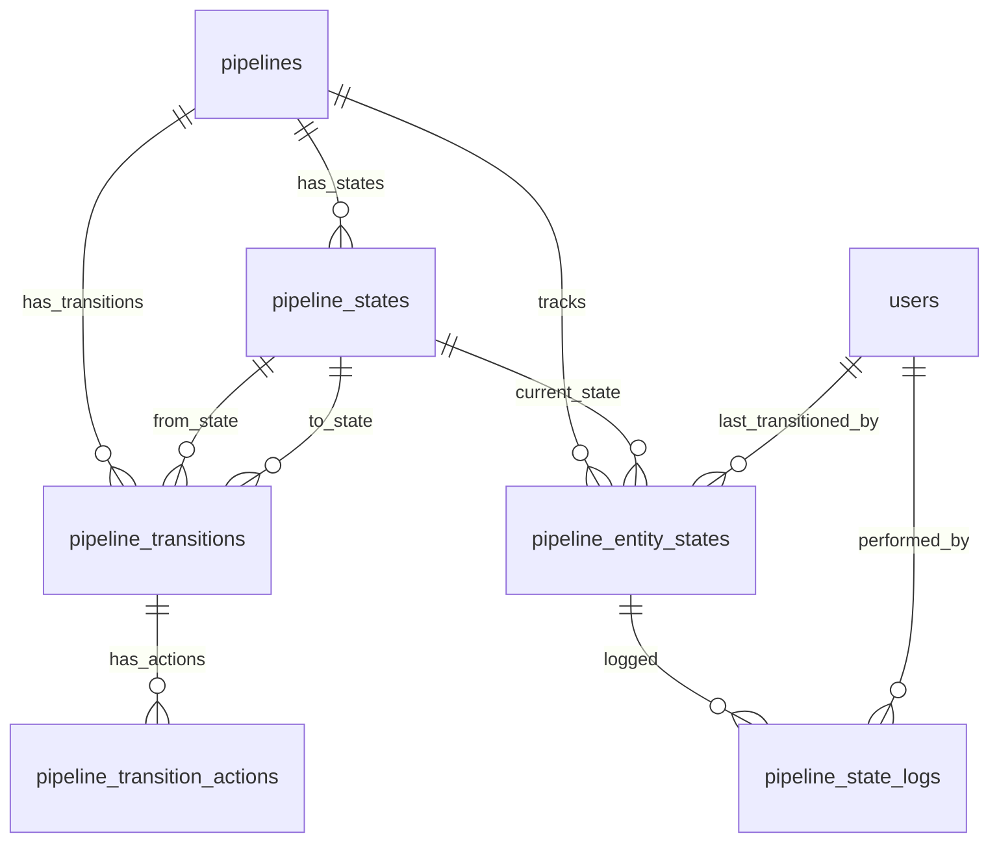
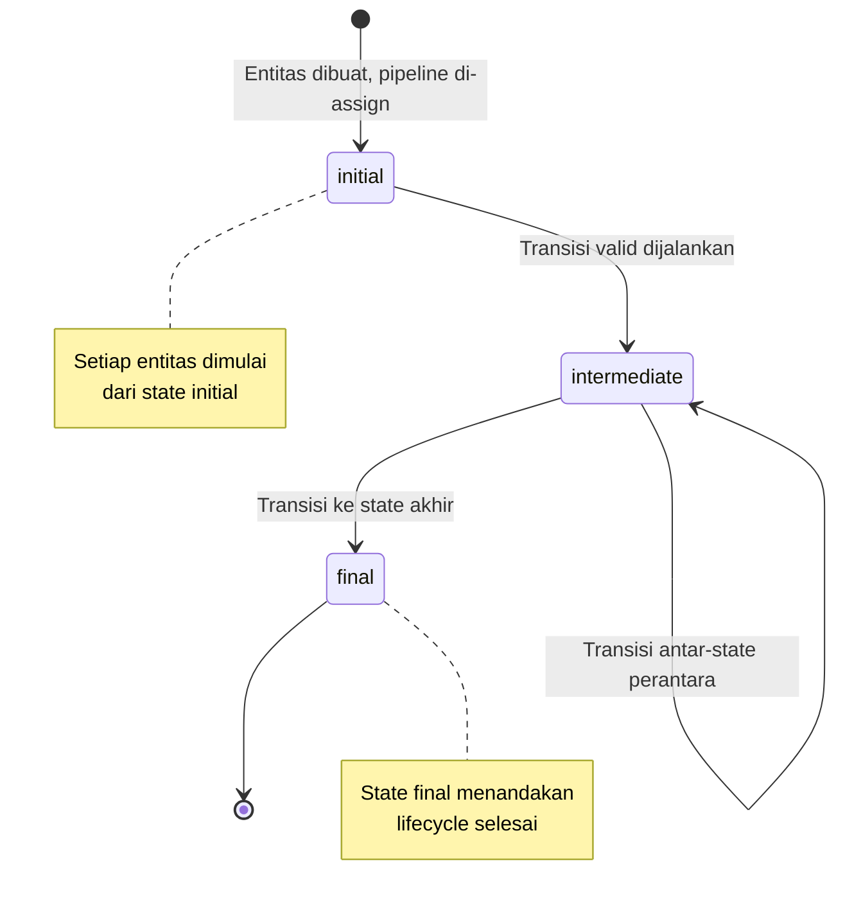
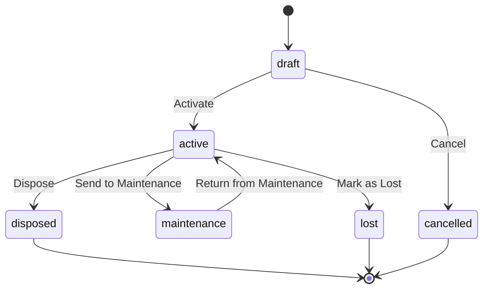
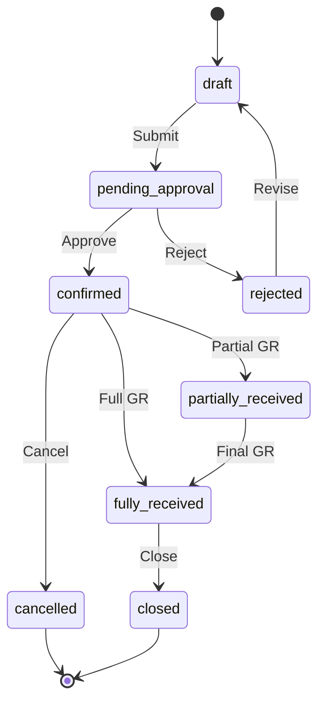

# Desain Database: Pipeline & Lifecycle (State Machine)

Dokumen ini menjelaskan struktur database untuk sistem **Pipeline & Lifecycle** yang bersifat **generik dan reusable** untuk seluruh modul ERP. Fokus utama: definisi state dan transisi, eksekusi lifecycle per entitas, automasi side-effect, guard/validasi, dan audit trail perubahan status.

## 1. Gambaran Umum

### Filosofi Desain

Sistem pipeline didesain sebagai **engine terpisah** yang mengelola lifecycle entitas melalui state machine yang dapat dikonfigurasi. Setiap entitas (Asset, PO, PR, JE, dll.) memiliki satu lifecycle yang deterministik — hanya transisi yang didefinisikan yang boleh terjadi.

### Hubungan dengan Modul Lain

| Modul | Referensi Desain | Hubungan |
| :--- | :--- | :--- |
| **Approval** | `11_approval_design.md` | Pipeline memanggil Approval pada transisi yang memerlukan persetujuan |
| **Asset Management** | `12_asset_management_design.md` | Asset lifecycle dikelola oleh pipeline |
| **Purchasing** | `13_purchasing_design.md` | PR & PO lifecycle dikelola oleh pipeline |
| **Chart of Accounts** | `01_chart_of_accounts_design.md` | Journal Entry lifecycle dikelola oleh pipeline |

### Filosofi State Machine

Setiap tipe entitas memiliki satu atau lebih **pipeline** yang mendefinisikan state yang valid dan transisi antar-state. Pipeline di-attach ke entitas melalui hubungan **polymorphic**.

> [!IMPORTANT]
> **Pipeline vs Approval**: Pipeline mengatur **lifecycle keseluruhan** suatu entitas (mis. `draft → pending_approval → approved → in_progress → completed`), sedangkan Approval System (lihat `11_approval_design.md`) mengatur **proses persetujuan** di dalam satu transisi (mis. saat status berubah dari `pending_approval` ke `approved`). Keduanya saling melengkapi — pipeline memanggil approval engine pada transisi yang memerlukan persetujuan.

### Komponen Utama
*   **Pipeline**: Template konfigurasi lifecycle per tipe entitas. Mendefinisikan semua state yang valid dan metadata pipeline.
*   **Pipeline States**: Daftar state yang tersedia dalam satu pipeline, termasuk atribut visual dan tipe (initial, intermediate, final).
*   **Pipeline Transitions**: Definisi transisi yang valid antar-state, termasuk guard conditions, required permissions, dan side-effects.
*   **Pipeline Transition Actions**: Side-effect otomatis yang dijalankan saat transisi terjadi (mis. kirim notifikasi, update field, trigger approval).
*   **Pipeline Entity States**: Tracking state saat ini dari setiap entitas yang menggunakan pipeline.
*   **Pipeline State Logs**: Audit trail lengkap setiap perpindahan state untuk keperluan tracing dan compliance.

### Integrasi dengan Master Data yang Sudah Ada
*   **Pengguna**: `users` — aktor yang melakukan transisi.
*   **Peran & Izin**: `roles`, `permissions` — guard transisi berdasarkan permission.
*   **Approval**: `approval_flows`, `approval_requests` — integrasi dengan Multi-Level Approval System.
*   **Entitas**: Tabel apapun yang membutuhkan lifecycle management — `assets`, `purchase_requests`, `purchase_orders`, `journal_entries`, dsb.

### Prinsip Desain
1.  **Generic (Polymorphic)**: Satu pipeline engine untuk semua tipe entitas.
2.  **Configurable**: States, transisi, guards, dan actions bisa dikonfigurasi via database tanpa perubahan kode.
3.  **Deterministic**: Dari satu state, hanya transisi yang didefinisikan yang boleh terjadi.
4.  **Side-Effect Driven**: Setiap transisi bisa memicu aksi otomatis (notifikasi, field update, create record, dll.).
5.  **Auditable**: Setiap perubahan state tercatat lengkap untuk compliance.
6.  **Guard-Protected**: Transisi bisa dibatasi oleh permission, kondisi field, atau business rule.

---

## 2. Diagram Hubungan Entitas (ERD)



> [!NOTE]
> Tabel `pipeline_entity_states` dan `pipeline_state_logs` memiliki kolom polymorphic (`entity_type`, `entity_id`) yang menghubungkan ke tabel entitas manapun. Hal ini tidak digambarkan di ERD karena keterbatasan notasi, namun merupakan inti dari desain generik ini.

---

## 3. Detail Tabel

### A. Konfigurasi Pipeline

#### 1. `pipelines`
Definisi pipeline per tipe entitas. Satu tipe entitas bisa memiliki lebih dari satu pipeline (mis. pipeline berbeda per kondisi/varian).

| Kolom | Tipe Data | Keterangan |
| :--- | :--- | :--- |
| `id` | BigInt | Primary Key |
| `name` | String | Nama pipeline (mis. "Asset Lifecycle", "Purchase Order Flow") |
| `code` | String | Kode unik pipeline (unique, mis. `asset_lifecycle`, `po_flow`) |
| `entity_type` | String | Nama class model (polymorphic, mis. `App\Models\Asset`) |
| `description` | Text | Deskripsi pipeline (nullable) |
| `version` | Integer | Versi pipeline (default: 1) |
| `is_active` | Boolean | Apakah pipeline aktif (default: true) |
| `conditions` | JSON | Kondisi kapan pipeline ini berlaku (nullable, mis. `{"asset_type": "vehicle"}`) |
| `created_by` | BigInt | FK -> `users` (nullable) |
| `created_at` | Timestamp | |
| `updated_at` | Timestamp | |

**Index (disarankan):** `entity_type`, `is_active`, `code` (unique)

> [!TIP]
> Kolom `conditions` memungkinkan multiple pipeline untuk tipe entitas yang sama. Contoh:
> - Asset kendaraan → pipeline khusus dengan state `inspection_due`.
> - Asset IT equipment → pipeline standar tanpa state inspeksi.
> - PO domestik vs PO impor → flow yang berbeda.

> [!IMPORTANT]
> **Versioning Strategy**: Saat pipeline di-update (state/transisi diubah), increment `version`. Entitas yang sedang in-flight tetap terikat pada `pipeline_id` yang sama — perubahan pipeline berlaku untuk transisi **berikutnya**, bukan transisi yang sedang berjalan. Jika perubahan bersifat breaking (state dihapus), buat pipeline baru dan deaktifkan yang lama.

> [!CAUTION]
> **Soft Delete**: Tabel konfigurasi (`pipelines`, `pipeline_states`, `pipeline_transitions`) **tidak boleh di-delete** jika masih ada entitas yang menggunakannya. Gunakan `is_active = false` untuk menonaktifkan. Menghapus state/transition yang direferensi oleh log historis akan merusak audit trail.

#### 2. `pipeline_states`
Daftar state yang valid dalam satu pipeline. Setiap state memiliki atribut visual dan klasifikasi tipe.

| Kolom | Tipe Data | Keterangan |
| :--- | :--- | :--- |
| `id` | BigInt | Primary Key |
| `pipeline_id` | BigInt | FK -> `pipelines` |
| `code` | String | Kode state (mis. `draft`, `active`, `disposed`) |
| `name` | String | Label tampilan (mis. "Draft", "Active", "Disposed") |
| `type` | Enum | `initial`, `intermediate`, `final` |
| `color` | String(7) | HEX color untuk badge UI (nullable, mis. `#10B981`) |
| `icon` | String | Icon identifier untuk UI (nullable, mis. `circle-check`) |
| `description` | Text | Penjelasan state (nullable) |
| `sort_order` | Integer | Urutan tampilan di UI (default: 0) |
| `metadata` | JSON | Data tambahan tergantung kebutuhan (nullable) |
| `created_at` | Timestamp | |
| `updated_at` | Timestamp | |

**Unique Constraint (disarankan):** `(pipeline_id, code)`

##### Penjelasan Tipe State (`type`)

| Tipe | Penjelasan | Contoh |
| :--- | :--- | :--- |
| **`initial`** | State awal saat entitas pertama kali dibuat. Setiap pipeline hanya boleh punya **satu** initial state. | `draft` pada PO, `new` pada Asset. |
| **`intermediate`** | State perantara selama lifecycle berlangsung. Bisa ada banyak. | `pending_approval`, `active`, `maintenance`, `in_progress`. |
| **`final`** | State akhir yang menandakan lifecycle selesai. Entitas di state ini tidak bisa berpindah lagi (kecuali ada transisi khusus). | `completed`, `disposed`, `cancelled`, `closed`. |

#### 3. `pipeline_transitions`
Definisi transisi yang valid antar-state. Mendefinisikan "edges" dalam state machine graph.

| Kolom | Tipe Data | Keterangan |
| :--- | :--- | :--- |
| `id` | BigInt | Primary Key |
| `pipeline_id` | BigInt | FK -> `pipelines` |
| `from_state_id` | BigInt | FK -> `pipeline_states` (state asal) |
| `to_state_id` | BigInt | FK -> `pipeline_states` (state tujuan) |
| `name` | String | Nama transisi / label action (mis. "Submit", "Approve", "Dispose") |
| `code` | String | Kode transisi (mis. `submit`, `approve`, `dispose`) |
| `description` | Text | Penjelasan transisi (nullable) |
| `required_permission` | String | Permission yang diperlukan untuk menjalankan transisi (nullable, mis. `assets.dispose`) |
| `guard_conditions` | JSON | Kondisi yang harus terpenuhi sebelum transisi diizinkan (nullable) |
| `requires_confirmation` | Boolean | Apakah perlu konfirmasi user sebelum eksekusi (default: false) |
| `requires_comment` | Boolean | Apakah wajib mengisi komentar saat transisi (default: false) |
| `requires_approval` | Boolean | Apakah transisi ini men-trigger approval flow (default: false) |
| `sort_order` | Integer | Urutan tampilan di UI (default: 0) |
| `is_active` | Boolean | Apakah transisi aktif (default: true) |
| `created_at` | Timestamp | |
| `updated_at` | Timestamp | |

**Unique Constraint (disarankan):** `(pipeline_id, from_state_id, to_state_id)`

**Index (disarankan):** `from_state_id`, `to_state_id`, `required_permission`

##### Penjelasan `guard_conditions`
Guard conditions adalah JSON yang mendefinisikan syarat (`AND`) agar transisi bisa dijalankan. Format:

```json
{
  "field_checks": [
    {"field": "purchase_cost", "operator": ">", "value": 0},
    {"field": "branch_id", "operator": "!=", "value": null}
  ],
  "relation_checks": [
    {"relation": "movements", "operator": "count_gte", "value": 1}
  ],
  "custom_rule": "App\\Rules\\AssetFullyDepreciated"
}
```

| Guard Type | Penjelasan |
| :--- | :--- |
| **`field_checks`** | Validasi terhadap field entitas (operator: `=`, `!=`, `>`, `<`, `>=`, `<=`, `in`, `not_in`, `is_null`, `is_not_null`) |
| **`relation_checks`** | Validasi terhadap relasi entitas (operator: `exists`, `not_exists`, `count_gte`, `count_lte`) |
| **`custom_rule`** | Nama class Laravel Rule atau invokable class untuk validasi kompleks |

> [!NOTE]
> Guard conditions dievaluasi secara **AND** — semua kondisi harus terpenuhi. Jika diperlukan logika OR, gunakan `custom_rule`.

##### Format Error Response Guard
Saat guard conditions gagal, pipeline engine mengembalikan error terstruktur agar UI bisa menampilkan alasan spesifik:

```json
{
  "transition_blocked": true,
  "transition_code": "dispose",
  "failed_guards": [
    {"type": "field_check", "field": "purchase_cost", "operator": ">", "value": 0, "message": "Purchase cost harus lebih dari 0"},
    {"type": "relation_check", "relation": "movements", "operator": "count_gte", "value": 1, "message": "Aset harus memiliki minimal 1 movement"}
  ]
}
```

UI dapat menggunakan `failed_guards[].message` untuk menampilkan tooltip pada tombol yang di-disable.

#### 4. `pipeline_transition_actions`
Side-effect otomatis yang dijalankan saat transisi berhasil. Dieksekusi secara berurutan berdasarkan `execution_order`.

| Kolom | Tipe Data | Keterangan |
| :--- | :--- | :--- |
| `id` | BigInt | Primary Key |
| `pipeline_transition_id` | BigInt | FK -> `pipeline_transitions` |
| `action_type` | Enum | `update_field`, `create_record`, `send_notification`, `dispatch_job`, `trigger_approval`, `webhook`, `custom` |
| `execution_order` | Integer | Urutan eksekusi (1, 2, 3, …) |
| `config` | JSON | Konfigurasi aksi (detail sesuai `action_type`) |
| `is_async` | Boolean | Apakah dijalankan via queue (default: false) |
| `on_failure` | Enum | `abort`, `continue`, `log_and_continue` (default: `abort`) |
| `is_active` | Boolean | Apakah aksi aktif (default: true) |
| `created_at` | Timestamp | |
| `updated_at` | Timestamp | |

**Unique Constraint (disarankan):** `(pipeline_transition_id, execution_order)`

##### Penjelasan `action_type` dan `config`

| Action Type | Penjelasan | Contoh `config` |
| :--- | :--- | :--- |
| **`update_field`** | Update field pada entitas. | `{"field": "status", "value": "active"}` |
| **`create_record`** | Membuat record baru di tabel lain. | `{"model": "AssetMovement", "data": {"movement_type": "dispose"}}` |
| **`send_notification`** | Kirim notifikasi ke user/role. | `{"channel": "database", "recipients": {"type": "role", "value": "asset-manager"}, "template": "asset_disposed"}` |
| **`dispatch_job`** | Dispatch Laravel job ke queue. | `{"job": "App\\Jobs\\CalculateDepreciation", "params": {"asset_id": "{entity.id}"}}` |
| **`trigger_approval`** | Men-trigger approval flow. | `{"approval_flow_code": "po_high_value"}` |
| **`webhook`** | Kirim HTTP request ke external service. | `{"url": "https://api.example.com/webhook", "method": "POST", "headers": {}}` |
| **`custom`** | Eksekusi custom class. | `{"class": "App\\Actions\\Pipeline\\HandleAssetDisposal", "method": "execute"}` |

> [!TIP]
> Di dalam `config`, Anda bisa menggunakan placeholder `{entity.field_name}` yang akan di-resolve ke nilai field entitas saat runtime. Contoh: `{entity.id}`, `{entity.branch_id}`, `{entity.purchase_cost}`.

---

### B. Tracking State Per Entitas

#### 5. `pipeline_entity_states`
State saat ini dari setiap entitas yang menggunakan pipeline. Satu record per entitas per pipeline.

| Kolom | Tipe Data | Keterangan |
| :--- | :--- | :--- |
| `id` | BigInt | Primary Key |
| `pipeline_id` | BigInt | FK -> `pipelines` |
| `entity_type` | String | Polymorphic type (mis. `App\Models\Asset`) |
| `entity_id` | BigInt | Polymorphic ID (ID entitas) |
| `current_state_id` | BigInt | FK -> `pipeline_states` (state saat ini) |
| `last_transitioned_by` | BigInt | FK -> `users` (nullable) |
| `last_transitioned_at` | Timestamp | Waktu transisi terakhir (nullable) |
| `metadata` | JSON | Data kontekstual tambahan (nullable) |
| `created_at` | Timestamp | |
| `updated_at` | Timestamp | |

**Unique Constraint (disarankan):** `(pipeline_id, entity_type, entity_id)` — satu entitas punya satu state aktif per pipeline.

**Index (disarankan):** `(entity_type, entity_id)`, `current_state_id`, `pipeline_id`

---

### C. Audit Trail

#### 6. `pipeline_state_logs`
Log lengkap setiap perpindahan state. Digunakan untuk audit, timeline, dan analytics.

| Kolom | Tipe Data | Keterangan |
| :--- | :--- | :--- |
| `id` | BigInt | Primary Key |
| `pipeline_entity_state_id` | BigInt | FK -> `pipeline_entity_states` |
| `entity_type` | String | Polymorphic type (denormalized untuk query cepat) |
| `entity_id` | BigInt | Polymorphic ID (denormalized) |
| `from_state_id` | BigInt | FK -> `pipeline_states` (nullable, NULL untuk state awal) |
| `to_state_id` | BigInt | FK -> `pipeline_states` |
| `transition_id` | BigInt | FK -> `pipeline_transitions` (nullable) |
| `performed_by` | BigInt | FK -> `users` (nullable, NULL untuk transisi otomatis) |
| `comment` | Text | Komentar saat transisi (nullable) |
| `metadata` | JSON | Data tambahan (nullable, mis. snapshot field sebelum/sesudah) |
| `ip_address` | String(45) | IP address aktor (nullable) |
| `user_agent` | String | Browser/client info (nullable) |
| `created_at` | Timestamp | |

**Index (disarankan):** `(entity_type, entity_id)`, `pipeline_entity_state_id`, `from_state_id`, `to_state_id`, `performed_by`, `created_at`

##### Contoh `metadata`

```json
{
  "snapshot_before": {
    "status": "active",
    "branch_id": 1,
    "employee_id": 5
  },
  "snapshot_after": {
    "status": "disposed",
    "branch_id": 1,
    "employee_id": null
  },
  "guard_results": {
    "field_checks": true,
    "custom_rule": true
  },
  "actions_executed": [
    {"type": "update_field", "success": true},
    {"type": "send_notification", "success": true}
  ]
}
```

---

## 4. Aturan Bisnis (Ringkas)

### Lifecycle Pipeline Entity



### Alur Saat Pipeline Di-assign ke Entitas
1.  Entitas dibuat atau masuk ke pipeline (mis. Asset baru dibuat).
2.  Sistem mencari `pipeline` yang cocok berdasarkan `entity_type` + `conditions`.
3.  Dibuat `pipeline_entity_state` dengan `current_state_id` = initial state dari pipeline.
4.  Log awal dicatat di `pipeline_state_logs` (`from_state_id = NULL`, `to_state_id = initial state`).

### Alur Saat Transisi Dijalankan
1.  User/sistem men-trigger transisi (mis. klik tombol "Submit").
2.  Sistem memeriksa:
    -   **State validity**: Apakah `from_state_id` transisi = `current_state_id` entitas?
    -   **Permission**: Apakah user memiliki `required_permission`?
    -   **Guard conditions**: Apakah semua `guard_conditions` terpenuhi?
    -   **Confirmation**: Jika `requires_confirmation = true`, tampilkan dialog konfirmasi.
    -   **Comment**: Jika `requires_comment = true`, wajibkan input komentar.
3.  Jika semua check lolos:
    -   Update `pipeline_entity_states.current_state_id` ke `to_state_id`.
    -   Eksekusi semua `pipeline_transition_actions` berurutan.
    -   Catat log di `pipeline_state_logs`.
4.  Jika ada check gagal → transisi ditolak, error ditampilkan ke user.

### Integrasi dengan Approval System
*   Jika `pipeline_transitions.requires_approval = true`:
    1.  Saat transisi di-trigger, entitas berpindah ke state tujuan (mis. `pending_approval`).
    2.  Aksi `trigger_approval` membuat `approval_request` di Approval System.
    3.  Approval System berjalan independen (level 1 → level 2 → …).
    4.  Saat approval selesai (approved/rejected), Approval System men-trigger transisi pipeline berikutnya:
        -   Approved → transisi ke state selanjutnya (mis. `approved`).
        -   Rejected → transisi ke state penolakan (mis. `rejected` atau kembali ke `draft`).

> [!IMPORTANT]
> Pipeline dan Approval System berkomunikasi melalui **event/callback** — bukan tight coupling. Approval System memanggil pipeline service untuk melakukan transisi setelah keputusan approval final.

### Sync Status Entitas
*   Aksi `update_field` pada transisi memungkinkan kolom `status` di tabel entitas asli (mis. `assets.status`, `purchase_requests.status`) tetap ter-sync dengan pipeline state.
*   Hal ini menjaga kompatibilitas dengan query/filter existing yang bergantung pada kolom `status` di tabel entitas.

---

## 5. Contoh Pipeline Konfigurasi

### Contoh A: Asset Lifecycle



**Pipeline:** `asset_lifecycle`
- entity_type: `App\Models\Asset`

| State (code) | Name | Type | Color |
| :--- | :--- | :--- | :--- |
| `draft` | Draft | initial | `#6B7280` |
| `active` | Active | intermediate | `#10B981` |
| `maintenance` | In Maintenance | intermediate | `#F59E0B` |
| `disposed` | Disposed | final | `#EF4444` |
| `lost` | Lost | final | `#DC2626` |
| `cancelled` | Cancelled | final | `#9CA3AF` |

| Transisi | From → To | Permission | Guard | Actions |
| :--- | :--- | :--- | :--- | :--- |
| Activate | `draft` → `active` | `assets.activate` | `purchase_cost > 0` | Update `assets.status` |
| Cancel | `draft` → `cancelled` | `assets.cancel` | — | Update `assets.status` |
| Send to Maintenance | `active` → `maintenance` | `assets.manage` | — | Update `assets.status`, Notify asset manager |
| Return from Maintenance | `maintenance` → `active` | `assets.manage` | — | Update `assets.status` |
| Dispose | `active` → `disposed` | `assets.dispose` | Requires approval, Requires comment | Update `assets.status`, Create `asset_movement` (type: dispose), Trigger approval |
| Mark as Lost | `active` → `lost` | `assets.manage` | Requires comment | Update `assets.status`, Create `asset_movement` (type: lost) |

### Contoh B: Purchase Order Flow



> [!NOTE]
> State PO di pipeline ini **harus konsisten** dengan enum `status` di tabel `purchase_orders` (`13_purchasing_design.md`). Transisi `confirmed → partially_received → fully_received` dikendalikan otomatis oleh Goods Receipt processing, bukan oleh user secara manual.

**Pipeline:** `po_flow`
- entity_type: `App\Models\PurchaseOrder`

| State (code) | Name | Type | Color |
| :--- | :--- | :--- | :--- |
| `draft` | Draft | initial | `#6B7280` |
| `pending_approval` | Pending Approval | intermediate | `#F59E0B` |
| `confirmed` | Confirmed | intermediate | `#10B981` |
| `rejected` | Rejected | intermediate | `#EF4444` |
| `partially_received` | Partially Received | intermediate | `#3B82F6` |
| `fully_received` | Fully Received | intermediate | `#059669` |
| `closed` | Closed | final | `#6B7280` |
| `cancelled` | Cancelled | final | `#9CA3AF` |

---

## 6. Dampak pada Tabel Entitas Existing

Dengan desain polymorphic ini, tabel-tabel entitas **tidak perlu diubah secara struktural**. Kolom `status` pada tabel entitas tetap dipertahankan dan di-sync melalui transition action `update_field`.

| Tabel Entitas | Kolom `status` (existing) | Dikelola oleh Pipeline |
| :--- | :--- | :--- |
| `assets` | `draft`, `active`, `maintenance`, `disposed`, `lost` | ✅ |
| `purchase_requests` | `draft`, `pending_approval`, `approved`, `rejected`, `partially_ordered`, `fully_ordered`, `cancelled` | ✅ |
| `purchase_orders` | `draft`, `pending_approval`, `confirmed`, `rejected`, `partially_received`, `fully_received`, `cancelled`, `closed` | ✅ |
| `journal_entries` | `draft`, `pending_approval`, `posted`, … | ✅ |
| `asset_stocktakes` | `draft`, `in_progress`, `completed`, `cancelled` | ✅ |
| `asset_depreciation_runs` | `draft`, `calculated`, `posted`, `void` | ✅ (desain tabel belum diformalkan — lihat roadmap) |

> [!IMPORTANT]
> Kolom `status` di tabel entitas **tetap dipertahankan** sebagai cache/shortcut query. Pipeline engine men-sync kolom ini melalui aksi `update_field` agar tidak ada breaking change pada query/filter existing.

---

## 7. Rekomendasi Menu & Tabel Terlibat

### A. Setup & Konfigurasi

#### 1) Pipeline Management
Tujuan: membuat dan mengelola definisi pipeline, states, transisi, dan actions.

Jenis menu: Complex CRUD
Agent skill: `feature-crud-complex`

Tabel terlibat:
* `pipelines`
* `pipeline_states`
* `pipeline_transitions`
* `pipeline_transition_actions`
* `users` (kolom `created_by`)

Fitur khusus:
* Visual pipeline builder — drag-and-drop state dan transisi (mermaid preview).
* Clone pipeline — duplikasi pipeline existing beserta state, transisi, dan actions.
* Validasi graph — pastikan ada minimal satu initial state, setidaknya satu final state, dan semua state reachable.
* Filter: entity_type, is_active.

#### 2) Pipeline State Configuration
Tujuan: mengelola daftar state per pipeline dengan atribut visual.

Jenis menu: Non-CRUD (inline sub-form dalam Pipeline Management)
Agent skill: `feature-non-crud`

Tabel terlibat:
* `pipeline_states`
* `pipelines`

#### 3) Pipeline Transition Configuration
Tujuan: mengelola transisi dan actions per pipeline.

Jenis menu: Non-CRUD (inline sub-form dalam Pipeline Management)
Agent skill: `feature-non-crud`

Tabel terlibat:
* `pipeline_transitions`
* `pipeline_transition_actions`
* `pipeline_states`
* `pipelines`

---

### B. Operasional (User-Facing)

#### 4) Entity State Actions
Tujuan: menampilkan tombol aksi transisi yang tersedia pada halaman detail entitas (mis. tombol "Submit", "Approve", "Dispose" di halaman Asset).

Jenis menu: Non-CRUD (komponen embed, bukan halaman terpisah)
Agent skill: `feature-non-crud`

Tabel terlibat:
* `pipeline_entity_states`
* `pipeline_transitions`
* `pipeline_states`
* `pipelines`
* `users`
* Tabel entitas (polymorphic)

Fitur khusus:
* Dynamic action buttons — hanya menampilkan transisi yang valid dari state saat ini.
* Permission-aware — tombol difilter berdasarkan permission user.
* Guard validation — tombol disabled jika guard conditions belum terpenuhi (tooltip menampilkan alasan).
* Confirm dialog — jika `requires_confirmation = true`.
* Comment modal — jika `requires_comment = true`.

#### 5) Entity State Timeline
Tujuan: menampilkan riwayat perubahan state dalam bentuk timeline pada halaman detail entitas.

Jenis menu: Non-CRUD (komponen embed, bukan halaman terpisah)
Agent skill: `feature-non-crud`

Tabel terlibat:
* `pipeline_state_logs`
* `pipeline_states`
* `pipeline_transitions`
* `users`

Fitur khusus:
* Timeline visual — setiap state change ditampilkan dengan badge warna, nama user, waktu, dan komentar.
* Bisa di-embed sebagai tab/section di halaman detail entitas apapun.

---

### C. Monitoring & Reporting

#### 6) Pipeline Dashboard
Tujuan: memonitor distribusi state seluruh entitas per pipeline.

Jenis menu: Non-CRUD
Agent skill: `feature-non-crud`

Tabel terlibat:
* `pipeline_entity_states`
* `pipeline_states`
* `pipelines`
* `users`

Fitur khusus:
* Summary cards: total entitas per state (grouped by color/badge).
* Doughnut chart: distribusi state per pipeline.
* List entitas yang sudah lama di satu state (stale/bottleneck detection).
* Filter: pipeline, entity_type, date range.

#### 7) Pipeline Audit Trail
Tujuan: melihat log lengkap perpindahan state untuk audit.

Jenis menu: Non-CRUD
Agent skill: `feature-non-crud`

Tabel terlibat:
* `pipeline_state_logs`
* `pipeline_entity_states`
* `pipeline_states`
* `users`

Fitur khusus:
* Searchable log dengan filter entity_type, state, performer, date range.
* Detail view per log entry dengan metadata snapshot.
* Export ke CSV/Excel.

---

## 8. Contoh Skenario Lengkap

### Skenario: Disposal Aset dengan Approval

**Setup (satu kali):**
1.  Admin membuat `pipeline` "Asset Lifecycle" (`entity_type = App\Models\Asset`).
2.  Admin mendefinisikan 6 states: `draft`, `active`, `maintenance`, `disposed`, `lost`, `cancelled`.
3.  Admin mendefinisikan transisi "Dispose" (`active → disposed`):
    - `required_permission`: `assets.dispose`
    - `requires_confirmation`: true
    - `requires_comment`: true
    - `requires_approval`: true
4.  Admin menambahkan 3 actions pada transisi "Dispose":
    - Action 1 (`trigger_approval`): Men-trigger approval flow "Asset Disposal Approval".
    - Action 2 (`update_field`): Update `assets.status = disposed`.
    - Action 3 (`create_record`): Membuat `asset_movement` dengan `movement_type = dispose`.

**Eksekusi:**
1.  User membuka halaman detail Asset "Laptop Dell #FA-000123" (status: `active`).
2.  Tombol "Dispose" muncul (user punya permission `assets.dispose`).
3.  User klik "Dispose" → dialog konfirmasi muncul + input komentar wajib.
4.  User isi komentar: "Laptop sudah melewati masa manfaat, layar rusak" → klik Confirm.
5.  Pipeline engine:
    -   Cek guard conditions → lolos.
    -   Transisi memerlukan approval → status sementara tetap `active`, tapi approval request dibuat.
    -   Notifikasi dikirim ke approver sesuai flow.
6.  Approver meng-approve → Approval System men-callback pipeline engine.
7.  Pipeline engine melanjutkan:
    -   Update `pipeline_entity_states.current_state_id` ke `disposed`.
    -   Execute action `update_field`: `assets.status = disposed`.
    -   Execute action `create_record`: buat `asset_movement` (type: `dispose`).
    -   Log dicatat di `pipeline_state_logs`.
8.  Asset "Laptop Dell #FA-000123" sekarang berstatus `disposed` di semua layer (pipeline + tabel `assets`).
