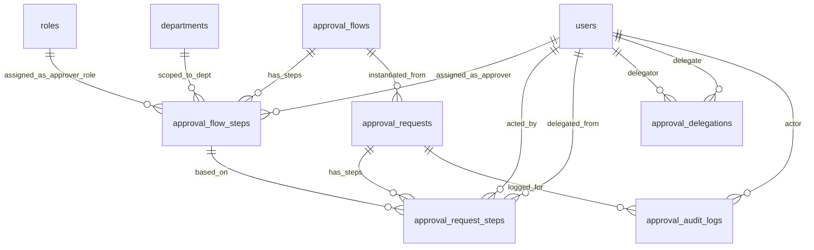
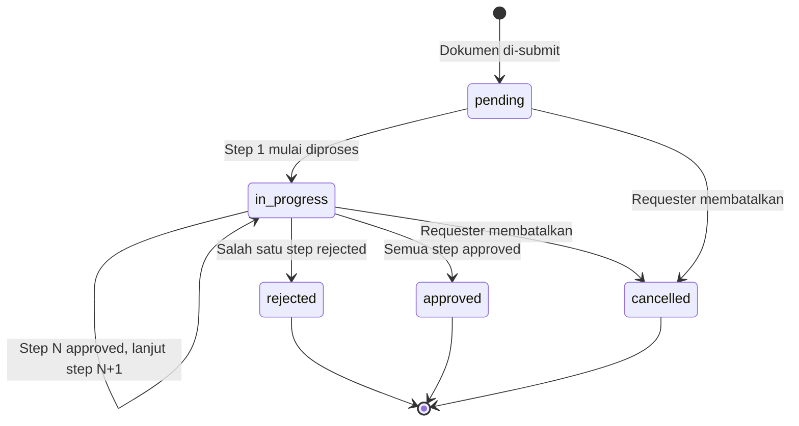
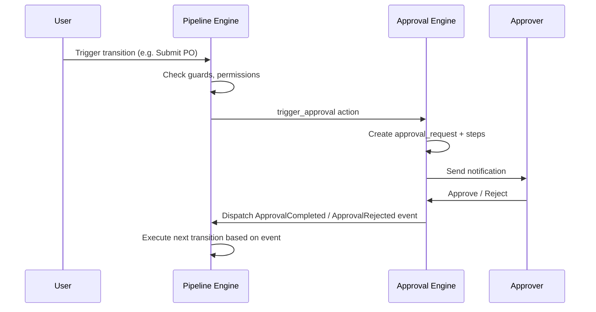

# Desain Database: Multi-Level Approval System

Dokumen ini menjelaskan struktur database untuk sistem persetujuan berlapis (Multi-Level Approval) yang bersifat **generik dan reusable** untuk seluruh modul ERP. Fokus utama: konfigurasi alur approval, eksekusi approval per dokumen, delegasi, eskalasi, dan audit trail.

## 1. Gambaran Umum

### Filosofi Desain

Sistem approval didesain sebagai **engine terpisah** yang dapat di-attach ke tipe dokumen apapun (Purchase Request, Purchase Order, Journal Entry, Asset Disposal, dll.) melalui hubungan **polymorphic**. Hal ini menghindari duplikasi kolom `approved_by`, `approved_at`, `rejection_reason` di setiap tabel dokumen.

### Komponen Utama
*   **Approval Flow**: Template konfigurasi alur approval per tipe dokumen. Mendefinisikan berapa level/tahap persetujuan yang diperlukan.
*   **Approval Flow Steps**: Detail setiap level/tahap approval dalam satu flow, termasuk siapa yang berhak menyetujui (approver).
*   **Approval Requests**: Instance approval untuk dokumen tertentu. Dibuat secara otomatis saat dokumen di-submit.
*   **Approval Request Steps**: Eksekusi setiap tahap approval, mencatat keputusan (approve/reject) dari approver yang ditunjuk.
*   **Approval Delegations**: Pendelegasian hak approve dari satu user ke user lain untuk periode tertentu (cuti, tugas di luar kantor, dll.).
*   **Approval Audit Logs**: Catatan detail setiap aksi terkait approval untuk keperluan audit trail.

### Integrasi dengan Master Data yang Sudah Ada
*   **Pengguna**: `users` — approver dan delegator.
*   **Organisasi**: `departments`, `branches`, `employees`.
*   **Peran & Izin**: `roles`, `permissions` — untuk approver berdasarkan role (opsional).
*   **Dokumen**: Tabel apapun yang memiliki workflow approval — `purchase_requests`, `purchase_orders`, `journal_entries`, dsb.

### Prinsip Desain
1.  **Generic (Polymorphic)**: Satu engine approval untuk semua tipe dokumen.
2.  **Configurable**: Jumlah level, approver, dan kondisi bisa dikonfigurasi per tipe dokumen tanpa perubahan kode.
3.  **Sequential**: Approval berjalan berurutan per level (level 1 → level 2 → … → level N).
4.  **Auditable**: Setiap aksi tercatat lengkap untuk keperluan compliance.
5.  **Delegable**: Hak approval bisa didelegasikan ke user lain.

---

## 2. Diagram Hubungan Entitas (ERD)



> [!NOTE]
> Tabel `approval_requests` dan `approval_audit_logs` memiliki kolom polymorphic (`approvable_type`, `approvable_id`) yang menghubungkan ke tabel dokumen manapun. Hal ini tidak digambarkan di ERD karena keterbatasan notasi, namun merupakan inti dari desain generik ini.

---

## 3. Detail Tabel

### A. Konfigurasi Alur Approval

#### 1. `approval_flows`
Template alur approval. Satu flow per tipe dokumen (atau per kombinasi tipe + kondisi).

| Kolom | Tipe Data | Keterangan |
| :--- | :--- | :--- |
| `id` | BigInt | Primary Key |
| `name` | String | Nama flow (mis. "PR Approval – Standard", "PO Approval – High Value") |
| `code` | String | Kode unik flow (unique, mis. `pr_standard`, `po_high_value`) |
| `approvable_type` | String | Nama class model (polymorphic, mis. `App\Models\PurchaseRequest`) |
| `description` | Text | Deskripsi flow (nullable) |
| `is_active` | Boolean | Apakah flow aktif (default: true) |
| `conditions` | JSON | Kondisi tambahan kapan flow ini berlaku (nullable, lihat format di bawah) |
| `created_by` | BigInt | FK -> `users` (nullable) |
| `created_at` | Timestamp | |
| `updated_at` | Timestamp | |

**Index (disarankan):** `approvable_type`, `is_active`, `code` (unique)

> [!TIP]
> Kolom `code` digunakan oleh Pipeline System (`10_pipeline_design.md`) untuk mereferensi flow pada action `trigger_approval`. Contoh: `{"approval_flow_code": "po_high_value"}`.

> [!TIP]
> Kolom `conditions` memungkinkan multiple flow untuk tipe dokumen yang sama. Contoh:
> - PR ≤ Rp 10 juta → 1 level approval (Manager).
> - PR > Rp 10 juta → 2 level approval (Manager → Direktur).
> - PO > Rp 100 juta → 3 level approval (Procurement → Finance → Direktur).

##### Format `conditions`
Kolom `conditions` menggunakan format JSON yang konsisten dengan `guard_conditions` di Pipeline System:

```json
{
  "field_checks": [
    {"field": "total_amount", "operator": ">", "value": 10000000},
    {"field": "priority", "operator": "in", "value": ["high", "urgent"]}
  ]
}
```

| Operator | Penjelasan |
| :--- | :--- |
| `=`, `!=`, `>`, `<`, `>=`, `<=` | Perbandingan standar |
| `in`, `not_in` | Cek apakah nilai ada di dalam array |
| `is_null`, `is_not_null` | Cek null |

Saat dokumen di-submit, sistem mengevaluasi `conditions` dari semua flow yang cocok dengan `approvable_type`, dan memilih flow yang paling spesifik (paling banyak kondisi terpenuhi). Jika tidak ada yang cocok, gunakan flow tanpa conditions (default flow).

#### 2. `approval_flow_steps`
Detail setiap level/tahap dalam satu flow. Diurutkan berdasarkan `step_order`.

| Kolom | Tipe Data | Keterangan |
| :--- | :--- | :--- |
| `id` | BigInt | Primary Key |
| `approval_flow_id` | BigInt | FK -> `approval_flows` |
| `step_order` | Integer | Urutan tahap (1, 2, 3, …) |
| `name` | String | Nama tahap (mis. "Manager Approval", "Director Approval") |
| `approver_type` | Enum | `user`, `role`, `department_head` |
| `approver_user_id` | BigInt | FK -> `users` (nullable, jika `approver_type = user`) |
| `approver_role_id` | BigInt | FK -> `roles` (nullable, jika `approver_type = role`) |
| `approver_department_id` | BigInt | FK -> `departments` (nullable, jika `approver_type = department_head`) |
| `required_action` | Enum | `approve`, `review`, `acknowledge` (default: `approve`) |
| `auto_approve_after_hours` | Integer | Auto-approve setelah N jam tanpa respons (nullable, 0 = tidak pernah) |
| `escalate_after_hours` | Integer | Eskalasi setelah N jam tanpa respons (nullable, 0 = tidak pernah) |
| `escalation_user_id` | BigInt | FK -> `users` (nullable, user target eskalasi jika bukan step berikutnya) |
| `can_reject` | Boolean | Apakah tahap ini bisa me-reject dokumen (default: true) |
| `created_at` | Timestamp | |
| `updated_at` | Timestamp | |

**Unique Constraint (disarankan):** `(approval_flow_id, step_order)`

> [!NOTE]
> **Eskalasi**: Jika `escalate_after_hours > 0` dan tidak ada respons dalam waktu tersebut:
> - Jika `escalation_user_id` diisi → notifikasi dikirim ke user tersebut dan user tersebut berhak mengambil tindakan.
> - Jika `escalation_user_id` kosong → step di-skip dan lanjut ke step berikutnya.
> - Event `escalated` dicatat di audit log.
> - Implementasi: menggunakan scheduled job yang sama dengan auto-approve.

##### Penjelasan `approver_type`

| Tipe | Penjelasan | Contoh Kasus |
| :--- | :--- | :--- |
| **`user`** | Approver adalah user spesifik yang ditunjuk. | CFO (user_id = 5) harus meng-approve semua PO > Rp 100 juta. |
| **`role`** | Approver adalah siapapun yang memiliki role tertentu. Salah satu user dengan role tersebut cukup untuk meng-approve. | Semua user dengan role "Procurement Manager" bisa meng-approve PR. |
| **`department_head`** | Approver adalah kepala departemen yang terkait dengan dokumen. Sistem akan menentukan kepala departemen berdasarkan `department_id` dokumen. | PR dari Departemen IT → Head of IT yang harus meng-approve. |

> [!IMPORTANT]
> Untuk `approver_type = role`, hanya satu user dengan role tersebut yang perlu melakukan aksi. Bukan berarti semua user dengan role tersebut harus setuju (bukan *all-must-approve*). Ini adalah *any-one-of-role* pattern.

---

### B. Eksekusi Approval Per Dokumen

#### 3. `approval_requests`
Instance approval untuk satu dokumen. Dibuat otomatis saat dokumen di-submit untuk approval.

| Kolom | Tipe Data | Keterangan |
| :--- | :--- | :--- |
| `id` | BigInt | Primary Key |
| `approval_flow_id` | BigInt | FK -> `approval_flows` |
| `approvable_type` | String | Polymorphic type (mis. `App\Models\PurchaseRequest`) |
| `approvable_id` | BigInt | Polymorphic ID (ID dokumen) |
| `current_step_order` | Integer | Step yang sedang aktif saat ini |
| `status` | Enum | `pending`, `in_progress`, `approved`, `rejected`, `cancelled` |
| `submitted_by` | BigInt | FK -> `users` (yang men-submit dokumen) |
| `submitted_at` | Timestamp | Waktu submit |
| `completed_at` | Timestamp | Waktu selesai — approved atau rejected (nullable) |
| `created_at` | Timestamp | |
| `updated_at` | Timestamp | |

**Index (disarankan):** `(approvable_type, approvable_id)`, `status`, `approval_flow_id`, `submitted_by`

> [!IMPORTANT]
> **Tidak menggunakan unique constraint** pada `(approvable_type, approvable_id)` karena satu dokumen bisa memiliki beberapa approval request (1 aktif + N cancelled dari resubmit). Validasi "hanya boleh ada satu request non-cancelled per dokumen" dilakukan di **application level**.

> [!NOTE]
> Jika sebuah dokumen di-reject lalu di-submit ulang, approval request lama akan di-cancel (`cancelled`) dan dibuat yang baru. Dengan demikian, histori approval sebelumnya tetap tersimpan.

#### 4. `approval_request_steps`
Eksekusi setiap tahap approval untuk satu approval request. Satu record per step yang telah/sedang diproses.

| Kolom | Tipe Data | Keterangan |
| :--- | :--- | :--- |
| `id` | BigInt | Primary Key |
| `approval_request_id` | BigInt | FK -> `approval_requests` |
| `approval_flow_step_id` | BigInt | FK -> `approval_flow_steps` |
| `step_order` | Integer | Urutan tahap (snapshot dari flow step, untuk keamanan data) |
| `status` | Enum | `pending`, `approved`, `rejected`, `skipped` |
| `acted_by` | BigInt | FK -> `users` (nullable, user yang mengambil tindakan) |
| `delegated_from` | BigInt | FK -> `users` (nullable, jika acted_by adalah delegate) |
| `action` | Enum | `approve`, `reject`, `skip`, `auto_approve` (nullable) |
| `comments` | Text | Komentar/catatan dari approver (nullable) |
| `acted_at` | Timestamp | Waktu tindakan diambil (nullable) |
| `due_at` | Timestamp | Batas waktu auto-approve / eskalasi (nullable) |
| `created_at` | Timestamp | |
| `updated_at` | Timestamp | |

**Index (disarankan):** `approval_request_id`, `status`, `acted_by`, `due_at`

**Unique Constraint (disarankan):** `(approval_request_id, approval_flow_step_id)`

---

### C. Delegasi

#### 5. `approval_delegations`
Pendelegasian hak approval dari satu user (delegator) ke user lain (delegate) untuk periode tertentu.

| Kolom | Tipe Data | Keterangan |
| :--- | :--- | :--- |
| `id` | BigInt | Primary Key |
| `delegator_user_id` | BigInt | FK -> `users` (yang mendelegasikan) |
| `delegate_user_id` | BigInt | FK -> `users` (yang menerima delegasi) |
| `approvable_type` | String | Polymorphic type — scope delegasi ke tipe dokumen tertentu (nullable = semua tipe) |
| `start_date` | Date | Mulai berlaku |
| `end_date` | Date | Berakhir berlaku |
| `reason` | String | Alasan delegasi (nullable, mis. "Cuti tahunan") |
| `is_active` | Boolean | Status aktif (default: true, bisa dinonaktifkan manual) |
| `created_at` | Timestamp | |
| `updated_at` | Timestamp | |

**Index (disarankan):** `delegator_user_id`, `delegate_user_id`, `(start_date, end_date)`, `is_active`

> [!NOTE]
> Jika `approvable_type` bernilai NULL, delegasi berlaku untuk **semua** tipe dokumen. Jika diisi (mis. `App\Models\PurchaseRequest`), delegasi hanya berlaku untuk tipe dokumen tersebut.

---

### D. Audit Trail

#### 6. `approval_audit_logs`
Log detail setiap aksi terkait approval. Digunakan untuk keperluan compliance dan investigasi.

| Kolom | Tipe Data | Keterangan |
| :--- | :--- | :--- |
| `id` | BigInt | Primary Key |
| `approval_request_id` | BigInt | FK -> `approval_requests` (nullable) |
| `approvable_type` | String | Polymorphic type |
| `approvable_id` | BigInt | Polymorphic ID |
| `event` | Enum | `submitted`, `step_approved`, `step_rejected`, `step_skipped`, `auto_approved`, `escalated`, `delegated`, `cancelled`, `resubmitted`, `completed` |
| `actor_user_id` | BigInt | FK -> `users` (nullable, user yang melakukan aksi) |
| `step_order` | Integer | Step yang bersangkutan (nullable) |
| `metadata` | JSON | Data tambahan tergantung event (nullable) |
| `ip_address` | String(45) | IP address aktor (nullable) |
| `user_agent` | String | Browser/client info (nullable) |
| `created_at` | Timestamp | |

**Index (disarankan):** `(approvable_type, approvable_id)`, `approval_request_id`, `event`, `actor_user_id`, `created_at`

##### Penjelasan Event Audit

| Event | Penjelasan | Contoh `metadata` |
| :--- | :--- | :--- |
| **`submitted`** | Dokumen di-submit untuk approval. | `{"flow_id": 1, "total_steps": 3}` |
| **`step_approved`** | Satu tahap di-approve. | `{"step_order": 1, "approver": "John Doe", "comments": "OK"}` |
| **`step_rejected`** | Satu tahap di-reject. | `{"step_order": 1, "approver": "Jane Doe", "reason": "Budget over"}` |
| **`step_skipped`** | Satu tahap di-skip (admin override). | `{"step_order": 2, "skipped_by": "Admin"}` |
| **`auto_approved`** | Tahap di-auto-approve karena melewati batas waktu. | `{"step_order": 1, "hours_elapsed": 48}` |
| **`escalated`** | Approval di-eskalasi ke level lebih tinggi. | `{"from_step": 1, "to_step": 2, "reason": "timeout"}` |
| **`delegated`** | Hak approve didelegasikan ke user lain. | `{"from_user": 5, "to_user": 8, "delegation_id": 3}` |
| **`cancelled`** | Approval request dibatalkan. | `{"cancelled_by": "requester", "reason": "PR revised"}` |
| **`resubmitted`** | Dokumen di-submit ulang setelah reject. | `{"previous_request_id": 12}` |
| **`completed`** | Seluruh tahap selesai, dokumen fully approved. | `{"total_steps": 3, "duration_hours": 24}` |

---

## 4. Aturan Bisnis (Ringkas)

### Lifecycle Approval Request



### Alur Saat Submit Dokumen
1.  Dokumen memasuki status `pending_approval` (misalnya di `purchase_requests`).
2.  Sistem mencari `approval_flow` yang cocok berdasarkan `approvable_type` + `conditions`.
3.  Dibuat `approval_request` (status = `pending`) dan semua `approval_request_steps` (status = `pending`).
4.  Step pertama (`step_order = 1`) diaktifkan → notifikasi dikirim ke approver.

### Alur Saat Approver Mengambil Tindakan
1.  **Approve**: Status step → `approved`. Jika ada step berikutnya → aktifkan step berikutnya. Jika step terakhir → approval request status = `approved`, dokumen berubah status (mis. `approved`).
2.  **Reject**: Status step → `rejected`. Approval request status = `rejected`. Dokumen berubah status (mis. `rejected`). Rejection comments wajib diisi.
3.  **Skip** (admin only): Status step → `skipped`. Lanjut ke step berikutnya.

### Delegasi
*   Saat approver mendapat notifikasi, sistem periksa `approval_delegations` yang aktif (`is_active = true`, tanggal saat ini di antara `start_date` dan `end_date`).
*   Jika ada delegasi aktif, delegate juga mendapat notifikasi dan berhak mengambil tindakan.
*   Jika delegate yang meng-approve, field `delegated_from` diisi dengan user delegator asli.

### Auto-Approve
*   Jika `approval_flow_steps.auto_approve_after_hours > 0` dan tidak ada tindakan setelah waktu tersebut, step otomatis di-approve oleh sistem.
*   Event `auto_approved` dicatat di audit log.
*   Implementasi: menggunakan scheduled job (Laravel Scheduler / Queue).

### Resubmit Setelah Reject
*   Dokumen yang di-reject bisa di-revise dan di-submit ulang.
*   Approval request lama status → `cancelled`.
*   Dibuat approval request baru — proses dimulai dari step 1 lagi.

---

## 5. Dampak pada Tabel Dokumen Existing

Dengan desain polymorphic ini, tabel-tabel dokumen **tidak perlu diubah secara struktural**. Namun, kolom `status` pada tabel dokumen harus mendukung status terkait approval:

| Tabel Dokumen | Status yang Perlu Ditambahkan/Diverifikasi |
| :--- | :--- |
| `purchase_requests` | `draft`, `pending_approval`, `approved`, `rejected`, `partially_ordered`, `fully_ordered`, `cancelled` |
| `purchase_orders` | `draft`, `pending_approval`, `confirmed`, `rejected`, `partially_received`, `fully_received`, `cancelled`, `closed` |
| `journal_entries` | `draft`, `pending_approval`, `posted`, … |

> [!IMPORTANT]
> Kolom `approved_by` dan `approved_at` pada tabel dokumen (mis. `purchase_requests`) **tetap bisa dipertahankan** sebagai cache/shortcut query untuk menampilkan "siapa yang final-approve" tanpa harus join ke tabel approval. Saat approval request status → `approved`, update kolom tersebut dari user yang meng-approve step terakhir.

---

## 6. Rekomendasi Menu & Tabel Terlibat

### A. Setup & Konfigurasi

#### 1) Approval Flows
Tujuan: membuat dan mengelola template alur approval per tipe dokumen.

Jenis menu: Complex CRUD
Agent skill: `feature-crud-complex`

Tabel terlibat:
* `approval_flows`
* `approval_flow_steps`
* `users` (untuk approver_user_id)
* `roles` (untuk approver_role_id)
* `departments` (untuk approver_department_id)

Fitur khusus:
* Inline editing step (drag-and-drop reorder step atau input `step_order`).
* Clone flow — duplikasi flow existing dengan step-nya.
* Preview: tampilkan visualisasi alur approval (step 1 → step 2 → … → done).
* Filter: approvable_type, is_active.

#### 2) Approval Delegations
Tujuan: mengelola pendelegasian hak approval.

Jenis menu: Complex CRUD
Agent skill: `feature-crud-complex`

Tabel terlibat:
* `approval_delegations`
* `users` (delegator dan delegate)

Fitur khusus:
* Validasi overlap — tidak boleh mendelegasikan ke user yang sama untuk periode yang tumpang tindih.
* Auto-deactivate setelah `end_date`.
* Filter: delegator, delegate, status (active/expired), date range.

---

### B. Operasional (User-Facing)

#### 3) My Approvals (Approval Inbox)
Tujuan: menampilkan daftar dokumen yang menunggu keputusan approval dari user yang sedang login.

Jenis menu: Non-CRUD
Agent skill: `feature-non-crud`

Tabel terlibat:
* `approval_requests`
* `approval_request_steps`
* `approval_flow_steps`
* `approval_delegations`
* Tabel dokumen (polymorphic resolve ke `purchase_requests`, `purchase_orders`, dll.)
* `users`

Fitur khusus:
* Inbox-style list: menampilkan dokumen yang butuh tindakan user.
* Quick action: approve/reject langsung dari list (dengan modal konfirmasi + komentar).
* Tabs/filter: Pending, Approved by Me, Rejected by Me, All.
* Badge count di sidebar menu.

#### 4) Approval History / Status (Per Dokumen)
Tujuan: menampilkan timeline approval pada halaman detail dokumen (mis. di profile PR, PO).

Jenis menu: Non-CRUD (komponen embed, bukan halaman terpisah)
Agent skill: `feature-non-crud`

Tabel terlibat:
* `approval_requests`
* `approval_request_steps`
* `approval_flow_steps`
* `approval_audit_logs`
* `users`

Fitur khusus:
* Timeline visual: setiap step ditampilkan dengan status, approver, waktu, dan komentar.
* Bisa di-embed sebagai tab/section di halaman detail dokumen apapun.

---

### C. Monitoring & Audit

#### 5) Approval Monitoring Dashboard
Tujuan: memonitor status approval seluruh dokumen untuk admin/management.

Jenis menu: Non-CRUD
Agent skill: `feature-non-crud`

Tabel terlibat:
* `approval_requests`
* `approval_request_steps`
* `approval_flows`
* `users`

Fitur khusus:
* Summary card: total pending, total approved hari ini, total rejected, rata-rata waktu proses.
* List overdue approvals (belum diproses melebihi batas waktu).
* Filter: tipe dokumen, status, approver, date range.

#### 6) Approval Audit Trail
Tujuan: melihat log lengkap seluruh aksi terkait approval.

Jenis menu: Non-CRUD
Agent skill: `feature-non-crud`

Tabel terlibat:
* `approval_audit_logs`
* `approval_requests`
* `users`

Fitur khusus:
* Searchable log dengan filter event, actor, tipe dokumen, date range.
* Detail view per log entry dengan metadata JSON formatted.
* Export ke CSV/Excel.

---

## 7. Contoh Skenario Lengkap

### Skenario: Purchase Request > Rp 10 Juta

**Setup (satu kali):**
1.  Admin membuat `approval_flow`:
    - Name: "PR – High Value (> Rp 10 Juta)"
    - approvable_type: `App\Models\PurchaseRequest`
    - conditions: `{"min_amount": 10000000}`
2.  Admin menambahkan 2 step:
    - Step 1: `department_head` — kepala departemen peminta (required: `approve`)
    - Step 2: `role` → "Finance Director" (required: `approve`)

**Eksekusi:**
1.  Staff HR membuat PR senilai Rp 25 Juta → status: `draft`.
2.  Staff klik **Submit** → sistem mendeteksi amount > 10 Juta → pakai flow "PR – High Value".
3.  Dibuat `approval_request` (status: `pending`) + 2 `approval_request_steps` (semua `pending`).
4.  PR status → `pending_approval`.
5.  Notifikasi dikirim ke Head of HR Dept.
6.  Head of HR Dept klik **Approve** + komentar "Budget tersedia" → step 1 status → `approved`.
7.  Step 2 diaktifkan → notifikasi ke semua user dengan role "Finance Director".
8.  Finance Director klik **Approve** → step 2 status → `approved`.
9.  Approval request status → `approved`. PR status → `approved`.
10. Kolom `purchase_requests.approved_by` diupdate dengan user Finance Director, `approved_at` diupdate.

---

## 8. Integrasi dengan Pipeline System

Approval System dan Pipeline System (`10_pipeline_design.md`) bekerja sebagai **dua engine yang saling melengkapi**:

### Hubungan
*   **Pipeline** mengatur lifecycle keseluruhan entitas (semua state dan transisi).
*   **Approval** mengatur proses persetujuan di dalam satu transisi pipeline (mis. `draft → pending_approval`).
*   Pipeline memanggil Approval saat transisi memerlukan persetujuan (`requires_approval = true`).
*   Approval memanggil kembali Pipeline saat keputusan final dibuat.

### Mekanisme Callback (Event-Driven)



### Events yang Di-dispatch

| Event | Kapan | Payload |
| :--- | :--- | :--- |
| `ApprovalCompleted` | Semua step approved | `{approvable_type, approvable_id, approval_request_id, final_approver_id}` |
| `ApprovalRejected` | Salah satu step rejected | `{approvable_type, approvable_id, approval_request_id, rejected_by, rejection_reason}` |

Pipeline Engine mendengarkan event ini via Laravel Event Listener dan menjalankan transisi yang sesuai:
*   `ApprovalCompleted` → transisi ke state positif (mis. `confirmed`, `approved`).
*   `ApprovalRejected` → transisi ke state negatif (mis. `rejected`, kembali ke `draft`).

> [!IMPORTANT]
> Komunikasi antar engine bersifat **event-driven (loose coupling)**, bukan direct method call. Ini memungkinkan kedua sistem digunakan secara independen atau bersama-sama.
