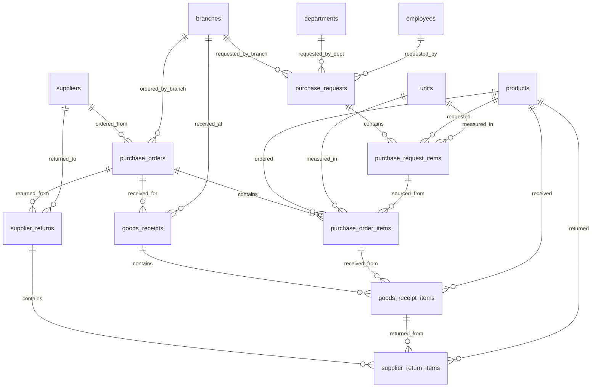
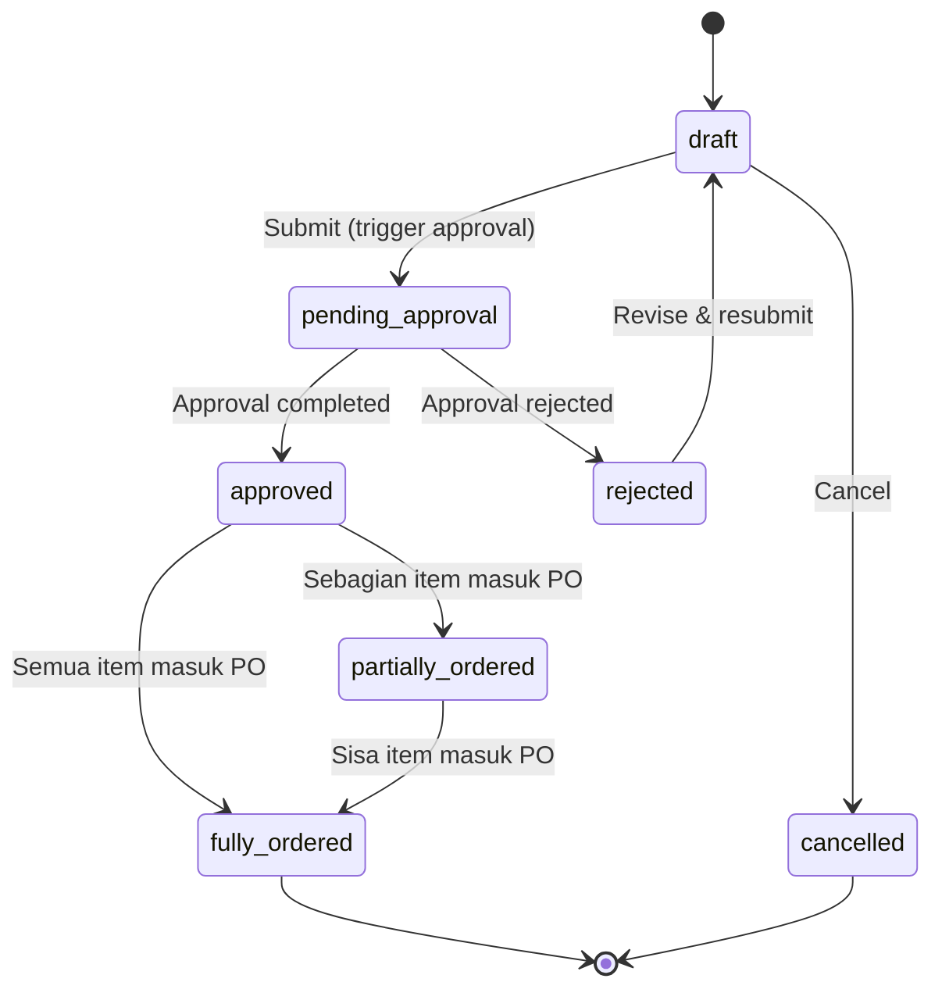
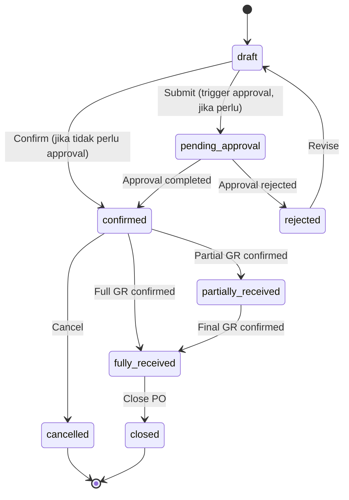

# Desain Database: Purchasing (Pembelian)

Dokumen ini menjelaskan struktur database untuk modul Purchasing dalam sistem ERP. Mencakup alur lengkap pembelian: Purchase Request (PR), Purchase Order (PO), Goods Receipt (Penerimaan Barang), serta Return to Supplier.

## 1. Gambaran Umum

### Filosofi Desain

Modul Purchasing mengikuti alur standar procurement: Request → Order → Receipt → (optional) Return. Setiap tahap memiliki dokumen tersendiri dengan header-detail pattern. Modul ini terintegrasi dengan Pipeline System untuk lifecycle management dan Approval System untuk proses persetujuan.

### Alur Proses Pembelian

```
Purchase Request (PR)  →  Purchase Order (PO)  →  Goods Receipt (GR)
   [permintaan]            [pesanan ke supplier]     [penerimaan barang]
```

### Hubungan dengan Modul Lain

| Modul | Referensi Desain | Hubungan |
| :--- | :--- | :--- |
| **Pipeline** | `10_pipeline_design.md` | PR & PO lifecycle dikelola oleh pipeline |
| **Approval** | `11_approval_design.md` | PR & PO memerlukan approval sebelum diproses |
| **Products** | `00_products_design.md` | Produk yang dibeli & update stok |
| **Chart of Accounts** | `01_chart_of_accounts_design.md` | Posting AP dan inventory ke jurnal |

### Komponen Utama
*   **Purchase Request (PR)**: Permintaan pembelian internal dari departemen/cabang. Membutuhkan approval sebelum dikonversi menjadi PO.
*   **Purchase Order (PO)**: Pesanan resmi ke supplier. Satu PR bisa menjadi satu atau lebih PO (split). Satu PO juga bisa menggabungkan item dari beberapa PR.
*   **Goods Receipt (GR)**: Penerimaan barang dari supplier berdasarkan PO. Satu PO bisa diterima bertahap (partial receipt).
*   **Return to Supplier**: Pengembalian barang ke supplier setelah GR (opsional, untuk barang cacat/salah kirim).

### Prinsip Desain
1.  **Header-Detail Pattern**: Setiap dokumen (PR, PO, GR, SR) menggunakan pola header + items untuk fleksibilitas.
2.  **Full Traceability**: Setiap item bisa dilacak dari PR → PO → GR → SR melalui FK chain.
3.  **Partial Processing**: PO bisa diterima bertahap, PR bisa dikonversi bertahap ke PO.
4.  **Cache Fields**: Field seperti `quantity_ordered`, `quantity_received`, `subtotal`, `grand_total` adalah cache yang dijaga konsistensinya oleh application logic.
5.  **No Hard Delete**: Dokumen purchasing **tidak boleh di-delete**. Gunakan status `cancelled` untuk pembatalan, menjaga integritas audit trail.

### Integrasi dengan Master Data yang Sudah Ada
*   **Supplier**: `suppliers` (penyedia barang/jasa).
*   **Produk**: `products`, `units` (barang yang dibeli).
*   **Stok**: `product_stocks` (update stok saat GR).
*   **Organisasi**: `branches`, `departments`, `employees`.
*   **Akuntansi**: `accounts`, `journal_entries`, `journal_entry_lines` (posting AP & stok).

---

## 2. Diagram Hubungan Entitas (ERD)



---

## 3. Detail Tabel

### A. Purchase Request (Permintaan Pembelian)

#### 1. `purchase_requests`
Header dokumen permintaan pembelian internal.

| Kolom | Tipe Data | Keterangan |
| :--- | :--- | :--- |
| `id` | BigInt | Primary Key |
| `pr_number` | String | Nomor PR (unique), generated, mis. PR-2026-000001 |
| `branch_id` | BigInt | FK -> `branches` (cabang peminta) |
| `department_id` | BigInt | FK -> `departments` (nullable, departemen peminta) |
| `requested_by` | BigInt | FK -> `employees` (pembuat permintaan) |
| `request_date` | Date | Tanggal permintaan |
| `required_date` | Date | Tanggal kebutuhan diharapkan (nullable) |
| `priority` | Enum | `low`, `normal`, `high`, `urgent` (default: `normal`) |
| `status` | Enum | `draft`, `pending_approval`, `approved`, `rejected`, `partially_ordered`, `fully_ordered`, `cancelled` |
| `estimated_amount` | Decimal(15,2) | Total estimasi biaya PR — cache dari SUM(items.estimated_total) (nullable) |
| `notes` | Text | Catatan (nullable) |
| `approved_by` | BigInt | FK -> `users` (nullable, yang menyetujui) |
| `approved_at` | Timestamp | Waktu persetujuan (nullable) |
| `rejection_reason` | Text | Alasan penolakan (nullable) |
| `created_by` | BigInt | FK -> `users` (nullable) |
| `created_at` | Timestamp | |
| `updated_at` | Timestamp | |

**Index (disarankan):** `pr_number` (unique), `status`, `branch_id`, `request_date`

#### 2. `purchase_request_items`
Detail item yang diminta pada PR.

| Kolom | Tipe Data | Keterangan |
| :--- | :--- | :--- |
| `id` | BigInt | Primary Key |
| `purchase_request_id` | BigInt | FK -> `purchase_requests` |
| `product_id` | BigInt | FK -> `products` |
| `unit_id` | BigInt | FK -> `units` |
| `quantity` | Decimal(15,2) | Jumlah yang diminta |
| `quantity_ordered` | Decimal(15,2) | Jumlah yang sudah masuk PO (cache, default 0) |
| `estimated_unit_price` | Decimal(15,2) | Estimasi harga satuan (nullable) |
| `estimated_total` | Decimal(15,2) | quantity × estimated_unit_price (cache, nullable) |
| `notes` | Text | Catatan per item (nullable) |
| `created_at` | Timestamp | |
| `updated_at` | Timestamp | |

**Unique Constraint (disarankan):** `(purchase_request_id, product_id)`

> [!NOTE]
> `quantity_ordered` adalah field cache yang dihitung dari total `purchase_order_items` yang mereferensi item ini. Berguna untuk mendeteksi apakah PR sudah fully ordered atau partially ordered.

> [!IMPORTANT]
> Relasi `purchase_order_items.purchase_request_item_id` adalah **Many-to-One**: beberapa PO items bisa mereferensi satu PR item (split order scenario). Invariant yang harus dijaga:
> ```
> SUM(poi.quantity) WHERE poi.purchase_request_item_id = X
>   MUST EQUAL purchase_request_items[X].quantity_ordered
> ```

---

### B. Purchase Order (Pesanan Pembelian)

#### 3. `purchase_orders`
Header dokumen pesanan pembelian ke supplier.

| Kolom | Tipe Data | Keterangan |
| :--- | :--- | :--- |
| `id` | BigInt | Primary Key |
| `po_number` | String | Nomor PO (unique), generated, mis. PO-2026-000001 |
| `supplier_id` | BigInt | FK -> `suppliers` |
| `branch_id` | BigInt | FK -> `branches` (cabang tujuan penerimaan) |
| `order_date` | Date | Tanggal PO |
| `expected_delivery_date` | Date | Tanggal perkiraan terima (nullable) |
| `payment_terms` | String | Syarat pembayaran (nullable, mis. "Net 30") |
| `currency` | String(3) | ISO currency (default: IDR) |
| `subtotal` | Decimal(15,2) | Total sebelum pajak (cache) |
| `tax_amount` | Decimal(15,2) | Total pajak (cache, default 0) |
| `discount_amount` | Decimal(15,2) | Total diskon (cache, default 0) |
| `grand_total` | Decimal(15,2) | Total keseluruhan (cache) |
| `status` | Enum | `draft`, `pending_approval`, `confirmed`, `rejected`, `partially_received`, `fully_received`, `cancelled`, `closed` |
| `notes` | Text | Catatan (nullable) |
| `shipping_address` | Text | Alamat pengiriman (nullable) |
| `approved_by` | BigInt | FK -> `users` (nullable) |
| `approved_at` | Timestamp | (nullable) |
| `created_by` | BigInt | FK -> `users` (nullable) |
| `created_at` | Timestamp | |
| `updated_at` | Timestamp | |

**Index (disarankan):** `po_number` (unique), `status`, `supplier_id`, `branch_id`, `order_date`

#### 4. `purchase_order_items`
Detail item yang dipesan pada PO.

| Kolom | Tipe Data | Keterangan |
| :--- | :--- | :--- |
| `id` | BigInt | Primary Key |
| `purchase_order_id` | BigInt | FK -> `purchase_orders` |
| `purchase_request_item_id` | BigInt | FK -> `purchase_request_items` (nullable, traceability ke PR) |
| `product_id` | BigInt | FK -> `products` |
| `unit_id` | BigInt | FK -> `units` |
| `quantity` | Decimal(15,2) | Jumlah yang dipesan |
| `quantity_received` | Decimal(15,2) | Jumlah yang sudah diterima (cache, default 0) |
| `unit_price` | Decimal(15,2) | Harga satuan |
| `discount_percent` | Decimal(5,2) | Diskon per item (%, default 0) |
| `tax_percent` | Decimal(5,2) | Pajak per item (%, default 0) |
| `line_total` | Decimal(15,2) | Subtotal baris (cache) |
| `notes` | Text | Catatan per item (nullable) |
| `created_at` | Timestamp | |
| `updated_at` | Timestamp | |

**Index (disarankan):** `purchase_order_id`, `product_id`

> [!NOTE]
> `quantity_received` diupdate setiap kali Goods Receipt diproses. Saat `quantity_received >= quantity` untuk semua item, status PO berubah ke `fully_received`.

---

### C. Goods Receipt (Penerimaan Barang)

#### 5. `goods_receipts`
Header dokumen penerimaan barang dari supplier.

| Kolom | Tipe Data | Keterangan |
| :--- | :--- | :--- |
| `id` | BigInt | Primary Key |
| `gr_number` | String | Nomor GR (unique), generated, mis. GR-2026-000001 |
| `purchase_order_id` | BigInt | FK -> `purchase_orders` |
| `branch_id` | BigInt | FK -> `branches` (cabang penerimaan) |
| `receipt_date` | Date | Tanggal penerimaan |
| `supplier_delivery_note` | String | Nomor surat jalan supplier (nullable) |
| `status` | Enum | `draft`, `confirmed`, `cancelled` |
| `notes` | Text | Catatan (nullable) |
| `received_by` | BigInt | FK -> `employees` (nullable, petugas penerimaan) |
| `confirmed_by` | BigInt | FK -> `users` (nullable) |
| `confirmed_at` | Timestamp | (nullable) |
| `created_by` | BigInt | FK -> `users` (nullable) |
| `created_at` | Timestamp | |
| `updated_at` | Timestamp | |

**Index (disarankan):** `gr_number` (unique), `purchase_order_id`, `branch_id`, `receipt_date`

#### 6. `goods_receipt_items`
Detail item yang diterima pada GR.

| Kolom | Tipe Data | Keterangan |
| :--- | :--- | :--- |
| `id` | BigInt | Primary Key |
| `goods_receipt_id` | BigInt | FK -> `goods_receipts` |
| `purchase_order_item_id` | BigInt | FK -> `purchase_order_items` (traceability ke PO item) |
| `product_id` | BigInt | FK -> `products` |
| `unit_id` | BigInt | FK -> `units` (nullable, default: unit dari PO item) |
| `quantity_received` | Decimal(15,2) | Jumlah yang diterima |
| `quantity_accepted` | Decimal(15,2) | Jumlah yang lolos QC / diterima baik |
| `quantity_rejected` | Decimal(15,2) | Jumlah yang ditolak / rusak (default 0) |
| `unit_price` | Decimal(15,2) | Harga satuan (dari PO, bisa override jika beda) |
| `notes` | Text | Catatan per item (nullable, mis. alasan reject) |
| `created_at` | Timestamp | |
| `updated_at` | Timestamp | |

**Unique Constraint (disarankan):** `(goods_receipt_id, purchase_order_item_id)`

> [!IMPORTANT]
> Saat GR di-confirm:
> 1. Update `purchase_order_items.quantity_received` += `quantity_accepted`.
> 2. Update `product_stocks.quantity_on_hand` += `quantity_accepted` untuk **branch di `goods_receipts.branch_id`** (bukan `purchase_orders.branch_id`, karena bisa berbeda).
> 3. Hitung ulang `product_stocks.average_cost` berdasarkan weighted average.
> 4. Evaluasi status PO: jika semua item PO sudah fully received → `fully_received`, jika sebagian → `partially_received`.

---

### D. Return to Supplier (Pengembalian ke Supplier)

#### 7. `supplier_returns`
Header dokumen retur barang ke supplier.

| Kolom | Tipe Data | Keterangan |
| :--- | :--- | :--- |
| `id` | BigInt | Primary Key |
| `return_number` | String | Nomor retur (unique), generated, mis. SR-2026-000001 |
| `purchase_order_id` | BigInt | FK -> `purchase_orders` |
| `goods_receipt_id` | BigInt | FK -> `goods_receipts` (nullable, untuk traceability langsung ke GR) |
| `supplier_id` | BigInt | FK -> `suppliers` |
| `branch_id` | BigInt | FK -> `branches` |
| `return_date` | Date | Tanggal retur |
| `reason` | Enum | `defective`, `wrong_item`, `excess_quantity`, `damaged`, `other` |
| `status` | Enum | `draft`, `confirmed`, `cancelled` |
| `notes` | Text | Catatan (nullable) |
| `created_by` | BigInt | FK -> `users` (nullable) |
| `created_at` | Timestamp | |
| `updated_at` | Timestamp | |

**Index (disarankan):** `return_number` (unique), `purchase_order_id`, `goods_receipt_id`, `supplier_id`, `return_date`

#### 8. `supplier_return_items`
Detail item yang dikembalikan.

| Kolom | Tipe Data | Keterangan |
| :--- | :--- | :--- |
| `id` | BigInt | Primary Key |
| `supplier_return_id` | BigInt | FK -> `supplier_returns` |
| `goods_receipt_item_id` | BigInt | FK -> `goods_receipt_items` (traceability ke GR item) |
| `product_id` | BigInt | FK -> `products` |
| `unit_id` | BigInt | FK -> `units` (nullable, default: unit dari GR item) |
| `quantity_returned` | Decimal(15,2) | Jumlah yang diretur |
| `unit_price` | Decimal(15,2) | Harga satuan (referensi dari GR) |
| `notes` | Text | Catatan (nullable) |
| `created_at` | Timestamp | |
| `updated_at` | Timestamp | |

**Unique Constraint (disarankan):** `(supplier_return_id, goods_receipt_item_id)`

> [!NOTE]
> Saat Supplier Return di-confirm:
> 1. Kurangi `product_stocks.quantity_on_hand` -= `quantity_returned`.
> 2. Hitung ulang `product_stocks.average_cost` jika diperlukan.

---

## 4. Aturan Bisnis (Ringkas)

### Status Purchase Request
*   `draft`: PR baru dibuat, belum diajukan.
*   `pending_approval`: PR sudah diajukan, menunggu persetujuan.
*   `approved`: PR disetujui, siap dikonversi ke PO.
*   `rejected`: PR ditolak (lihat `rejection_reason`).
*   `partially_ordered`: Sebagian item PR sudah masuk PO.
*   `fully_ordered`: Semua item PR sudah masuk PO.
*   `cancelled`: PR dibatalkan.

### Status Purchase Order
*   `draft`: PO baru dibuat, belum dikonfirmasi ke supplier.
*   `pending_approval`: PO diajukan, menunggu persetujuan (jika diperlukan).
*   `confirmed`: PO sudah dikonfirmasi/dikirim ke supplier.
*   `rejected`: PO ditolak (jika melalui approval).
*   `partially_received`: Sebagian barang sudah diterima (GR).
*   `fully_received`: Semua barang sudah diterima.
*   `cancelled`: PO dibatalkan.
*   `closed`: PO ditutup secara manual (mis. sisa quantity tidak akan dipesan lagi).

### Status Goods Receipt
*   `draft`: GR baru dibuat, belum dikonfirmasi.
*   `confirmed`: GR dikonfirmasi → stok terupdate.
*   `cancelled`: GR dibatalkan (harus reverse stok jika sebelumnya sudah confirmed).

### Nomor Dokumen (Auto-Generate)
Format penomoran otomatis:
*   PR: `PR-{YYYY}-{seq:6}` → PR-2026-000001
*   PO: `PO-{YYYY}-{seq:6}` → PO-2026-000001
*   GR: `GR-{YYYY}-{seq:6}` → GR-2026-000001
*   SR: `SR-{YYYY}-{seq:6}` → SR-2026-000001

Disarankan menggunakan tabel `document_sequences` untuk mengelola auto-increment per prefix per tahun:

| Kolom | Tipe Data | Keterangan |
| :--- | :--- | :--- |
| `id` | BigInt | Primary Key |
| `prefix` | String | Prefix dokumen (mis. `PR`, `PO`, `GR`, `SR`) |
| `year` | Integer | Tahun (mis. 2026) |
| `last_number` | Integer | Nomor terakhir yang digunakan (default: 0) |
| `created_at` | Timestamp | |
| `updated_at` | Timestamp | |

**Unique Constraint:** `(prefix, year)`

> [!NOTE]
> Saat membuat dokumen baru, increment `last_number` secara atomik (menggunakan `DB::transaction` + `lockForUpdate`) untuk menghindari duplikasi nomor di lingkungan concurrent.

### Perhitungan Harga PO Item
```
line_total = quantity × unit_price × (1 - discount_percent/100) × (1 + tax_percent/100)
```

### Update Stok (Average Cost)
Saat Goods Receipt di-confirm, average cost dihitung ulang:
```
new_avg_cost = (old_qty × old_avg_cost + received_qty × unit_price) / (old_qty + received_qty)
```

---

## 5. Rekomendasi Menu & Tabel Terlibat

### A. Purchasing — Transaksi

#### 1) Purchase Requests
Tujuan: membuat dan mengelola permintaan pembelian internal.

Jenis menu: Complex CRUD
Agent skill: `feature-crud-complex`

Tabel terlibat:
* `purchase_requests`
* `purchase_request_items`
* `products`
* `units`
* `branches`
* `departments`
* `employees`
* `users` (kolom `created_by`, `approved_by`)

Fitur khusus:
* Approval workflow (submit → approve/reject).
* Konversi PR ke PO (pilih item → generate PO draft).
* Filter: status, branch, department, date range, priority.

#### 2) Purchase Orders
Tujuan: membuat dan mengelola pesanan pembelian ke supplier.

Jenis menu: Complex CRUD
Agent skill: `feature-crud-complex`

Tabel terlibat:
* `purchase_orders`
* `purchase_order_items`
* `purchase_request_items` (referensi asal PR)
* `products`
* `units`
* `suppliers`
* `branches`
* `users` (kolom `created_by`, `approved_by`)

Fitur khusus:
* Bisa dibuat langsung atau dari PR.
* Tracking progress penerimaan per item.
* Print/export PO.
* Filter: status, supplier, branch, date range.

#### 3) Goods Receipts
Tujuan: mencatat penerimaan barang dari supplier berdasarkan PO.

Jenis menu: Complex CRUD
Agent skill: `feature-crud-complex`

Tabel terlibat:
* `goods_receipts`
* `goods_receipt_items`
* `purchase_orders` (referensi PO)
* `purchase_order_items`
* `products`
* `product_stocks` (update stok)
* `branches`
* `employees` (kolom `received_by`)
* `users` (kolom `created_by`, `confirmed_by`)

Fitur khusus:
* Partial receipt (terima sebagian item PO).
* QC check (quantity accepted vs rejected).
* Auto-update stok saat confirm.
* Filter: status, PO number, branch, date range.

#### 4) Supplier Returns
Tujuan: mengelola pengembalian barang ke supplier.

Jenis menu: Complex CRUD
Agent skill: `feature-crud-complex`

Tabel terlibat:
* `supplier_returns`
* `supplier_return_items`
* `goods_receipts` (referensi GR)
* `goods_receipt_items`
* `purchase_orders`
* `products`
* `product_stocks` (update stok)
* `suppliers`
* `branches`
* `users` (kolom `created_by`)

Fitur khusus:
* Pilih item dari GR yang sudah confirmed.
* Auto-reverse stok saat confirm.
* Filter: status, supplier, reason, date range.

---

### B. Purchasing — Laporan (Opsional tapi umum)

#### 5) Purchase Order Status Report
Tujuan: monitoring status PO (outstanding, partially received, closed).

Jenis menu: Non-CRUD
Agent skill: `feature-non-crud`

Tabel terlibat:
* `purchase_orders`, `purchase_order_items`
* `suppliers`
* `branches`
* `products`

#### 6) Purchase History Report
Tujuan: riwayat pembelian per supplier / per produk / per periode.

Jenis menu: Non-CRUD
Agent skill: `feature-non-crud`

Tabel terlibat:
* `purchase_orders`, `purchase_order_items`
* `goods_receipts`, `goods_receipt_items`
* `suppliers`
* `products`

#### 7) Goods Receipt Report
Tujuan: daftar penerimaan barang per periode, per supplier, per branch.

Jenis menu: Non-CRUD
Agent skill: `feature-non-crud`

Tabel terlibat:
* `goods_receipts`, `goods_receipt_items`
* `purchase_orders`
* `suppliers`
* `products`
* `branches`

---

## 6. Integrasi Akuntansi

> [!WARNING]
> **Decision Required**: Apakah modul Purchasing akan langsung memposting jurnal akuntansi (AP entry) saat GR confirmed, atau ini ditunda ke fase berikutnya? Keputusan ini mempengaruhi apakah kolom `journal_entry_id` disertakan di migration awal atau ditambahkan nanti.

Saat siap diintegrasikan dengan modul akuntansi, berikut posting jurnal yang umum:

### Saat Goods Receipt Confirmed
| Akun | Debit | Kredit |
| :--- | :--- | :--- |
| Inventory / Stock (Persediaan) | ✓ | |
| Accounts Payable (Hutang Dagang) | | ✓ |

### Saat Supplier Return Confirmed
| Akun | Debit | Kredit |
| :--- | :--- | :--- |
| Accounts Payable (Hutang Dagang) | ✓ | |
| Inventory / Stock (Persediaan) | | ✓ |

> [!TIP]
> Untuk integrasi akuntansi, tambahkan kolom `journal_entry_id` (FK -> `journal_entries`, nullable) pada tabel `goods_receipts` dan `supplier_returns` saat modul akuntansi pembelian diaktifkan.

---

## 7. Integrasi dengan Pipeline & Approval System

Modul Purchasing terintegrasi dengan Pipeline System (`10_pipeline_design.md`) untuk lifecycle management dan Approval System (`11_approval_design.md`) untuk proses persetujuan.

### Purchase Request Lifecycle (via Pipeline)



**Pipeline:** `pr_lifecycle`
- entity_type: `App\Models\PurchaseRequest`
- Transisi `Submit` men-trigger `trigger_approval` action dengan `approval_flow_code` yang sesuai berdasarkan nilai PR.
- Transisi `approved → partially_ordered` dan `partially_ordered → fully_ordered` dikontrol otomatis saat PO dibuat dari PR items.

### Purchase Order Lifecycle (via Pipeline)



**Pipeline:** `po_lifecycle`
- entity_type: `App\Models\PurchaseOrder`
- Transisi `confirmed → partially_received → fully_received` dikontrol oleh Goods Receipt processing, bukan user manual.
- Approval hanya diperlukan untuk PO bernilai tinggi (ditentukan oleh `conditions` di `approval_flows`).

### Hubungan Antar Dokumen & Pipeline

| Aksi User | Pipeline PR | Pipeline PO | Approval |
| :--- | :--- | :--- | :--- |
| Submit PR | `draft → pending_approval` | — | Flow PR aktif |
| Approve PR | `pending_approval → approved` | — | Callback |
| Create PO from PR | Auto-update `partially_ordered` / `fully_ordered` | `draft` (PO baru) | — |
| Submit PO | — | `draft → pending_approval` | Flow PO aktif (jika perlu) |
| Confirm GR | — | Auto-update `partially_received` / `fully_received` | — |

> [!NOTE]
> Dokumen purchasing **tidak boleh** di-delete. Gunakan status `cancelled` untuk membatalkan. Ini menjaga integritas audit trail di Pipeline State Logs dan Approval Audit Logs.
