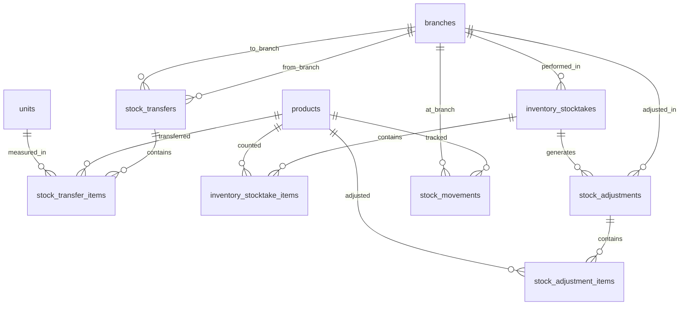
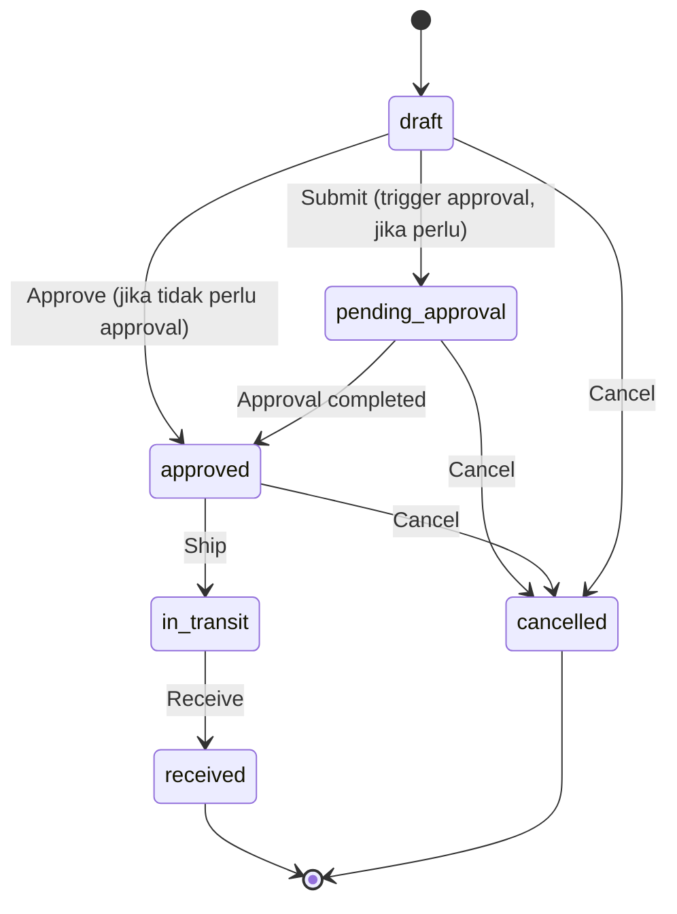
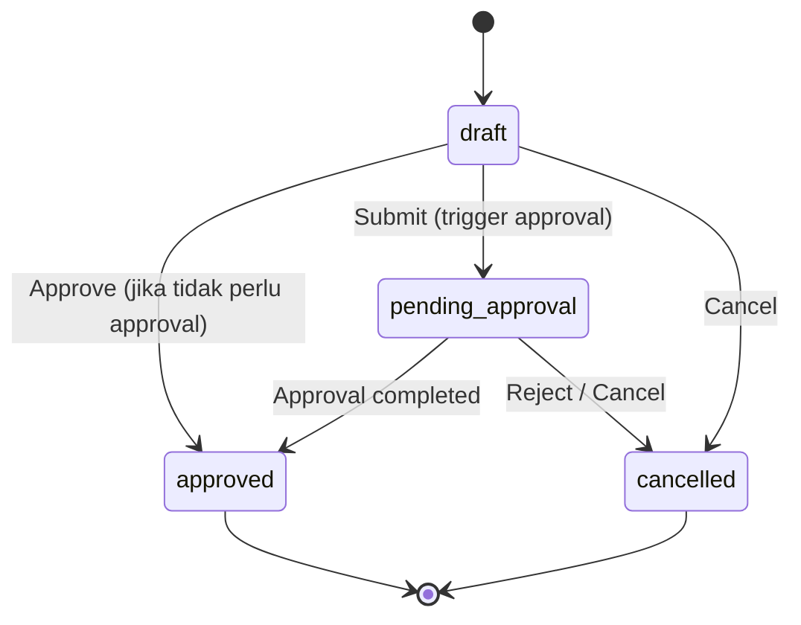
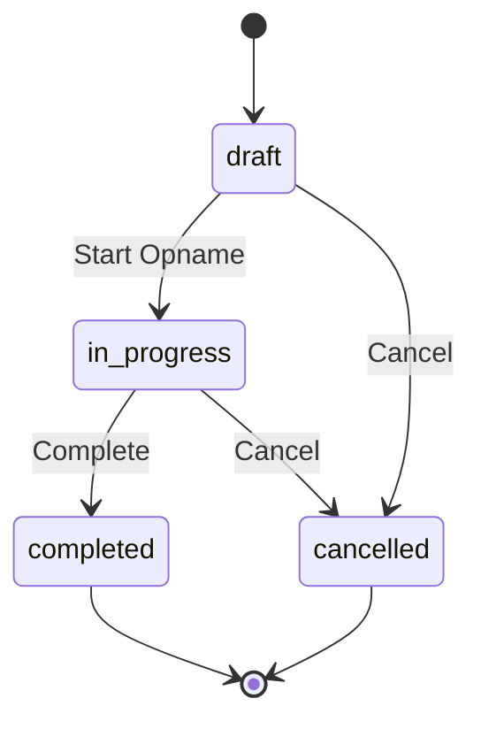

# Desain Database: Inventory (Persediaan)

Dokumen ini menjelaskan struktur database untuk modul Inventory (Persediaan) dalam sistem ERP. Fokus utama: transfer antar gudang/cabang, stock opname (inventarisasi fisik), penyesuaian stok, dan audit trail pergerakan stok.

## 1. Gambaran Umum

### Filosofi Desain

Modul Inventory melengkapi infrastruktur stok yang sudah ada di `product_stocks` (`00_products_design_v2.md`) dengan menambahkan **operasi gudang** — transfer, opname, dan adjustment. Setiap pergerakan stok (masuk/keluar) dicatat di `stock_movements` sebagai **kartu stok digital** yang menyediakan audit trail lengkap dan memungkinkan rekonsiliasi historis.

> [!IMPORTANT]
> Dokumen ini **tidak menduplikasi** desain yang sudah ada. Tabel `products`, `product_stocks`, `product_categories`, dan `units` sudah didefinisikan di `00_products_design_v2.md`. Tabel `goods_receipts` dan `supplier_returns` sudah didefinisikan di `13_purchasing_design.md`. Dokumen ini hanya menambahkan tabel baru untuk operasi gudang dan audit trail stok.

### Perbedaan dengan Manajemen Aset

| Aspek | **Inventory (Persediaan)** | **Asset Management (Aset Tetap)** |
| :--- | :--- | :--- |
| **Apa yang dikelola** | Barang habis pakai / dijual (stok) | Barang bernilai tinggi & tahan lama (aset tetap) |
| **Unit tracking** | **Kuantitas total** per lokasi (`quantity_on_hand = 150`) | **Per unit individual** (tiap aset punya kode unik) |
| **Contoh** | Kertas A4, tinta, laptop untuk dijual kembali | Laptop kantor (aset perusahaan), mobil dinas, mesin |
| **Tabel utama** | `products` + `product_stocks` | `assets` |
| **Lokasi** | Per `branch` (cabang/gudang) | Per `branch` + `asset_location` (hierarki) |
| **Pergerakan** | Transfer kuantitas batch antar cabang | Movement unit individual + audit trail |
| **Penilaian** | Average cost (weighted average) | Nilai perolehan + depresiasi (book value) |
| **Depresiasi** | ❌ Tidak ada | ✅ Straight line / declining balance |
| **Stocktake** | Hitung **kuantitas** (counted vs system) | Cek **keberadaan per unit** (found/missing/damaged) |
| **Tujuan akhir** | **Dijual** atau **dikonsumsi** | **Dipakai** untuk operasional, akhirnya di-dispose |
| **Impact akuntansi** | COGS, inventory valuation | Depreciation expense, accumulated depreciation |

### Komponen Utama
*   **Transfer Antar Gudang**: Pemindahan stok produk antar cabang/gudang dengan dokumen transfer.
*   **Stock Opname (Inventarisasi)**: Proses penghitungan fisik stok untuk validasi kesesuaian data sistem dengan kondisi aktual.
*   **Penyesuaian Stok**: Koreksi stok manual karena kerusakan, expired, shrinkage, atau hasil stock opname.
*   **Kartu Stok (Stock Movement)**: Audit trail setiap pergerakan stok (masuk/keluar) per produk per cabang.

### Hubungan dengan Modul Lain

| Modul | Referensi Desain | Hubungan |
| :--- | :--- | :--- |
| **Products** | `00_products_design_v2.md` | Master produk & stok per cabang (`product_stocks`) |
| **Purchasing** | `13_purchasing_design.md` | Goods Receipt menambah stok, Supplier Return mengurangi stok |
| **Pipeline** | `10_pipeline_design.md` | Stock transfer lifecycle dikelola oleh pipeline |
| **Approval** | `11_approval_design.md` | Transfer bernilai tinggi & adjustment memerlukan approval |
| **Chart of Accounts** | `01_chart_of_accounts_design.md` | Adjustment & transfer diposting sebagai jurnal |

### Integrasi dengan Master Data yang Sudah Ada
*   **Produk**: `products`, `product_categories`, `units` — produk yang dikelola stoknya.
*   **Stok**: `product_stocks` — stok per cabang (sudah ada, digunakan langsung).
*   **Cabang**: `branches` — lokasi gudang/cabang.
*   **Organisasi**: `departments`, `employees` — penanggung jawab operasi gudang.
*   **Purchasing**: `goods_receipts`, `goods_receipt_items` — source stok masuk (GR).
*   **Supplier Return**: `supplier_returns`, `supplier_return_items` — source stok keluar (retur).
*   **Akuntansi**: `accounts`, `journal_entries`, `journal_entry_lines` — posting jurnal inventory.

### Prinsip Desain
1.  **Header-Detail Pattern**: Setiap dokumen (transfer, stocktake, adjustment) menggunakan pola header + items.
2.  **Complete Audit Trail**: Setiap pergerakan stok dicatat di `stock_movements` dengan reference polymorphic ke dokumen sumber.
3.  **Multi-Branch**: Stok dikelola per cabang melalui `product_stocks` (sudah ada), transfer memindahkan kuantitas antar branch.
4.  **No Hard Delete**: Dokumen inventory **tidak boleh di-delete**. Gunakan status `cancelled` untuk pembatalan.
5.  **Cached Balance**: `product_stocks.quantity_on_hand` adalah cache yang dijaga konsistensinya oleh setiap operasi inventory.
6.  **Accounting Ready**: Adjustment dan transfer siap diposting ke jurnal akuntansi.

---

## 2. Diagram Hubungan Entitas (ERD)



> [!NOTE]
> Tabel `stock_movements` memiliki kolom polymorphic (`reference_type`, `reference_id`) yang menghubungkan ke tabel dokumen sumber manapun (`goods_receipts`, `stock_transfers`, `stock_adjustments`, `production_orders`, dll.). Hal ini tidak digambarkan di ERD karena keterbatasan notasi.

---

## 3. Detail Tabel

### A. Transfer Antar Gudang

#### 1. `stock_transfers`
Header dokumen transfer stok antar cabang/gudang.

| Kolom | Tipe Data | Keterangan |
| :--- | :--- | :--- |
| `id` | BigInt | Primary Key |
| `transfer_number` | String | Nomor transfer (unique), generated, mis. ST-2026-000001 |
| `from_branch_id` | BigInt | FK -> `branches` (cabang asal) |
| `to_branch_id` | BigInt | FK -> `branches` (cabang tujuan) |
| `transfer_date` | Date | Tanggal transfer |
| `expected_arrival_date` | Date | Tanggal perkiraan tiba (nullable) |
| `status` | Enum | `draft`, `pending_approval`, `approved`, `in_transit`, `received`, `cancelled` |
| `notes` | Text | Catatan (nullable) |
| `requested_by` | BigInt | FK -> `employees` (nullable, yang meminta transfer) |
| `approved_by` | BigInt | FK -> `users` (nullable) |
| `approved_at` | Timestamp | (nullable) |
| `shipped_by` | BigInt | FK -> `users` (nullable, yang mengirim) |
| `shipped_at` | Timestamp | (nullable) |
| `received_by` | BigInt | FK -> `users` (nullable, yang menerima) |
| `received_at` | Timestamp | (nullable) |
| `created_by` | BigInt | FK -> `users` (nullable) |
| `created_at` | Timestamp | |
| `updated_at` | Timestamp | |

**Index (disarankan):** `transfer_number` (unique), `status`, `from_branch_id`, `to_branch_id`, `transfer_date`

##### Penjelasan Status

| Status | Penjelasan |
| :--- | :--- |
| **`draft`** | Dokumen transfer baru dibuat, belum diajukan. |
| **`pending_approval`** | Transfer diajukan, menunggu persetujuan (jika diperlukan). |
| **`approved`** | Transfer disetujui, siap dikirim. |
| **`in_transit`** | Barang sudah dikirim dari cabang asal, belum diterima di cabang tujuan. |
| **`received`** | Barang sudah diterima di cabang tujuan. Transfer selesai. |
| **`cancelled`** | Transfer dibatalkan. |

> [!IMPORTANT]
> Saat status berubah ke `in_transit`:
> - Stok di cabang asal (`from_branch_id`) di-kurangi: `product_stocks.quantity_on_hand -= quantity`.
> - Stock movement `transfer_out` dicatat di cabang asal.
>
> Saat status berubah ke `received`:
> - Stok di cabang tujuan (`to_branch_id`) di-tambah: `product_stocks.quantity_on_hand += quantity`.
> - Average cost di cabang tujuan dihitung ulang menggunakan weighted average.
> - Stock movement `transfer_in` dicatat di cabang tujuan.

#### 2. `stock_transfer_items`
Detail item yang ditransfer.

| Kolom | Tipe Data | Keterangan |
| :--- | :--- | :--- |
| `id` | BigInt | Primary Key |
| `stock_transfer_id` | BigInt | FK -> `stock_transfers` |
| `product_id` | BigInt | FK -> `products` |
| `unit_id` | BigInt | FK -> `units` |
| `quantity` | Decimal(15,2) | Jumlah yang ditransfer |
| `quantity_received` | Decimal(15,2) | Jumlah yang diterima di tujuan (default 0) |
| `unit_cost` | Decimal(15,2) | Biaya satuan saat transfer (dari average cost cabang asal) |
| `notes` | Text | Catatan per item (nullable) |
| `created_at` | Timestamp | |
| `updated_at` | Timestamp | |

**Unique Constraint (disarankan):** `(stock_transfer_id, product_id)`

> [!NOTE]
> `quantity_received` memungkinkan penerimaan parsial. Jika `quantity_received < quantity`, selisih dicatat sebagai stock variance (hilang dalam perjalanan) dan bisa di-follow up dengan `stock_adjustment`.

---

### B. Stock Opname (Inventarisasi)

#### 3. `inventory_stocktakes`
Dokumen stock opname per cabang/per periode. Digunakan untuk menghitung fisik stok dan membandingkan dengan data sistem.

| Kolom | Tipe Data | Keterangan |
| :--- | :--- | :--- |
| `id` | BigInt | Primary Key |
| `stocktake_number` | String | Nomor dokumen (unique), generated, mis. SO-2026-000001 |
| `branch_id` | BigInt | FK -> `branches` |
| `stocktake_date` | Date | Tanggal pelaksanaan opname |
| `status` | Enum | `draft`, `in_progress`, `completed`, `cancelled` |
| `product_category_id` | BigInt | FK -> `product_categories` (nullable, scope per kategori) |
| `notes` | Text | Catatan (nullable) |
| `created_by` | BigInt | FK -> `users` (nullable) |
| `completed_by` | BigInt | FK -> `users` (nullable) |
| `completed_at` | Timestamp | (nullable) |
| `created_at` | Timestamp | |
| `updated_at` | Timestamp | |

**Index (disarankan):** `stocktake_number` (unique), `branch_id`, `status`, `stocktake_date`

##### Penjelasan Status

| Status | Penjelasan |
| :--- | :--- |
| **`draft`** | Dokumen opname baru dibuat. Sistem belum mengisi item. |
| **`in_progress`** | Opname sedang berjalan. Sistem mengisi `inventory_stocktake_items` berdasarkan `product_stocks` di branch ini. Petugas mengisi `counted_quantity`. |
| **`completed`** | Opname selesai. Variance dihitung. Bisa generate `stock_adjustment` otomatis. |
| **`cancelled`** | Opname dibatalkan. |

> [!TIP]
> Kolom `product_category_id` opsional. Jika diisi, opname hanya mencakup produk dalam kategori tersebut. Jika NULL, opname mencakup seluruh produk di branch. Ini berguna untuk opname parsial (mis. opname mingguan untuk kategori "Fast-Moving Goods").

#### 4. `inventory_stocktake_items`
Hasil penghitungan fisik per produk pada stock opname.

| Kolom | Tipe Data | Keterangan |
| :--- | :--- | :--- |
| `id` | BigInt | Primary Key |
| `inventory_stocktake_id` | BigInt | FK -> `inventory_stocktakes` |
| `product_id` | BigInt | FK -> `products` |
| `unit_id` | BigInt | FK -> `units` |
| `system_quantity` | Decimal(15,2) | Stok menurut sistem (snapshot `quantity_on_hand` saat opname dimulai) |
| `counted_quantity` | Decimal(15,2) | Stok hasil hitung fisik (nullable, diisi oleh petugas) |
| `variance` | Decimal(15,2) | Selisih: `counted_quantity - system_quantity` (cache, nullable) |
| `result` | Enum | `match`, `surplus`, `deficit`, `uncounted` (cache) |
| `notes` | Text | Catatan per item (nullable, mis. alasan variance) |
| `counted_by` | BigInt | FK -> `users` (nullable, petugas yang menghitung) |
| `counted_at` | Timestamp | Waktu penghitungan (nullable) |
| `created_at` | Timestamp | |
| `updated_at` | Timestamp | |

**Unique Constraint (disarankan):** `(inventory_stocktake_id, product_id)`

**Index (disarankan):** `inventory_stocktake_id`, `product_id`, `result`

##### Penjelasan `result`

| Result | Penjelasan | Contoh |
| :--- | :--- | :--- |
| **`match`** | Stok fisik = stok sistem. Tidak ada selisih. | Sistem: 100, Hitung: 100. |
| **`surplus`** | Stok fisik > stok sistem. Ada kelebihan. | Sistem: 100, Hitung: 105. Variance: +5. |
| **`deficit`** | Stok fisik < stok sistem. Ada kekurangan. | Sistem: 100, Hitung: 95. Variance: -5. |
| **`uncounted`** | Belum dihitung (petugas belum mengisi `counted_quantity`). | — |

> [!NOTE]
> Saat stock opname selesai (`completed`) dan ditemukan variance, admin bisa membuat `stock_adjustment` otomatis dari hasil opname untuk mengoreksi data stok. Field `stock_adjustments.inventory_stocktake_id` menyimpan referensi ke opname yang men-generate adjustment.

---

### C. Penyesuaian Stok

#### 5. `stock_adjustments`
Header dokumen penyesuaian stok. Bisa dibuat manual atau otomatis dari hasil stock opname.

| Kolom | Tipe Data | Keterangan |
| :--- | :--- | :--- |
| `id` | BigInt | Primary Key |
| `adjustment_number` | String | Nomor adjustment (unique), generated, mis. SA-2026-000001 |
| `branch_id` | BigInt | FK -> `branches` |
| `adjustment_date` | Date | Tanggal penyesuaian |
| `adjustment_type` | Enum | `damage`, `expired`, `shrinkage`, `correction`, `stocktake_result`, `initial_stock`, `other` |
| `status` | Enum | `draft`, `pending_approval`, `approved`, `cancelled` |
| `inventory_stocktake_id` | BigInt | FK -> `inventory_stocktakes` (nullable, jika dari hasil opname) |
| `notes` | Text | Catatan (nullable) |
| `journal_entry_id` | BigInt | FK -> `journal_entries` (nullable, untuk posting akuntansi) |
| `approved_by` | BigInt | FK -> `users` (nullable) |
| `approved_at` | Timestamp | (nullable) |
| `created_by` | BigInt | FK -> `users` (nullable) |
| `created_at` | Timestamp | |
| `updated_at` | Timestamp | |

**Index (disarankan):** `adjustment_number` (unique), `branch_id`, `status`, `adjustment_type`, `adjustment_date`, `inventory_stocktake_id`

##### Penjelasan `adjustment_type`

| Tipe | Penjelasan | Contoh |
| :--- | :--- | :--- |
| **`damage`** | Barang rusak, tidak bisa dijual/dipakai lagi. | 10 unit botol pecah di gudang. |
| **`expired`** | Barang melewati tanggal kadaluarsa. | 50 unit obat expired. |
| **`shrinkage`** | Kehilangan stok tanpa sebab jelas (susut). | Selisih stok yang tidak bisa dijelaskan. |
| **`correction`** | Koreksi administratif (salah input, dll). | Salah input GR kemarin (harusnya 100, diinput 110). |
| **`stocktake_result`** | Penyesuaian otomatis dari hasil stock opname. | Opname menemukan selisih -5 unit. |
| **`initial_stock`** | Pengisian stok awal saat setup sistem. | Input saldo awal persediaan per gudang. |
| **`other`** | Alasan lainnya. | Donasi, sampel, dll. |

> [!IMPORTANT]
> Saat adjustment di-approve/confirm:
> 1. Update `product_stocks.quantity_on_hand` sesuai `quantity_adjusted` per item.
> 2. Hitung ulang `product_stocks.average_cost` jika diperlukan.
> 3. Catat `stock_movement` per item (type: `adjustment_in` atau `adjustment_out`).
> 4. (Opsional) Posting jurnal akuntansi — debit/kredit akun persediaan dan akun beban terkait.

#### 6. `stock_adjustment_items`
Detail item yang disesuaikan.

| Kolom | Tipe Data | Keterangan |
| :--- | :--- | :--- |
| `id` | BigInt | Primary Key |
| `stock_adjustment_id` | BigInt | FK -> `stock_adjustments` |
| `product_id` | BigInt | FK -> `products` |
| `unit_id` | BigInt | FK -> `units` |
| `quantity_before` | Decimal(15,2) | Stok sebelum adjustment (snapshot) |
| `quantity_adjusted` | Decimal(15,2) | Jumlah penyesuaian (positif = tambah stok, negatif = kurang stok) |
| `quantity_after` | Decimal(15,2) | Stok setelah adjustment (cache: `quantity_before + quantity_adjusted`) |
| `unit_cost` | Decimal(15,2) | Biaya satuan (dari `product_stocks.average_cost`) |
| `total_cost` | Decimal(15,2) | Total nilai adjustment: `abs(quantity_adjusted) × unit_cost` (cache) |
| `reason` | Text | Alasan penyesuaian per item (nullable) |
| `created_at` | Timestamp | |
| `updated_at` | Timestamp | |

**Unique Constraint (disarankan):** `(stock_adjustment_id, product_id)`

**Index (disarankan):** `stock_adjustment_id`, `product_id`

> [!TIP]
> `quantity_adjusted` menggunakan konvensi:
> - **Positif** (+) = menambah stok (surplus, correction up, initial stock).
> - **Negatif** (−) = mengurangi stok (damage, expired, shrinkage, correction down).

---

### D. Kartu Stok / Audit Trail

#### 7. `stock_movements`
Audit trail setiap pergerakan stok per produk per cabang. Berfungsi sebagai **kartu stok digital** yang mencatat semua transaksi masuk/keluar.

| Kolom | Tipe Data | Keterangan |
| :--- | :--- | :--- |
| `id` | BigInt | Primary Key |
| `product_id` | BigInt | FK -> `products` |
| `branch_id` | BigInt | FK -> `branches` |
| `movement_type` | Enum | `goods_receipt`, `supplier_return`, `transfer_out`, `transfer_in`, `adjustment_in`, `adjustment_out`, `production_consume`, `production_output`, `sales`, `sales_return` |
| `quantity_in` | Decimal(15,2) | Kuantitas masuk (default 0) |
| `quantity_out` | Decimal(15,2) | Kuantitas keluar (default 0) |
| `balance_after` | Decimal(15,2) | Saldo stok setelah movement ini (cache) |
| `unit_cost` | Decimal(15,2) | Biaya satuan saat movement |
| `average_cost_after` | Decimal(15,2) | Average cost setelah movement ini (cache) |
| `reference_type` | String | Polymorphic type (mis. `App\Models\GoodsReceipt`, `App\Models\StockTransfer`) |
| `reference_id` | BigInt | Polymorphic ID (ID dokumen sumber) |
| `reference_number` | String | Nomor dokumen sumber untuk display (nullable, denormalized) |
| `notes` | Text | Catatan (nullable) |
| `moved_at` | Timestamp | Waktu kejadian |
| `created_by` | BigInt | FK -> `users` (nullable) |
| `created_at` | Timestamp | |

**Index (disarankan):** `(product_id, branch_id, moved_at)`, `movement_type`, `(reference_type, reference_id)`, `moved_at`

> [!CAUTION]
> Tabel `stock_movements` bersifat **append-only** — record tidak boleh diedit atau dihapus. Jika ada pembatalan dokumen sumber, buatlah movement baru sebagai reversal (bukan menghapus movement lama). Ini menjaga integritas kartu stok.

##### Penjelasan `movement_type`

| Tipe | Arah | Penjelasan | Dokumen Sumber |
| :--- | :--- | :--- | :--- |
| **`goods_receipt`** | IN | Penerimaan barang dari supplier. | `goods_receipts` (`13_purchasing_design.md`) |
| **`supplier_return`** | OUT | Pengembalian barang ke supplier. | `supplier_returns` (`13_purchasing_design.md`) |
| **`transfer_out`** | OUT | Pengiriman stok ke cabang lain. | `stock_transfers` |
| **`transfer_in`** | IN | Penerimaan stok dari cabang lain. | `stock_transfers` |
| **`adjustment_in`** | IN | Penambahan stok via adjustment (surplus, correction, initial). | `stock_adjustments` |
| **`adjustment_out`** | OUT | Pengurangan stok via adjustment (damage, expired, shrinkage). | `stock_adjustments` |
| **`production_consume`** | OUT | Konsumsi bahan baku untuk produksi. | `production_orders` (`00_products_design_v2.md`) |
| **`production_output`** | IN | Output produk jadi dari produksi. | `production_orders` (`00_products_design_v2.md`) |
| **`sales`** | OUT | Pengiriman barang ke pelanggan (future: Sales module). | — |
| **`sales_return`** | IN | Pengembalian barang dari pelanggan (future: Sales module). | — |

> [!NOTE]
> Movement type `sales` dan `sales_return` disiapkan untuk integrasi dengan modul Sales di masa depan. Saat ini belum ada dokumen sumber yang men-trigger movement ini.

##### Contoh Kartu Stok

Produk "Kertas A4" di Gudang Jakarta:

| # | Tanggal | Tipe | Ref | Qty In | Qty Out | Saldo | Avg Cost |
| :--- | :--- | :--- | :--- | :--- | :--- | :--- | :--- |
| 1 | 2026-01-05 | `adjustment_in` | SA-2026-000001 | 500 | — | 500 | 50.000 |
| 2 | 2026-01-10 | `goods_receipt` | GR-2026-000015 | 200 | — | 700 | 48.571 |
| 3 | 2026-01-15 | `transfer_out` | ST-2026-000003 | — | 100 | 600 | 48.571 |
| 4 | 2026-01-20 | `adjustment_out` | SA-2026-000005 | — | 10 | 590 | 48.571 |
| 5 | 2026-01-31 | `production_consume` | MO-2026-000002 | — | 50 | 540 | 48.571 |

---

## 4. Aturan Bisnis (Ringkas)

### Transfer Antar Gudang
*   `from_branch_id` dan `to_branch_id` **tidak boleh sama**.
*   Stok di cabang asal harus cukup (`quantity_on_hand >= total quantity transfer items`) sebelum bisa dikirim.
*   Average cost di cabang tujuan dihitung ulang saat `received`:
    ```
    new_avg = (dest_qty × dest_avg + transfer_qty × transfer_unit_cost) / (dest_qty + transfer_qty)
    ```
*   Jika `quantity_received < quantity` pada item, selisih mengindikasikan kehilangan dalam perjalanan.

### Stock Opname
*   Saat opname dimulai (`in_progress`), sistem men-snapshot `product_stocks.quantity_on_hand` ke `system_quantity` untuk setiap produk di branch tersebut.
*   Petugas mengisi `counted_quantity`. Sistem menghitung `variance = counted_quantity - system_quantity`.
*   Variance positif = surplus (`result = surplus`), negatif = deficit (`result = deficit`), nol = match (`result = match`).
*   Setelah opname selesai (`completed`), variance bisa di-convert menjadi `stock_adjustment` dengan `adjustment_type = stocktake_result`.

### Penyesuaian Stok
*   Adjustment menambah atau mengurangi `product_stocks.quantity_on_hand` sesuai `quantity_adjusted`.
*   Setiap adjustment yang di-approve menghasilkan `stock_movement` record(s).
*   Adjustment bernilai di atas threshold tertentu memerlukan approval (dikonfigurasi via `approval_flows`).

### Nomor Dokumen (Auto-Generate)
Format penomoran mengikuti konvensi purchasing (`13_purchasing_design.md`):
*   Stock Transfer: `ST-{YYYY}-{seq:6}` → ST-2026-000001
*   Stock Opname: `SO-{YYYY}-{seq:6}` → SO-2026-000001
*   Stock Adjustment: `SA-{YYYY}-{seq:6}` → SA-2026-000001

Menggunakan tabel `document_sequences` yang sudah didesain di `13_purchasing_design.md` dengan prefix tambahan: `ST`, `SO`, `SA`.

### Konsistensi Stok
Invariant yang harus selalu terpenuhi:

```
product_stocks.quantity_on_hand =
    SUM(stock_movements.quantity_in) - SUM(stock_movements.quantity_out)
    WHERE product_id = X AND branch_id = Y
```

> [!IMPORTANT]
> Semua operasi yang mengubah stok **wajib** membuat record di `stock_movements`. Ini mencakup operasi dari modul lain: Goods Receipt, Supplier Return, dan Production Order. Modul-modul tersebut perlu diupdate untuk juga menulis ke `stock_movements` saat mengubah `product_stocks`.

---

## 5. Rekomendasi Menu & Tabel Terlibat

### A. Operasional Gudang

#### 1) Stock Transfers
Tujuan: membuat dan mengelola dokumen transfer stok antar cabang.

Jenis menu: Complex CRUD
Agent skill: `feature-crud-complex`

Tabel terlibat:
* `stock_transfers`
* `stock_transfer_items`
* `products`
* `product_stocks` (validasi ketersediaan & update stok)
* `units`
* `branches`
* `employees` (kolom `requested_by`)
* `users` (kolom `created_by`, `approved_by`, `shipped_by`, `received_by`)

Fitur khusus:
* Validasi ketersediaan stok di cabang asal sebelum submit.
* Two-step process: Ship (kurangi stok asal) → Receive (tambah stok tujuan).
* Partial receive: `quantity_received` bisa kurang dari `quantity`.
* Print/export dokumen transfer.
* Filter: status, from_branch, to_branch, date range.

#### 2) Stock Opname (Inventory Stocktake)
Tujuan: melaksanakan inventarisasi fisik stok per cabang.

Jenis menu: Complex CRUD
Agent skill: `feature-crud-complex`

Tabel terlibat:
* `inventory_stocktakes`
* `inventory_stocktake_items`
* `products`
* `product_stocks` (snapshot stok sistem)
* `product_categories` (opsional, scope per kategori)
* `units`
* `branches`
* `users` (kolom `created_by`, `completed_by`, items `counted_by`)

Fitur khusus:
* Auto-populate items dari `product_stocks` saat opname dimulai.
* Input counted_quantity per item (bisa via form atau barcode scanner).
* Summary: total items, matched, surplus, deficit, uncounted.
* Tombol "Generate Adjustment" → membuat `stock_adjustment` dari variance.
* Filter: status, branch, date range, category.

#### 3) Stock Adjustments
Tujuan: mengelola penyesuaian stok manual atau otomatis dari opname.

Jenis menu: Complex CRUD
Agent skill: `feature-crud-complex`

Tabel terlibat:
* `stock_adjustments`
* `stock_adjustment_items`
* `products`
* `product_stocks` (update stok)
* `units`
* `branches`
* `inventory_stocktakes` (nullable, referensi opname)
* `users` (kolom `created_by`, `approved_by`)

Fitur khusus:
* Approval workflow untuk adjustment di atas threshold.
* Auto-fill dari stock opname (jika `inventory_stocktake_id` diisi).
* Filter: status, branch, adjustment_type, date range.

---

### B. Monitoring & Kartu Stok

#### 4) Stock Movements (Kartu Stok)
Tujuan: melihat riwayat pergerakan stok per produk per cabang.

Jenis menu: Non-CRUD (read-only)
Agent skill: `feature-non-crud`

Tabel terlibat:
* `stock_movements`
* `products`
* `branches`
* `users`

Fitur khusus:
* Filter: product, branch, movement_type, date range.
* Running balance (saldo berjalan).
* Drill-down: klik reference_number → navigasi ke dokumen sumber.
* Export ke CSV/Excel.

#### 5) Stock Monitor (Dashboard Stok)
Tujuan: memonitor stok per produk per cabang, termasuk alert stok rendah.

Jenis menu: Non-CRUD (read-only, existing dari `00_products_design_v2.md`)
Agent skill: `feature-non-crud`

Tabel terlibat:
* `product_stocks`
* `products`
* `product_categories`
* `branches`

Fitur khusus:
* Summary: total stok per branch, stok per kategori.
* Low stock alert (produk dengan `quantity_on_hand` di bawah threshold).
* Filter: product, branch, category, low stock threshold.

> [!NOTE]
> Menu ini sudah didesain di `00_products_design_v2.md` sebagai "Product Stocks (Monitor)" — bagian 5.B.5. Bisa diperluas dengan data dari `stock_movements`.

---

### C. Laporan (Opsional tapi umum)

#### 6) Inventory Valuation Report
Tujuan: laporan nilai persediaan per produk per cabang (quantity × average cost).

Jenis menu: Non-CRUD
Agent skill: `feature-non-crud`

Tabel terlibat:
* `product_stocks`
* `products`
* `product_categories`
* `branches`
* `units`

#### 7) Stock Movement Report
Tujuan: laporan pergerakan stok per periode (total masuk, total keluar, saldo akhir).

Jenis menu: Non-CRUD
Agent skill: `feature-non-crud`

Tabel terlibat:
* `stock_movements`
* `products`
* `branches`
* `product_categories`

#### 8) Stocktake Variance Report
Tujuan: laporan hasil stock opname — daftar produk dengan selisih (surplus/deficit).

Jenis menu: Non-CRUD
Agent skill: `feature-non-crud`

Tabel terlibat:
* `inventory_stocktakes`
* `inventory_stocktake_items`
* `products`
* `branches`

#### 9) Stock Adjustment Report
Tujuan: laporan penyesuaian stok per tipe, per periode, per branch (total nilai adjustment).

Jenis menu: Non-CRUD
Agent skill: `feature-non-crud`

Tabel terlibat:
* `stock_adjustments`
* `stock_adjustment_items`
* `products`
* `branches`

---

## 6. Integrasi dengan Pipeline & Approval System

### Stock Transfer Lifecycle (via Pipeline)



**Pipeline:** `stock_transfer_lifecycle`
- entity_type: `App\Models\StockTransfer`

| State (code) | Name | Type | Color |
| :--- | :--- | :--- | :--- |
| `draft` | Draft | initial | `#6B7280` |
| `pending_approval` | Pending Approval | intermediate | `#F59E0B` |
| `approved` | Approved | intermediate | `#10B981` |
| `in_transit` | In Transit | intermediate | `#3B82F6` |
| `received` | Received | final | `#059669` |
| `cancelled` | Cancelled | final | `#9CA3AF` |

| Transisi | From → To | Permission | Guard | Actions |
| :--- | :--- | :--- | :--- | :--- |
| Submit | `draft` → `pending_approval` | `stock-transfers.submit` | — | Update `status`, Trigger approval |
| Approve (direct) | `draft` → `approved` | `stock-transfers.approve` | Transfer value < threshold | Update `status` |
| Approve (via approval) | `pending_approval` → `approved` | — | Approval completed | Update `status` |
| Cancel (from pending) | `pending_approval` → `cancelled` | `stock-transfers.cancel` | — | Update `status` |
| Ship | `approved` → `in_transit` | `stock-transfers.ship` | Stok cukup di cabang asal | Update `status`, Kurangi stok asal, Create `stock_movement` (transfer_out) |
| Receive | `in_transit` → `received` | `stock-transfers.receive` | — | Update `status`, Tambah stok tujuan, Create `stock_movement` (transfer_in) |
| Cancel (from approved) | `approved` → `cancelled` | `stock-transfers.cancel` | — | Update `status` |
| Cancel (from draft) | `draft` → `cancelled` | `stock-transfers.cancel` | — | Update `status` |

### Stock Adjustment Lifecycle (via Pipeline)



**Pipeline:** `stock_adjustment_lifecycle`
- entity_type: `App\Models\StockAdjustment`

| State (code) | Name | Type | Color |
| :--- | :--- | :--- | :--- |
| `draft` | Draft | initial | `#6B7280` |
| `pending_approval` | Pending Approval | intermediate | `#F59E0B` |
| `approved` | Approved | final | `#10B981` |
| `cancelled` | Cancelled | final | `#9CA3AF` |

| Transisi | From → To | Permission | Guard | Actions |
| :--- | :--- | :--- | :--- | :--- |
| Submit | `draft` → `pending_approval` | `stock-adjustments.submit` | — | Update `status`, Trigger approval |
| Approve (direct) | `draft` → `approved` | `stock-adjustments.approve` | Total value < threshold | Update `status`, Update stok, Create `stock_movement` |
| Approve (via approval) | `pending_approval` → `approved` | — | Approval completed | Update `status`, Update stok, Create `stock_movement` |
| Reject | `pending_approval` → `cancelled` | `stock-adjustments.reject` | Requires comment | Update `status` |
| Cancel | `draft` → `cancelled` | `stock-adjustments.cancel` | — | Update `status` |

### Inventory Stocktake Lifecycle (via Pipeline)



**Pipeline:** `inventory_stocktake_lifecycle`
- entity_type: `App\Models\InventoryStocktake`

| State (code) | Name | Type | Color |
| :--- | :--- | :--- | :--- |
| `draft` | Draft | initial | `#6B7280` |
| `in_progress` | In Progress | intermediate | `#3B82F6` |
| `completed` | Completed | final | `#10B981` |
| `cancelled` | Cancelled | final | `#9CA3AF` |

| Transisi | From → To | Permission | Guard | Actions |
| :--- | :--- | :--- | :--- | :--- |
| Start Opname | `draft` → `in_progress` | `inventory-stocktakes.manage` | — | Update `status`, Auto-populate items dari `product_stocks` |
| Complete | `in_progress` → `completed` | `inventory-stocktakes.manage` | Semua items sudah counted | Update `status`, Hitung variance |
| Cancel (from in_progress) | `in_progress` → `cancelled` | `inventory-stocktakes.cancel` | — | Update `status` |
| Cancel (from draft) | `draft` → `cancelled` | `inventory-stocktakes.cancel` | — | Update `status` |

---

## 7. Integrasi Akuntansi

> [!WARNING]
> **Decision Required**: Apakah modul Inventory akan langsung memposting jurnal akuntansi saat adjustment/transfer di-approve, atau ini ditunda ke fase berikutnya? Keputusan ini mempengaruhi apakah kolom `journal_entry_id` disertakan di migration awal.

Saat siap diintegrasikan dengan modul akuntansi, berikut posting jurnal yang umum:

### Saat Stock Adjustment Di-approve (Pengurangan)
| Akun | Debit | Kredit |
| :--- | :--- | :--- |
| Beban Penyesuaian Persediaan (Expense) | ✓ | |
| Persediaan / Inventory (Asset) | | ✓ |

### Saat Stock Adjustment Di-approve (Penambahan)
| Akun | Debit | Kredit |
| :--- | :--- | :--- |
| Persediaan / Inventory (Asset) | ✓ | |
| Pendapatan Lain-lain / Other Income (Revenue) | | ✓ |

### Saat Stock Transfer In-Transit
| Akun | Debit | Kredit |
| :--- | :--- | :--- |
| Persediaan In-Transit (Asset) | ✓ | |
| Persediaan — Cabang Asal (Asset) | | ✓ |

### Saat Stock Transfer Received
| Akun | Debit | Kredit |
| :--- | :--- | :--- |
| Persediaan — Cabang Tujuan (Asset) | ✓ | |
| Persediaan In-Transit (Asset) | | ✓ |

> [!TIP]
> Untuk integrasi akuntansi, tambahkan kolom `journal_entry_id` (FK -> `journal_entries`, nullable) pada tabel `stock_transfers` dan `stock_adjustments` saat modul akuntansi inventory diaktifkan.

---

## 8. Dampak pada Modul Existing

### Update yang Diperlukan pada Modul Lain

Agar `stock_movements` menjadi satu sumber kebenaran (single source of truth) untuk audit trail stok, modul-modul berikut perlu diupdate untuk **juga menulis ke `stock_movements`** saat mengubah `product_stocks`:

| Modul | Aksi | Movement Type |
| :--- | :--- | :--- |
| **Purchasing** (`13_purchasing_design.md`) | Goods Receipt confirmed | `goods_receipt` |
| **Purchasing** (`13_purchasing_design.md`) | Supplier Return confirmed | `supplier_return` |
| **Products** (`00_products_design_v2.md`) | Production Order completed (consume raw material) | `production_consume` |
| **Products** (`00_products_design_v2.md`) | Production Order completed (output finished good) | `production_output` |

> [!NOTE]
> Update ini bersifat **additive** — hanya menambahkan penulisan ke `stock_movements`, tidak mengubah logika existing. Tabel `product_stocks` tetap di-update seperti biasa.

### Tabel `document_sequences`
Tambahkan prefix baru ke tabel `document_sequences` (sudah didesain di `13_purchasing_design.md`):

| Prefix | Dokumen |
| :--- | :--- |
| `ST` | Stock Transfer |
| `SO` | Stock Opname (Inventory Stocktake) |
| `SA` | Stock Adjustment |
