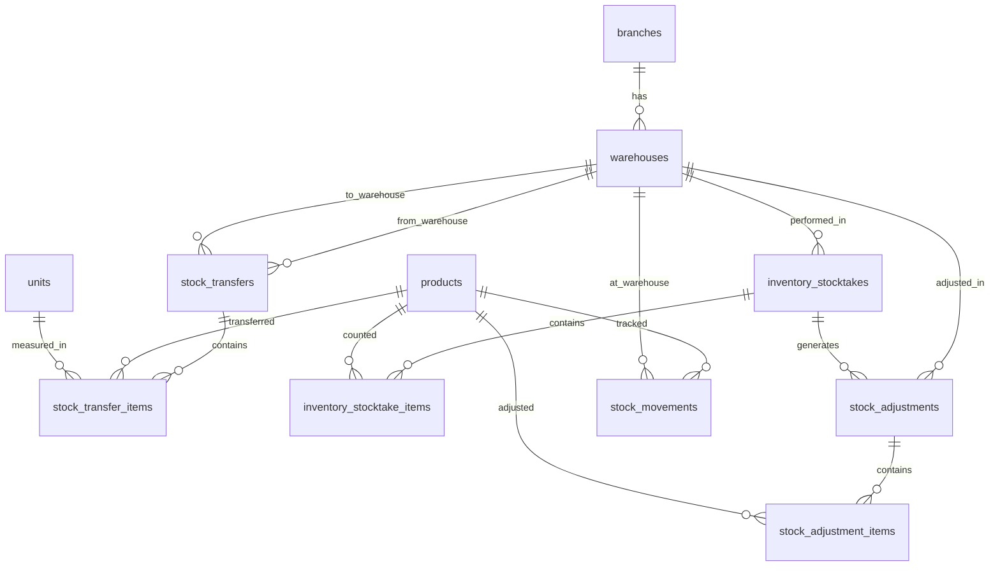

# Desain Database: Inventory (Persediaan)

Dokumen ini menjelaskan struktur database untuk modul Inventory (Persediaan) dalam sistem ERP. Fokus utama: master gudang, transfer antar gudang, stock opname (inventarisasi fisik), penyesuaian stok, dan audit trail pergerakan stok.

## 1. Gambaran Umum

### Filosofi Desain

Modul Inventory melengkapi infrastruktur stok yang sudah ada di `product_stocks` (`00_products_design_v2.md`) dengan menambahkan **master gudang (`warehouses`)** dan **operasi gudang** — transfer, opname, dan adjustment. Satu cabang (`branch`) bisa memiliki beberapa gudang (`warehouses`), dan seluruh operasi stok dikelola pada level **gudang** (bukan cabang). Setiap pergerakan stok (masuk/keluar) dicatat di `stock_movements` sebagai **kartu stok digital** yang menyediakan audit trail lengkap dan memungkinkan rekonsiliasi historis.

> [!IMPORTANT]
> Dokumen ini **tidak menduplikasi** desain yang sudah ada. Tabel `products`, `product_stocks`, `product_categories`, dan `units` sudah didefinisikan di `00_products_design_v2.md`. Tabel `goods_receipts` dan `supplier_returns` sudah didefinisikan di `13_purchasing_design.md`. Dokumen ini menambahkan tabel `warehouses` sebagai master lokasi gudang dan tabel baru untuk operasi gudang serta audit trail stok.
>
> **Perubahan penting**: Dokumen ini mengubah granularitas stok dari **per-branch** menjadi **per-warehouse**. Tabel `product_stocks` (di `00_products_design_v2.md`) perlu diupdate: `branch_id` → `warehouse_id`. Lihat Section 8 untuk detail dampak.

### Perbedaan dengan Manajemen Aset

| Aspek                 | **Inventory (Persediaan)**                                | **Asset Management (Aset Tetap)**                   |
| :-------------------- | :-------------------------------------------------------- | :-------------------------------------------------- |
| **Apa yang dikelola** | Barang habis pakai / dijual (stok)                        | Barang bernilai tinggi & tahan lama (aset tetap)    |
| **Unit tracking**     | **Kuantitas total** per gudang (`quantity_on_hand = 150`) | **Per unit individual** (tiap aset punya kode unik) |
| **Contoh**            | Kertas A4, tinta, laptop untuk dijual kembali             | Laptop kantor (aset perusahaan), mobil dinas, mesin |
| **Tabel utama**       | `products` + `product_stocks`                             | `assets`                                            |
| **Lokasi**            | Per `warehouse` (gudang dalam cabang)                     | Per `branch` + `asset_location` (hierarki)          |
| **Pergerakan**        | Transfer kuantitas batch antar gudang                     | Movement unit individual + audit trail              |
| **Penilaian**         | Average cost (weighted average)                           | Nilai perolehan + depresiasi (book value)           |
| **Depresiasi**        | ❌ Tidak ada                                              | ✅ Straight line / declining balance                |
| **Stocktake**         | Hitung **kuantitas** (counted vs system)                  | Cek **keberadaan per unit** (found/missing/damaged) |
| **Tujuan akhir**      | **Dijual** atau **dikonsumsi**                            | **Dipakai** untuk operasional, akhirnya di-dispose  |
| **Impact akuntansi**  | COGS, inventory valuation                                 | Depreciation expense, accumulated depreciation      |

### Komponen Utama

- **Master Gudang (Warehouses)**: Mengelola data gudang per cabang. Satu cabang bisa memiliki banyak gudang.
- **Transfer Antar Gudang**: Pemindahan stok produk antar gudang (bisa dalam cabang yang sama atau beda cabang) dengan dokumen transfer.
- **Stock Opname (Inventarisasi)**: Proses penghitungan fisik stok untuk validasi kesesuaian data sistem dengan kondisi aktual.
- **Penyesuaian Stok**: Koreksi stok manual karena kerusakan, expired, shrinkage, atau hasil stock opname.
- **Kartu Stok (Stock Movement)**: Audit trail setiap pergerakan stok (masuk/keluar) per produk per gudang.

### Hubungan dengan Modul Lain

| Modul                 | Referensi Desain                 | Hubungan                                                     |
| :-------------------- | :------------------------------- | :----------------------------------------------------------- |
| **Products**          | `00_products_design_v2.md`       | Master produk & stok per gudang (`product_stocks`)           |
| **Purchasing**        | `13_purchasing_design.md`        | Goods Receipt menambah stok, Supplier Return mengurangi stok |
| **Pipeline**          | `10_pipeline_design.md`          | Stock transfer lifecycle dikelola oleh pipeline              |
| **Approval**          | `11_approval_design.md`          | Transfer bernilai tinggi & adjustment memerlukan approval    |
| **Chart of Accounts** | `01_chart_of_accounts_design.md` | Adjustment & transfer diposting sebagai jurnal               |

### Integrasi dengan Master Data yang Sudah Ada

- **Produk**: `products`, `product_categories`, `units` — produk yang dikelola stoknya.
- **Stok**: `product_stocks` — stok per gudang (diupdate dari per-branch ke per-warehouse, lihat Section 8).
- **Gudang**: `warehouses` — lokasi penyimpanan stok (baru, didefinisikan di dokumen ini).
- **Cabang**: `branches` — cabang organisasi (parent dari warehouses).
- **Organisasi**: `departments`, `employees` — penanggung jawab operasi gudang.
- **Purchasing**: `goods_receipts`, `goods_receipt_items` — source stok masuk (GR).
- **Supplier Return**: `supplier_returns`, `supplier_return_items` — source stok keluar (retur).
- **Akuntansi**: `accounts`, `journal_entries`, `journal_entry_lines` — posting jurnal inventory.

### Prinsip Desain

1.  **Header-Detail Pattern**: Setiap dokumen (transfer, stocktake, adjustment) menggunakan pola header + items.
2.  **Complete Audit Trail**: Setiap pergerakan stok dicatat di `stock_movements` dengan reference polymorphic ke dokumen sumber.
3.  **Multi-Warehouse**: Stok dikelola per gudang melalui `product_stocks`. Satu cabang bisa memiliki banyak gudang. Transfer memindahkan kuantitas antar warehouse.
4.  **No Hard Delete**: Dokumen inventory **tidak boleh di-delete**. Gunakan status `cancelled` untuk pembatalan.
5.  **Cached Balance**: `product_stocks.quantity_on_hand` adalah cache yang dijaga konsistensinya oleh setiap operasi inventory.
6.  **Accounting Ready**: Adjustment dan transfer siap diposting ke jurnal akuntansi.

---

## 2. Diagram Hubungan Entitas (ERD)



> [!NOTE]
> Tabel `stock_movements` memiliki kolom polymorphic (`reference_type`, `reference_id`) yang menghubungkan ke tabel dokumen sumber manapun (`goods_receipts`, `stock_transfers`, `stock_adjustments`, `production_orders`, dll.). Hal ini tidak digambarkan di ERD karena keterbatasan notasi.

---

## 3. Detail Tabel

### A. Master Gudang

#### 1. `warehouses`

Master data gudang. Satu cabang (`branch`) bisa memiliki banyak gudang.

| Kolom        | Tipe Data | Keterangan                                |
| :----------- | :-------- | :---------------------------------------- |
| `id`         | BigInt    | Primary Key                               |
| `code`       | String    | Kode gudang (unique, mis. WH-JKT-01)      |
| `name`       | String    | Nama gudang (mis. "Gudang Utama Jakarta") |
| `branch_id`  | BigInt    | FK -> `branches`                          |
| `address`    | Text      | Alamat gudang (nullable)                  |
| `type`       | Enum      | `main`, `transit`, `return`, `production` |
| `is_active`  | Boolean   | Status aktif (default: true)              |
| `notes`      | Text      | Catatan (nullable)                        |
| `created_at` | Timestamp |                                           |
| `updated_at` | Timestamp |                                           |

**Index (disarankan):** `code` (unique), `branch_id`, `type`, `is_active`

##### Penjelasan `type`

| Tipe             | Penjelasan                                                                         | Contoh                           |
| :--------------- | :--------------------------------------------------------------------------------- | :------------------------------- |
| **`main`**       | Gudang utama cabang untuk penyimpanan stok umum.                                   | Gudang Utama Jakarta.            |
| **`transit`**    | Gudang transit untuk barang yang sedang dalam perjalanan atau menunggu distribusi. | Gudang Transit Bandara.          |
| **`return`**     | Gudang khusus untuk barang retur dari pelanggan atau supplier.                     | Gudang Retur Surabaya.           |
| **`production`** | Gudang bahan baku atau hasil produksi yang terkait dengan proses manufaktur.       | Gudang Produksi Pabrik Cikarang. |

> [!TIP]
> Setiap cabang minimal harus memiliki satu gudang bertipe `main`. Validasi ini bisa diterapkan di level aplikasi (bukan constraint database) agar fleksibel.

---

### B. Transfer Antar Gudang

#### 2. `stock_transfers`

Header dokumen transfer stok antar gudang.

| Kolom                   | Tipe Data | Keterangan                                                                     |
| :---------------------- | :-------- | :----------------------------------------------------------------------------- |
| `id`                    | BigInt    | Primary Key                                                                    |
| `transfer_number`       | String    | Nomor transfer (unique), generated, mis. ST-2026-000001                        |
| `from_warehouse_id`     | BigInt    | FK -> `warehouses` (gudang asal)                                               |
| `to_warehouse_id`       | BigInt    | FK -> `warehouses` (gudang tujuan)                                             |
| `transfer_date`         | Date      | Tanggal transfer                                                               |
| `expected_arrival_date` | Date      | Tanggal perkiraan tiba (nullable)                                              |
| `status`                | Enum      | `draft`, `pending_approval`, `approved`, `in_transit`, `received`, `cancelled` |
| `notes`                 | Text      | Catatan (nullable)                                                             |
| `requested_by`          | BigInt    | FK -> `employees` (nullable, yang meminta transfer)                            |
| `approved_by`           | BigInt    | FK -> `users` (nullable)                                                       |
| `approved_at`           | Timestamp | (nullable)                                                                     |
| `shipped_by`            | BigInt    | FK -> `users` (nullable, yang mengirim)                                        |
| `shipped_at`            | Timestamp | (nullable)                                                                     |
| `received_by`           | BigInt    | FK -> `users` (nullable, yang menerima)                                        |
| `received_at`           | Timestamp | (nullable)                                                                     |
| `created_by`            | BigInt    | FK -> `users` (nullable)                                                       |
| `created_at`            | Timestamp |                                                                                |
| `updated_at`            | Timestamp |                                                                                |

**Index (disarankan):** `transfer_number` (unique), `status`, `from_warehouse_id`, `to_warehouse_id`, `transfer_date`

##### Penjelasan Status

| Status                 | Penjelasan                                                              |
| :--------------------- | :---------------------------------------------------------------------- |
| **`draft`**            | Dokumen transfer baru dibuat, belum diajukan.                           |
| **`pending_approval`** | Transfer diajukan, menunggu persetujuan (jika diperlukan).              |
| **`approved`**         | Transfer disetujui, siap dikirim.                                       |
| **`in_transit`**       | Barang sudah dikirim dari gudang asal, belum diterima di gudang tujuan. |
| **`received`**         | Barang sudah diterima di gudang tujuan. Transfer selesai.               |
| **`cancelled`**        | Transfer dibatalkan.                                                    |

> [!IMPORTANT]
> Saat status berubah ke `in_transit`:
>
> - Stok di gudang asal (`from_warehouse_id`) di-kurangi: `product_stocks.quantity_on_hand -= quantity`.
> - Stock movement `transfer_out` dicatat di gudang asal.
>
> Saat status berubah ke `received`:
>
> - Stok di gudang tujuan (`to_warehouse_id`) di-tambah: `product_stocks.quantity_on_hand += quantity`.
> - Average cost di gudang tujuan dihitung ulang menggunakan weighted average.
> - Stock movement `transfer_in` dicatat di gudang tujuan.

#### 3. `stock_transfer_items`

Detail item yang ditransfer.

| Kolom               | Tipe Data     | Keterangan                                                 |
| :------------------ | :------------ | :--------------------------------------------------------- |
| `id`                | BigInt        | Primary Key                                                |
| `stock_transfer_id` | BigInt        | FK -> `stock_transfers`                                    |
| `product_id`        | BigInt        | FK -> `products`                                           |
| `unit_id`           | BigInt        | FK -> `units`                                              |
| `quantity`          | Decimal(15,2) | Jumlah yang ditransfer                                     |
| `quantity_received` | Decimal(15,2) | Jumlah yang diterima di tujuan (default 0)                 |
| `unit_cost`         | Decimal(15,2) | Biaya satuan saat transfer (dari average cost gudang asal) |
| `notes`             | Text          | Catatan per item (nullable)                                |
| `created_at`        | Timestamp     |                                                            |
| `updated_at`        | Timestamp     |                                                            |

**Unique Constraint (disarankan):** `(stock_transfer_id, product_id)`

> [!NOTE]
> `quantity_received` memungkinkan penerimaan parsial. Jika `quantity_received < quantity`, selisih dicatat sebagai stock variance (hilang dalam perjalanan) dan bisa di-follow up dengan `stock_adjustment`.

---

### C. Stock Opname (Inventarisasi)

#### 4. `inventory_stocktakes`

Dokumen stock opname per gudang/per periode. Digunakan untuk menghitung fisik stok dan membandingkan dengan data sistem.

| Kolom                 | Tipe Data | Keterangan                                                |
| :-------------------- | :-------- | :-------------------------------------------------------- |
| `id`                  | BigInt    | Primary Key                                               |
| `stocktake_number`    | String    | Nomor dokumen (unique), generated, mis. SO-2026-000001    |
| `warehouse_id`        | BigInt    | FK -> `warehouses`                                        |
| `stocktake_date`      | Date      | Tanggal pelaksanaan opname                                |
| `status`              | Enum      | `draft`, `in_progress`, `completed`, `cancelled`          |
| `product_category_id` | BigInt    | FK -> `product_categories` (nullable, scope per kategori) |
| `notes`               | Text      | Catatan (nullable)                                        |
| `created_by`          | BigInt    | FK -> `users` (nullable)                                  |
| `completed_by`        | BigInt    | FK -> `users` (nullable)                                  |
| `completed_at`        | Timestamp | (nullable)                                                |
| `created_at`          | Timestamp |                                                           |
| `updated_at`          | Timestamp |                                                           |

**Index (disarankan):** `stocktake_number` (unique), `warehouse_id`, `status`, `stocktake_date`

##### Penjelasan Status

| Status            | Penjelasan                                                                                                                                            |
| :---------------- | :---------------------------------------------------------------------------------------------------------------------------------------------------- |
| **`draft`**       | Dokumen opname baru dibuat. Sistem belum mengisi item.                                                                                                |
| **`in_progress`** | Opname sedang berjalan. Sistem mengisi `inventory_stocktake_items` berdasarkan `product_stocks` di warehouse ini. Petugas mengisi `counted_quantity`. |
| **`completed`**   | Opname selesai. Variance dihitung. Bisa generate `stock_adjustment` otomatis.                                                                         |
| **`cancelled`**   | Opname dibatalkan.                                                                                                                                    |

> [!TIP]
> Kolom `product_category_id` opsional. Jika diisi, opname hanya mencakup produk dalam kategori tersebut. Jika NULL, opname mencakup seluruh produk di warehouse. Ini berguna untuk opname parsial (mis. opname mingguan untuk kategori "Fast-Moving Goods").

#### 5. `inventory_stocktake_items`

Hasil penghitungan fisik per produk pada stock opname.

| Kolom                    | Tipe Data     | Keterangan                                                            |
| :----------------------- | :------------ | :-------------------------------------------------------------------- |
| `id`                     | BigInt        | Primary Key                                                           |
| `inventory_stocktake_id` | BigInt        | FK -> `inventory_stocktakes`                                          |
| `product_id`             | BigInt        | FK -> `products`                                                      |
| `unit_id`                | BigInt        | FK -> `units`                                                         |
| `system_quantity`        | Decimal(15,2) | Stok menurut sistem (snapshot `quantity_on_hand` saat opname dimulai) |
| `counted_quantity`       | Decimal(15,2) | Stok hasil hitung fisik (nullable, diisi oleh petugas)                |
| `variance`               | Decimal(15,2) | Selisih: `counted_quantity - system_quantity` (cache, nullable)       |
| `result`                 | Enum          | `match`, `surplus`, `deficit`, `uncounted` (cache)                    |
| `notes`                  | Text          | Catatan per item (nullable, mis. alasan variance)                     |
| `counted_by`             | BigInt        | FK -> `users` (nullable, petugas yang menghitung)                     |
| `counted_at`             | Timestamp     | Waktu penghitungan (nullable)                                         |
| `created_at`             | Timestamp     |                                                                       |
| `updated_at`             | Timestamp     |                                                                       |

**Unique Constraint (disarankan):** `(inventory_stocktake_id, product_id)`

**Index (disarankan):** `inventory_stocktake_id`, `product_id`, `result`

##### Penjelasan `result`

| Result          | Penjelasan                                                 | Contoh                                  |
| :-------------- | :--------------------------------------------------------- | :-------------------------------------- |
| **`match`**     | Stok fisik = stok sistem. Tidak ada selisih.               | Sistem: 100, Hitung: 100.               |
| **`surplus`**   | Stok fisik > stok sistem. Ada kelebihan.                   | Sistem: 100, Hitung: 105. Variance: +5. |
| **`deficit`**   | Stok fisik < stok sistem. Ada kekurangan.                  | Sistem: 100, Hitung: 95. Variance: -5.  |
| **`uncounted`** | Belum dihitung (petugas belum mengisi `counted_quantity`). | —                                       |

> [!NOTE]
> Saat stock opname selesai (`completed`) dan ditemukan variance, admin bisa membuat `stock_adjustment` otomatis dari hasil opname untuk mengoreksi data stok. Field `stock_adjustments.inventory_stocktake_id` menyimpan referensi ke opname yang men-generate adjustment.

---

### D. Penyesuaian Stok

#### 6. `stock_adjustments`

Header dokumen penyesuaian stok. Bisa dibuat manual atau otomatis dari hasil stock opname.

| Kolom                    | Tipe Data | Keterangan                                                                                   |
| :----------------------- | :-------- | :------------------------------------------------------------------------------------------- |
| `id`                     | BigInt    | Primary Key                                                                                  |
| `adjustment_number`      | String    | Nomor adjustment (unique), generated, mis. SA-2026-000001                                    |
| `warehouse_id`           | BigInt    | FK -> `warehouses`                                                                           |
| `adjustment_date`        | Date      | Tanggal penyesuaian                                                                          |
| `adjustment_type`        | Enum      | `damage`, `expired`, `shrinkage`, `correction`, `stocktake_result`, `initial_stock`, `other` |
| `status`                 | Enum      | `draft`, `pending_approval`, `approved`, `cancelled`                                         |
| `inventory_stocktake_id` | BigInt    | FK -> `inventory_stocktakes` (nullable, jika dari hasil opname)                              |
| `notes`                  | Text      | Catatan (nullable)                                                                           |
| `journal_entry_id`       | BigInt    | FK -> `journal_entries` (nullable, untuk posting akuntansi)                                  |
| `approved_by`            | BigInt    | FK -> `users` (nullable)                                                                     |
| `approved_at`            | Timestamp | (nullable)                                                                                   |
| `created_by`             | BigInt    | FK -> `users` (nullable)                                                                     |
| `created_at`             | Timestamp |                                                                                              |
| `updated_at`             | Timestamp |                                                                                              |

**Index (disarankan):** `adjustment_number` (unique), `warehouse_id`, `status`, `adjustment_type`, `adjustment_date`, `inventory_stocktake_id`

##### Penjelasan `adjustment_type`

| Tipe                   | Penjelasan                                    | Contoh                                              |
| :--------------------- | :-------------------------------------------- | :-------------------------------------------------- |
| **`damage`**           | Barang rusak, tidak bisa dijual/dipakai lagi. | 10 unit botol pecah di gudang.                      |
| **`expired`**          | Barang melewati tanggal kadaluarsa.           | 50 unit obat expired.                               |
| **`shrinkage`**        | Kehilangan stok tanpa sebab jelas (susut).    | Selisih stok yang tidak bisa dijelaskan.            |
| **`correction`**       | Koreksi administratif (salah input, dll).     | Salah input GR kemarin (harusnya 100, diinput 110). |
| **`stocktake_result`** | Penyesuaian otomatis dari hasil stock opname. | Opname menemukan selisih -5 unit.                   |
| **`initial_stock`**    | Pengisian stok awal saat setup sistem.        | Input saldo awal persediaan per gudang.             |
| **`other`**            | Alasan lainnya.                               | Donasi, sampel, dll.                                |

> [!IMPORTANT]
> Saat adjustment di-approve/confirm:
>
> 1. Update `product_stocks.quantity_on_hand` sesuai `quantity_adjusted` per item.
> 2. Hitung ulang `product_stocks.average_cost` jika diperlukan.
> 3. Catat `stock_movement` per item (type: `adjustment_in` atau `adjustment_out`).
> 4. (Opsional) Posting jurnal akuntansi — debit/kredit akun persediaan dan akun beban terkait.

#### 7. `stock_adjustment_items`

Detail item yang disesuaikan.

| Kolom                 | Tipe Data     | Keterangan                                                             |
| :-------------------- | :------------ | :--------------------------------------------------------------------- |
| `id`                  | BigInt        | Primary Key                                                            |
| `stock_adjustment_id` | BigInt        | FK -> `stock_adjustments`                                              |
| `product_id`          | BigInt        | FK -> `products`                                                       |
| `unit_id`             | BigInt        | FK -> `units`                                                          |
| `quantity_before`     | Decimal(15,2) | Stok sebelum adjustment (snapshot)                                     |
| `quantity_adjusted`   | Decimal(15,2) | Jumlah penyesuaian (positif = tambah stok, negatif = kurang stok)      |
| `quantity_after`      | Decimal(15,2) | Stok setelah adjustment (cache: `quantity_before + quantity_adjusted`) |
| `unit_cost`           | Decimal(15,2) | Biaya satuan (dari `product_stocks.average_cost`)                      |
| `total_cost`          | Decimal(15,2) | Total nilai adjustment: `abs(quantity_adjusted) × unit_cost` (cache)   |
| `reason`              | Text          | Alasan penyesuaian per item (nullable)                                 |
| `created_at`          | Timestamp     |                                                                        |
| `updated_at`          | Timestamp     |                                                                        |

**Unique Constraint (disarankan):** `(stock_adjustment_id, product_id)`

**Index (disarankan):** `stock_adjustment_id`, `product_id`

> [!TIP]
> `quantity_adjusted` menggunakan konvensi:
>
> - **Positif** (+) = menambah stok (surplus, correction up, initial stock).
> - **Negatif** (−) = mengurangi stok (damage, expired, shrinkage, correction down).

---

### E. Kartu Stok / Audit Trail

#### 8. `stock_movements`

Audit trail setiap pergerakan stok per produk per gudang. Berfungsi sebagai **kartu stok digital** yang mencatat semua transaksi masuk/keluar.

| Kolom                | Tipe Data     | Keterangan                                                                                                                                                               |
| :------------------- | :------------ | :----------------------------------------------------------------------------------------------------------------------------------------------------------------------- |
| `id`                 | BigInt        | Primary Key                                                                                                                                                              |
| `product_id`         | BigInt        | FK -> `products`                                                                                                                                                         |
| `warehouse_id`       | BigInt        | FK -> `warehouses`                                                                                                                                                       |
| `movement_type`      | Enum          | `goods_receipt`, `supplier_return`, `transfer_out`, `transfer_in`, `adjustment_in`, `adjustment_out`, `production_consume`, `production_output`, `sales`, `sales_return` |
| `quantity_in`        | Decimal(15,2) | Kuantitas masuk (default 0)                                                                                                                                              |
| `quantity_out`       | Decimal(15,2) | Kuantitas keluar (default 0)                                                                                                                                             |
| `balance_after`      | Decimal(15,2) | Saldo stok setelah movement ini (cache)                                                                                                                                  |
| `unit_cost`          | Decimal(15,2) | Biaya satuan saat movement                                                                                                                                               |
| `average_cost_after` | Decimal(15,2) | Average cost setelah movement ini (cache)                                                                                                                                |
| `reference_type`     | String        | Polymorphic type (mis. `App\\Models\\GoodsReceipt`, `App\\Models\\StockTransfer`)                                                                                        |
| `reference_id`       | BigInt        | Polymorphic ID (ID dokumen sumber)                                                                                                                                       |
| `reference_number`   | String        | Nomor dokumen sumber untuk display (nullable, denormalized)                                                                                                              |
| `notes`              | Text          | Catatan (nullable)                                                                                                                                                       |
| `moved_at`           | Timestamp     | Waktu kejadian                                                                                                                                                           |
| `created_by`         | BigInt        | FK -> `users` (nullable)                                                                                                                                                 |
| `created_at`         | Timestamp     |                                                                                                                                                                          |

**Index (disarankan):** `(product_id, warehouse_id, moved_at)`, `movement_type`, `(reference_type, reference_id)`, `moved_at`

> [!CAUTION]
> Tabel `stock_movements` bersifat **append-only** — record tidak boleh diedit atau dihapus. Jika ada pembatalan dokumen sumber, buatlah movement baru sebagai reversal (bukan menghapus movement lama). Ini menjaga integritas kartu stok.

##### Penjelasan `movement_type`

| Tipe                     | Arah | Penjelasan                                                     | Dokumen Sumber                                   |
| :----------------------- | :--- | :------------------------------------------------------------- | :----------------------------------------------- |
| **`goods_receipt`**      | IN   | Penerimaan barang dari supplier.                               | `goods_receipts` (`13_purchasing_design.md`)     |
| **`supplier_return`**    | OUT  | Pengembalian barang ke supplier.                               | `supplier_returns` (`13_purchasing_design.md`)   |
| **`transfer_out`**       | OUT  | Pengiriman stok ke gudang lain.                                | `stock_transfers`                                |
| **`transfer_in`**        | IN   | Penerimaan stok dari gudang lain.                              | `stock_transfers`                                |
| **`adjustment_in`**      | IN   | Penambahan stok via adjustment (surplus, correction, initial). | `stock_adjustments`                              |
| **`adjustment_out`**     | OUT  | Pengurangan stok via adjustment (damage, expired, shrinkage).  | `stock_adjustments`                              |
| **`production_consume`** | OUT  | Konsumsi bahan baku untuk produksi.                            | `production_orders` (`00_products_design_v2.md`) |
| **`production_output`**  | IN   | Output produk jadi dari produksi.                              | `production_orders` (`00_products_design_v2.md`) |
| **`sales`**              | OUT  | Pengiriman barang ke pelanggan (future: Sales module).         | —                                                |
| **`sales_return`**       | IN   | Pengembalian barang dari pelanggan (future: Sales module).     | —                                                |

> [!NOTE]
> Movement type `sales` dan `sales_return` disiapkan untuk integrasi dengan modul Sales di masa depan. Saat ini belum ada dokumen sumber yang men-trigger movement ini.

##### Contoh Kartu Stok

Produk "Kertas A4" di Gudang Utama Jakarta (WH-JKT-01):

| #   | Tanggal    | Tipe                 | Ref            | Qty In | Qty Out | Saldo | Avg Cost |
| :-- | :--------- | :------------------- | :------------- | :----- | :------ | :---- | :------- |
| 1   | 2026-01-05 | `adjustment_in`      | SA-2026-000001 | 500    | —       | 500   | 50.000   |
| 2   | 2026-01-10 | `goods_receipt`      | GR-2026-000015 | 200    | —       | 700   | 48.571   |
| 3   | 2026-01-15 | `transfer_out`       | ST-2026-000003 | —      | 100     | 600   | 48.571   |
| 4   | 2026-01-20 | `adjustment_out`     | SA-2026-000005 | —      | 10      | 590   | 48.571   |
| 5   | 2026-01-31 | `production_consume` | MO-2026-000002 | —      | 50      | 540   | 48.571   |

---

## 4. Aturan Bisnis (Ringkas)

### Transfer Antar Gudang

- `from_warehouse_id` dan `to_warehouse_id` **tidak boleh sama**.
- Transfer bisa terjadi antar gudang **dalam cabang yang sama** maupun **antar cabang berbeda**.
- Stok di gudang asal harus cukup (`quantity_on_hand >= total quantity transfer items`) sebelum bisa dikirim.
- Average cost di gudang tujuan dihitung ulang saat `received`:
    ```
    new_avg = (dest_qty × dest_avg + transfer_qty × transfer_unit_cost) / (dest_qty + transfer_qty)
    ```
- Jika `quantity_received < quantity` pada item, selisih mengindikasikan kehilangan dalam perjalanan.

### Stock Opname

- Saat opname dimulai (`in_progress`), sistem men-snapshot `product_stocks.quantity_on_hand` ke `system_quantity` untuk setiap produk di warehouse tersebut.
- Petugas mengisi `counted_quantity`. Sistem menghitung `variance = counted_quantity - system_quantity`.
- Variance positif = surplus (`result = surplus`), negatif = deficit (`result = deficit`), nol = match (`result = match`).
- Setelah opname selesai (`completed`), variance bisa di-convert menjadi `stock_adjustment` dengan `adjustment_type = stocktake_result`.

### Penyesuaian Stok

- Adjustment menambah atau mengurangi `product_stocks.quantity_on_hand` sesuai `quantity_adjusted`.
- Setiap adjustment yang di-approve menghasilkan `stock_movement` record(s).
- Adjustment bernilai di atas threshold tertentu memerlukan approval (dikonfigurasi via `approval_flows`).

### Nomor Dokumen (Auto-Generate)

Format penomoran mengikuti konvensi purchasing (`13_purchasing_design.md`):

- Stock Transfer: `ST-{YYYY}-{seq:6}` → ST-2026-000001
- Stock Opname: `SO-{YYYY}-{seq:6}` → SO-2026-000001
- Stock Adjustment: `SA-{YYYY}-{seq:6}` → SA-2026-000001

Menggunakan tabel `document_sequences` yang sudah didesain di `13_purchasing_design.md` dengan prefix tambahan: `ST`, `SO`, `SA`.

### Konsistensi Stok

Invariant yang harus selalu terpenuhi:

```
product_stocks.quantity_on_hand =
    SUM(stock_movements.quantity_in) - SUM(stock_movements.quantity_out)
    WHERE product_id = X AND warehouse_id = Y
```

> [!IMPORTANT]
> Semua operasi yang mengubah stok **wajib** membuat record di `stock_movements`. Ini mencakup operasi dari modul lain: Goods Receipt, Supplier Return, dan Production Order. Modul-modul tersebut perlu diupdate untuk juga menulis ke `stock_movements` saat mengubah `product_stocks`.

---

## 5. Rekomendasi Menu & Tabel Terlibat

### A. Master Data

#### 1) Warehouses

Tujuan: mengelola master data gudang per cabang.

Jenis menu: Simple CRUD
Agent skill: `feature-crud-simple`

Tabel terlibat:

- `warehouses`
- `branches`

Fitur khusus:

- Setiap gudang terkait dengan satu cabang (`branch_id`).
- Filter: branch, type, is_active.
- Sortable columns: Code, Name, Branch, Type, Status.
- Validasi: code unik, minimal satu gudang `main` per cabang (soft validation).

---

### B. Operasional Gudang

#### 2) Stock Transfers

Tujuan: membuat dan mengelola dokumen transfer stok antar gudang.

Jenis menu: Complex CRUD
Agent skill: `feature-crud-complex`

Tabel terlibat:

- `stock_transfers`
- `stock_transfer_items`
- `products`
- `product_stocks` (validasi ketersediaan & update stok)
- `units`
- `warehouses`
- `branches` (untuk display cabang asal/tujuan via warehouse)
- `employees` (kolom `requested_by`)
- `users` (kolom `created_by`, `approved_by`, `shipped_by`, `received_by`)

Fitur khusus:

- Validasi ketersediaan stok di gudang asal sebelum submit.
- Two-step process: Ship (kurangi stok asal) → Receive (tambah stok tujuan).
- Partial receive: `quantity_received` bisa kurang dari `quantity`.
- Print/export dokumen transfer.
- Filter: status, from_warehouse, to_warehouse, date range.

#### 3) Stock Opname (Inventory Stocktake)

Tujuan: melaksanakan inventarisasi fisik stok per gudang.

Jenis menu: Complex CRUD
Agent skill: `feature-crud-complex`

Tabel terlibat:

- `inventory_stocktakes`
- `inventory_stocktake_items`
- `products`
- `product_stocks` (snapshot stok sistem)
- `product_categories` (opsional, scope per kategori)
- `units`
- `warehouses`
- `branches` (untuk display cabang via warehouse)
- `users` (kolom `created_by`, `completed_by`, items `counted_by`)

Fitur khusus:

- Auto-populate items dari `product_stocks` saat opname dimulai.
- Input counted_quantity per item (bisa via form atau barcode scanner).
- Summary: total items, matched, surplus, deficit, uncounted.
- Tombol "Generate Adjustment" → membuat `stock_adjustment` dari variance.
- Filter: status, warehouse, date range, category.

#### 4) Stock Adjustments

Tujuan: mengelola penyesuaian stok manual atau otomatis dari opname.

Jenis menu: Complex CRUD
Agent skill: `feature-crud-complex`

Tabel terlibat:

- `stock_adjustments`
- `stock_adjustment_items`
- `products`
- `product_stocks` (update stok)
- `units`
- `warehouses`
- `branches` (untuk display cabang via warehouse)
- `inventory_stocktakes` (nullable, referensi opname)
- `users` (kolom `created_by`, `approved_by`)

Fitur khusus:

- Approval workflow untuk adjustment di atas threshold.
- Auto-fill dari stock opname (jika `inventory_stocktake_id` diisi).
- Filter: status, warehouse, adjustment_type, date range.

---

### C. Monitoring & Kartu Stok

#### 5) Stock Movements (Kartu Stok)

Tujuan: melihat riwayat pergerakan stok per produk per gudang.

Jenis menu: Non-CRUD (read-only)
Agent skill: `feature-non-crud`

Tabel terlibat:

- `stock_movements`
- `products`
- `warehouses`
- `branches` (untuk display cabang via warehouse)
- `users`

Fitur khusus:

- Filter: product, warehouse, movement_type, date range.
- Running balance (saldo berjalan).
- Drill-down: klik reference_number → navigasi ke dokumen sumber.
- Export ke CSV/Excel.

#### 6) Stock Monitor (Dashboard Stok)

Tujuan: memonitor stok per produk per gudang, termasuk alert stok rendah.

Jenis menu: Non-CRUD (read-only, existing dari `00_products_design_v2.md`)
Agent skill: `feature-non-crud`

Tabel terlibat:

- `product_stocks`
- `products`
- `product_categories`
- `warehouses`
- `branches` (untuk grouping per cabang)

Fitur khusus:

- Summary: total stok per warehouse, stok per kategori, rollup per branch.
- Low stock alert (produk dengan `quantity_on_hand` di bawah threshold).
- Filter: product, warehouse, branch, category, low stock threshold.

> [!NOTE]
> Menu ini sudah didesain di `00_products_design_v2.md` sebagai "Product Stocks (Monitor)" — bagian 5.B.5. Perlu diperluas untuk mendukung filter per warehouse (bukan hanya per branch).

---

### D. Laporan (Opsional tapi umum)

#### 7) Inventory Valuation Report

Tujuan: laporan nilai persediaan per produk per gudang (quantity × average cost).

Jenis menu: Non-CRUD
Agent skill: `feature-non-crud`

Tabel terlibat:

- `product_stocks`
- `products`
- `product_categories`
- `warehouses`
- `branches`
- `units`

#### 8) Stock Movement Report

Tujuan: laporan pergerakan stok per periode (total masuk, total keluar, saldo akhir).

Jenis menu: Non-CRUD
Agent skill: `feature-non-crud`

Tabel terlibat:

- `stock_movements`
- `products`
- `warehouses`
- `branches`
- `product_categories`

#### 9) Stocktake Variance Report

Tujuan: laporan hasil stock opname — daftar produk dengan selisih (surplus/deficit).

Jenis menu: Non-CRUD
Agent skill: `feature-non-crud`

Tabel terlibat:

- `inventory_stocktakes`
- `inventory_stocktake_items`
- `products`
- `warehouses`
- `branches`

#### 10) Stock Adjustment Report

Tujuan: laporan penyesuaian stok per tipe, per periode, per gudang (total nilai adjustment).

Jenis menu: Non-CRUD
Agent skill: `feature-non-crud`

Tabel terlibat:

- `stock_adjustments`
- `stock_adjustment_items`
- `products`
- `warehouses`
- `branches`

---

## 6. Integrasi dengan Pipeline & Approval System

### Stock Transfer Lifecycle (via Pipeline)


**Pipeline:** `stock_transfer_lifecycle`

- entity_type: `App\\Models\\StockTransfer`

| State (code)       | Name             | Type         | Color     |
| :----------------- | :--------------- | :----------- | :-------- |
| `draft`            | Draft            | initial      | `#6B7280` |
| `pending_approval` | Pending Approval | intermediate | `#F59E0B` |
| `approved`         | Approved         | intermediate | `#10B981` |
| `in_transit`       | In Transit       | intermediate | `#3B82F6` |
| `received`         | Received         | final        | `#059669` |
| `cancelled`        | Cancelled        | final        | `#9CA3AF` |

| Transisi               | From → To                        | Permission                | Guard                      | Actions                                                                    |
| :--------------------- | :------------------------------- | :------------------------ | :------------------------- | :------------------------------------------------------------------------- |
| Submit                 | `draft` → `pending_approval`     | `stock-transfers.submit`  | —                          | Update `status`, Trigger approval                                          |
| Approve (direct)       | `draft` → `approved`             | `stock-transfers.approve` | Transfer value < threshold | Update `status`                                                            |
| Approve (via approval) | `pending_approval` → `approved`  | —                         | Approval completed         | Update `status`                                                            |
| Cancel (from pending)  | `pending_approval` → `cancelled` | `stock-transfers.cancel`  | —                          | Update `status`                                                            |
| Ship                   | `approved` → `in_transit`        | `stock-transfers.ship`    | Stok cukup di gudang asal  | Update `status`, Kurangi stok asal, Create `stock_movement` (transfer_out) |
| Receive                | `in_transit` → `received`        | `stock-transfers.receive` | —                          | Update `status`, Tambah stok tujuan, Create `stock_movement` (transfer_in) |
| Cancel (from approved) | `approved` → `cancelled`         | `stock-transfers.cancel`  | —                          | Update `status`                                                            |
| Cancel (from draft)    | `draft` → `cancelled`            | `stock-transfers.cancel`  | —                          | Update `status`                                                            |

### Stock Adjustment Lifecycle (via Pipeline)


**Pipeline:** `stock_adjustment_lifecycle`

- entity_type: `App\\Models\\StockAdjustment`

| State (code)       | Name             | Type         | Color     |
| :----------------- | :--------------- | :----------- | :-------- |
| `draft`            | Draft            | initial      | `#6B7280` |
| `pending_approval` | Pending Approval | intermediate | `#F59E0B` |
| `approved`         | Approved         | final        | `#10B981` |
| `cancelled`        | Cancelled        | final        | `#9CA3AF` |

| Transisi               | From → To                        | Permission                  | Guard                   | Actions                                               |
| :--------------------- | :------------------------------- | :-------------------------- | :---------------------- | :---------------------------------------------------- |
| Submit                 | `draft` → `pending_approval`     | `stock-adjustments.submit`  | —                       | Update `status`, Trigger approval                     |
| Approve (direct)       | `draft` → `approved`             | `stock-adjustments.approve` | Total value < threshold | Update `status`, Update stok, Create `stock_movement` |
| Approve (via approval) | `pending_approval` → `approved`  | —                           | Approval completed      | Update `status`, Update stok, Create `stock_movement` |
| Reject                 | `pending_approval` → `cancelled` | `stock-adjustments.reject`  | Requires comment        | Update `status`                                       |
| Cancel                 | `draft` → `cancelled`            | `stock-adjustments.cancel`  | —                       | Update `status`                                       |

### Inventory Stocktake Lifecycle (via Pipeline)


**Pipeline:** `inventory_stocktake_lifecycle`

- entity_type: `App\\Models\\InventoryStocktake`

| State (code)  | Name        | Type         | Color     |
| :------------ | :---------- | :----------- | :-------- |
| `draft`       | Draft       | initial      | `#6B7280` |
| `in_progress` | In Progress | intermediate | `#3B82F6` |
| `completed`   | Completed   | final        | `#10B981` |
| `cancelled`   | Cancelled   | final        | `#9CA3AF` |

| Transisi                  | From → To                   | Permission                    | Guard                     | Actions                                                                    |
| :------------------------ | :-------------------------- | :---------------------------- | :------------------------ | :------------------------------------------------------------------------- |
| Start Opname              | `draft` → `in_progress`     | `inventory-stocktakes.manage` | —                         | Update `status`, Auto-populate items dari `product_stocks` (per warehouse) |
| Complete                  | `in_progress` → `completed` | `inventory-stocktakes.manage` | Semua items sudah counted | Update `status`, Hitung variance                                           |
| Cancel (from in_progress) | `in_progress` → `cancelled` | `inventory-stocktakes.cancel` | —                         | Update `status`                                                            |
| Cancel (from draft)       | `draft` → `cancelled`       | `inventory-stocktakes.cancel` | —                         | Update `status`                                                            |

---

## 7. Integrasi Akuntansi

> [!WARNING]
> **Decision Required**: Apakah modul Inventory akan langsung memposting jurnal akuntansi saat adjustment/transfer di-approve, atau ini ditunda ke fase berikutnya? Keputusan ini mempengaruhi apakah kolom `journal_entry_id` disertakan di migration awal.

Saat siap diintegrasikan dengan modul akuntansi, berikut posting jurnal yang umum:

### Saat Stock Adjustment Di-approve (Pengurangan)

| Akun                                   | Debit | Kredit |
| :------------------------------------- | :---- | :----- |
| Beban Penyesuaian Persediaan (Expense) | ✓     |        |
| Persediaan / Inventory (Asset)         |       | ✓      |

### Saat Stock Adjustment Di-approve (Penambahan)

| Akun                                          | Debit | Kredit |
| :-------------------------------------------- | :---- | :----- |
| Persediaan / Inventory (Asset)                | ✓     |        |
| Pendapatan Lain-lain / Other Income (Revenue) |       | ✓      |

### Saat Stock Transfer In-Transit

| Akun                             | Debit | Kredit |
| :------------------------------- | :---- | :----- |
| Persediaan In-Transit (Asset)    | ✓     |        |
| Persediaan — Gudang Asal (Asset) |       | ✓      |

### Saat Stock Transfer Received

| Akun                               | Debit | Kredit |
| :--------------------------------- | :---- | :----- |
| Persediaan — Gudang Tujuan (Asset) | ✓     |        |
| Persediaan In-Transit (Asset)      |       | ✓      |

> [!TIP]
> Untuk integrasi akuntansi, tambahkan kolom `journal_entry_id` (FK -> `journal_entries`, nullable) pada tabel `stock_transfers` dan `stock_adjustments` saat modul akuntansi inventory diaktifkan.

---

## 8. Dampak pada Modul Existing

### Perubahan Granularitas Stok: Branch → Warehouse

> [!CAUTION]
> Penambahan tabel `warehouses` mengubah granularitas pengelolaan stok dari **per-branch** menjadi **per-warehouse**. Berikut perubahan yang diperlukan pada modul existing:

#### A. `product_stocks` (`00_products_design_v2.md`)

Tabel `product_stocks` perlu diubah:

| Perubahan         | Sebelum                        | Sesudah                             |
| :---------------- | :----------------------------- | :---------------------------------- |
| Kolom FK          | `branch_id` (FK -> `branches`) | `warehouse_id` (FK -> `warehouses`) |
| Unique Constraint | `(product_id, branch_id)`      | `(product_id, warehouse_id)`        |
| Index             | `branch_id`                    | `warehouse_id`                      |

Stok sekarang dilacak per gudang, bukan per cabang. Untuk mendapatkan total stok per cabang, lakukan aggregate:

```sql
SELECT w.branch_id, SUM(ps.quantity_on_hand) as total_on_hand
FROM product_stocks ps
JOIN warehouses w ON ps.warehouse_id = w.id
WHERE ps.product_id = ?
GROUP BY w.branch_id
```

#### B. `goods_receipts` (`13_purchasing_design.md`)

Tabel `goods_receipts` perlu diubah:

| Perubahan | Sebelum                        | Sesudah                             |
| :-------- | :----------------------------- | :---------------------------------- |
| Kolom FK  | `branch_id` (FK -> `branches`) | `warehouse_id` (FK -> `warehouses`) |

Penerimaan barang dari supplier sekarang diterima ke **gudang** spesifik, bukan hanya ke cabang.

#### C. `production_orders` (`00_products_design_v2.md`)

Tabel `production_orders` perlu diubah:

| Perubahan | Sebelum                        | Sesudah                             |
| :-------- | :----------------------------- | :---------------------------------- |
| Kolom FK  | `branch_id` (FK -> `branches`) | `warehouse_id` (FK -> `warehouses`) |

Produksi terjadi di gudang spesifik (biasanya gudang bertipe `production`).

### Update Stock Movements dari Modul Lain

Agar `stock_movements` menjadi satu sumber kebenaran (single source of truth) untuk audit trail stok, modul-modul berikut perlu diupdate untuk **juga menulis ke `stock_movements`** saat mengubah `product_stocks`:

| Modul                                      | Aksi                                              | Movement Type        |
| :----------------------------------------- | :------------------------------------------------ | :------------------- |
| **Purchasing** (`13_purchasing_design.md`) | Goods Receipt confirmed                           | `goods_receipt`      |
| **Purchasing** (`13_purchasing_design.md`) | Supplier Return confirmed                         | `supplier_return`    |
| **Products** (`00_products_design_v2.md`)  | Production Order completed (consume raw material) | `production_consume` |
| **Products** (`00_products_design_v2.md`)  | Production Order completed (output finished good) | `production_output`  |

> [!NOTE]
> Update ini bersifat **additive** — hanya menambahkan penulisan ke `stock_movements`, tidak mengubah logika existing. Tabel `product_stocks` tetap di-update seperti biasa, hanya FK-nya berubah dari `branch_id` ke `warehouse_id`.

### Tabel `document_sequences`

Tambahkan prefix baru ke tabel `document_sequences` (sudah didesain di `13_purchasing_design.md`):

| Prefix | Dokumen                            |
| :----- | :--------------------------------- |
| `ST`   | Stock Transfer                     |
| `SO`   | Stock Opname (Inventory Stocktake) |
| `SA`   | Stock Adjustment                   |
