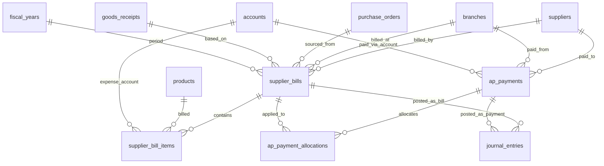
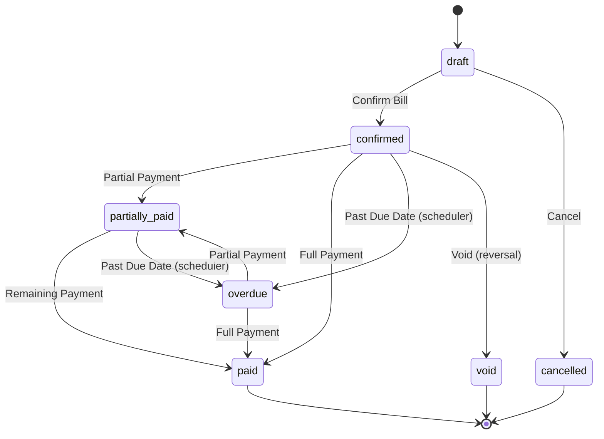
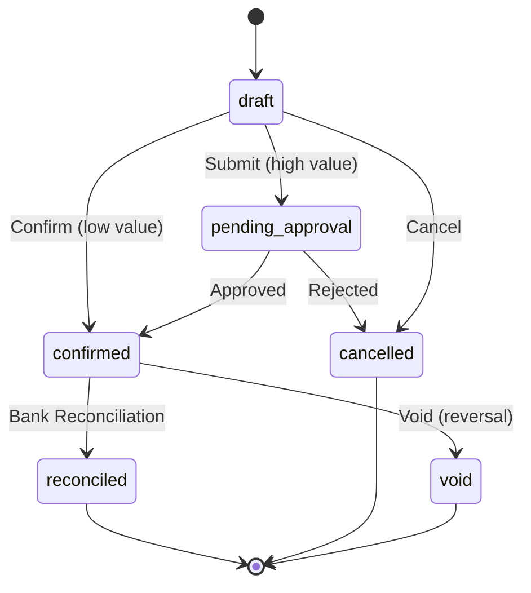
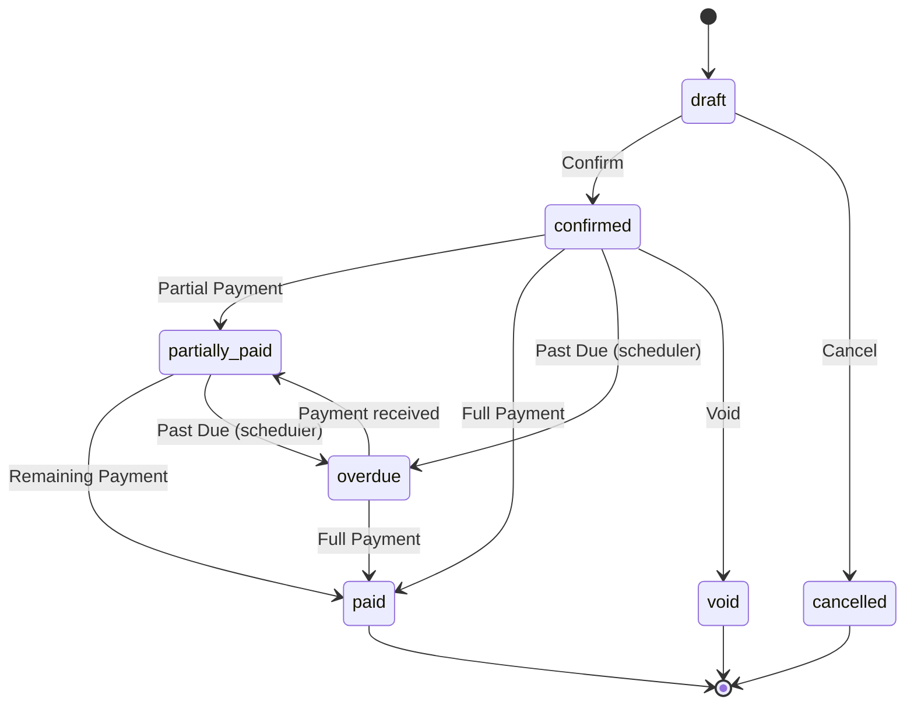

# Desain Database: Accounts Payable (Hutang Usaha)

Dokumen ini menjelaskan struktur database untuk modul Accounts Payable (AP) dalam sistem ERP. Fokus utama: pencatatan tagihan vendor (supplier bills), penjadwalan pembayaran, pelunasan hutang, dan integrasi dengan jurnal akuntansi.

## 1. Gambaran Umum

### Filosofi Desain

Modul AP mengelola **siklus hutang lengkap** — dari penerimaan tagihan vendor hingga pelunasan. Setiap tagihan (bill) terikat ke supplier dan secara opsional ke Purchase Order / Goods Receipt sebagai bukti transaksi. Pembayaran dicatat secara terpisah agar mendukung pembayaran parsial, multi-bill payment, dan rekonsiliasi bank.

### Alur Proses Hutang

```
Goods Receipt (GR)  →  Supplier Bill  →  Payment Allocation  →  Bank Payment
   [penerimaan barang]    [tagihan vendor]    [alokasi ke bill]      [uang keluar]
```

### Hubungan dengan Modul Lain

| Modul | Referensi Desain | Hubungan |
| :--- | :--- | :--- |
| **Purchasing** | `13_purchasing_design.md` | GR men-generate bill otomatis atau manual |
| **Inventory** | `14_inventory_design.md` | Supplier Return mengurangi tagihan |
| **Chart of Accounts** | `01_chart_of_accounts_design.md` | Bill & payment diposting ke jurnal (AP, kas/bank) |
| **Pipeline** | `10_pipeline_design.md` | Bill lifecycle dikelola oleh pipeline |
| **Approval** | `11_approval_design.md` | Pembayaran bernilai tinggi memerlukan approval |
| **General Ledger** | `17_general_ledger_design.md` | Rekonsiliasi bank memvalidasi pembayaran |

### Komponen Utama
*   **Supplier Bill (Tagihan Vendor)**: Dokumen tagihan dari supplier yang menciptakan kewajiban bayar (hutang).
*   **Bill Items**: Rincian item tagihan (dari GR atau manual input).
*   **AP Payments (Pembayaran)**: Dokumen pembayaran untuk melunasi satu atau lebih tagihan.
*   **Payment Allocations**: Alokasi pembayaran ke tagihan-tagihan tertentu (mendukung partial payment & multi-bill payment).

### Integrasi dengan Master Data yang Sudah Ada
*   **Supplier**: `suppliers` — penerima tagihan dan pembayaran.
*   **Purchasing**: `purchase_orders`, `goods_receipts` — sumber tagihan.
*   **Cabang**: `branches` — lokasi operasional.
*   **Akuntansi**: `accounts`, `journal_entries`, `journal_entry_lines` — posting AP & payment.
*   **Tahun Fiskal**: `fiscal_years` — periode akuntansi.

### Prinsip Desain
1.  **Header-Detail Pattern**: Setiap bill dan payment menggunakan pola header + items/allocations.
2.  **Three-Way Matching**: Bill bisa dicocokkan dengan PO dan GR untuk validasi (opsional).
3.  **Partial Payment**: Satu bill bisa dibayar bertahap melalui beberapa payment.
4.  **Multi-Bill Payment**: Satu payment bisa melunasi beberapa bill sekaligus.
5.  **Auto Journal Posting**: Setiap bill confirmed dan payment confirmed secara otomatis membuat jurnal.
6.  **Aging Ready**: Status dan tanggal jatuh tempo mendukung laporan aging hutang.
7.  **No Hard Delete**: Dokumen AP **tidak boleh di-delete**. Gunakan status `cancelled` / `void`.

---

## 2. Diagram Hubungan Entitas (ERD)



---

## 3. Detail Tabel

### A. Tagihan Vendor (Supplier Bills)

#### 1. `supplier_bills`
Header dokumen tagihan dari supplier.

| Kolom | Tipe Data | Keterangan |
| :--- | :--- | :--- |
| `id` | BigInt | Primary Key |
| `bill_number` | String | Nomor bill internal (unique), generated, mis. BILL-2026-000001 |
| `supplier_id` | BigInt | FK -> `suppliers` |
| `branch_id` | BigInt | FK -> `branches` |
| `fiscal_year_id` | BigInt | FK -> `fiscal_years` |
| `purchase_order_id` | BigInt | FK -> `purchase_orders` (nullable, referensi PO) |
| `goods_receipt_id` | BigInt | FK -> `goods_receipts` (nullable, referensi GR) |
| `supplier_invoice_number` | String | Nomor faktur/invoice dari supplier (nullable) |
| `supplier_invoice_date` | Date | Tanggal faktur supplier (nullable) |
| `bill_date` | Date | Tanggal pencatatan tagihan |
| `due_date` | Date | Tanggal jatuh tempo pembayaran |
| `payment_terms` | String | Syarat pembayaran (nullable, mis. "Net 30", "Net 60") |
| `currency` | String(3) | ISO currency (default: IDR) |
| `subtotal` | Decimal(15,2) | Total sebelum pajak (cache) |
| `tax_amount` | Decimal(15,2) | Total pajak (cache, default 0) |
| `discount_amount` | Decimal(15,2) | Total diskon (cache, default 0) |
| `grand_total` | Decimal(15,2) | Total tagihan (cache) |
| `amount_paid` | Decimal(15,2) | Total yang sudah dibayar (cache, default 0) |
| `amount_due` | Decimal(15,2) | Sisa yang belum dibayar: `grand_total - amount_paid` (cache) |
| `status` | Enum | `draft`, `confirmed`, `partially_paid`, `paid`, `overdue`, `cancelled`, `void` |
| `notes` | Text | Catatan (nullable) |
| `journal_entry_id` | BigInt | FK -> `journal_entries` (nullable, jurnal saat bill confirmed) |
| `created_by` | BigInt | FK -> `users` (nullable) |
| `confirmed_by` | BigInt | FK -> `users` (nullable) |
| `confirmed_at` | Timestamp | (nullable) |
| `created_at` | Timestamp | |
| `updated_at` | Timestamp | |

**Index (disarankan):** `bill_number` (unique), `supplier_id`, `status`, `due_date`, `bill_date`, `fiscal_year_id`, `purchase_order_id`, `goods_receipt_id`

##### Penjelasan Status

| Status | Penjelasan |
| :--- | :--- |
| **`draft`** | Bill baru dibuat, belum dikonfirmasi. Masih bisa diedit. |
| **`confirmed`** | Bill dikonfirmasi, jurnal AP dibuat. Menunggu pembayaran. |
| **`partially_paid`** | Sebagian tagihan sudah dibayar. |
| **`paid`** | Tagihan sudah lunas (`amount_due = 0`). |
| **`overdue`** | Tagihan melewati `due_date` dan belum lunas (diupdate otomatis oleh scheduler). |
| **`cancelled`** | Bill dibatalkan sebelum confirmed. |
| **`void`** | Bill yang sudah confirmed dibatalkan (jurnal reversal dibuat). |

> [!IMPORTANT]
> Saat bill di-confirm:
> 1. Buat jurnal: **Debit** akun expense/inventory per item, **Kredit** akun Accounts Payable.
> 2. Kolom `journal_entry_id` diisi dengan jurnal yang dibuat.
> 3. Status berubah ke `confirmed`.

> [!CAUTION]
> Bill yang sudah `confirmed` / `paid` **tidak boleh diedit**. Jika ada kesalahan, buat bill void (jurnal reversal otomatis) dan buat bill baru. Ini menjaga integritas audit trail akuntansi.

#### 2. `supplier_bill_items`
Rincian item pada tagihan.

| Kolom | Tipe Data | Keterangan |
| :--- | :--- | :--- |
| `id` | BigInt | Primary Key |
| `supplier_bill_id` | BigInt | FK -> `supplier_bills` |
| `product_id` | BigInt | FK -> `products` (nullable, bisa tagihan non-produk) |
| `account_id` | BigInt | FK -> `accounts` (akun beban/persediaan yang di-debit) |
| `description` | String | Deskripsi item (mis. nama produk atau uraian jasa) |
| `quantity` | Decimal(15,2) | Jumlah (default 1) |
| `unit_price` | Decimal(15,2) | Harga satuan |
| `discount_percent` | Decimal(5,2) | Diskon per item (%, default 0) |
| `tax_percent` | Decimal(5,2) | Pajak per item (%, default 0) |
| `line_total` | Decimal(15,2) | Subtotal baris (cache) |
| `goods_receipt_item_id` | BigInt | FK -> `goods_receipt_items` (nullable, traceability ke GR item) |
| `notes` | Text | Catatan per item (nullable) |
| `created_at` | Timestamp | |
| `updated_at` | Timestamp | |

**Index (disarankan):** `supplier_bill_id`, `product_id`, `account_id`

> [!NOTE]
> Kolom `account_id` menentukan akun yang di-debit saat bill confirmed. Untuk pembelian produk, biasanya akun Persediaan/Inventory (asset). Untuk jasa atau biaya langsung, akun Beban yang sesuai.

---

### B. Pembayaran Hutang (AP Payments)

#### 3. `ap_payments`
Header dokumen pembayaran ke supplier.

| Kolom | Tipe Data | Keterangan |
| :--- | :--- | :--- |
| `id` | BigInt | Primary Key |
| `payment_number` | String | Nomor payment (unique), generated, mis. PAY-2026-000001 |
| `supplier_id` | BigInt | FK -> `suppliers` |
| `branch_id` | BigInt | FK -> `branches` |
| `fiscal_year_id` | BigInt | FK -> `fiscal_years` |
| `payment_date` | Date | Tanggal pembayaran |
| `payment_method` | Enum | `bank_transfer`, `cash`, `check`, `giro`, `other` |
| `bank_account_id` | BigInt | FK -> `accounts` (akun kas/bank yang dikredit) |
| `currency` | String(3) | ISO currency (default: IDR) |
| `total_amount` | Decimal(15,2) | Total nominal pembayaran |
| `total_allocated` | Decimal(15,2) | Total yang sudah dialokasikan ke bill (cache, default 0) |
| `total_unallocated` | Decimal(15,2) | Sisa yang belum dialokasikan: `total_amount - total_allocated` (cache) |
| `reference` | String | Nomor referensi pembayaran (nullable, mis. nomor transfer bank) |
| `status` | Enum | `draft`, `pending_approval`, `confirmed`, `reconciled`, `cancelled`, `void` |
| `notes` | Text | Catatan (nullable) |
| `journal_entry_id` | BigInt | FK -> `journal_entries` (nullable, jurnal saat payment confirmed) |
| `approved_by` | BigInt | FK -> `users` (nullable) |
| `approved_at` | Timestamp | (nullable) |
| `created_by` | BigInt | FK -> `users` (nullable) |
| `confirmed_by` | BigInt | FK -> `users` (nullable) |
| `confirmed_at` | Timestamp | (nullable) |
| `created_at` | Timestamp | |
| `updated_at` | Timestamp | |

**Index (disarankan):** `payment_number` (unique), `supplier_id`, `status`, `payment_date`, `fiscal_year_id`, `bank_account_id`

##### Penjelasan Status

| Status | Penjelasan |
| :--- | :--- |
| **`draft`** | Payment baru dibuat, belum dikonfirmasi. |
| **`pending_approval`** | Payment diajukan, menunggu persetujuan (untuk pembayaran bernilai tinggi). |
| **`confirmed`** | Payment dikonfirmasi, jurnal dibuat, bill terkait diupdate. |
| **`reconciled`** | Payment sudah dicocokkan dengan mutasi bank (via rekonsiliasi bank). |
| **`cancelled`** | Payment dibatalkan sebelum confirmed. |
| **`void`** | Payment yang sudah confirmed dibatalkan (jurnal reversal dibuat, bill amount_paid di-rollback). |

##### Penjelasan `payment_method`

| Metode | Penjelasan |
| :--- | :--- |
| **`bank_transfer`** | Transfer antar bank / RTGS / SKN. |
| **`cash`** | Pembayaran tunai. |
| **`check`** | Pembayaran via cek. |
| **`giro`** | Pembayaran via bilyet giro. |
| **`other`** | Metode lainnya. |

> [!IMPORTANT]
> Saat payment di-confirm:
> 1. Buat jurnal: **Debit** akun Accounts Payable, **Kredit** akun Kas/Bank (`bank_account_id`).
> 2. Update `supplier_bills.amount_paid` dan `amount_due` untuk setiap bill yang dialokasikan.
> 3. Jika bill sudah lunas (`amount_due = 0`), update `supplier_bills.status = paid`.
> 4. Jika bill sebagian dibayar, update `supplier_bills.status = partially_paid`.

#### 4. `ap_payment_allocations`
Alokasi pembayaran ke tagihan tertentu. Mendukung multi-bill payment dan partial payment.

| Kolom | Tipe Data | Keterangan |
| :--- | :--- | :--- |
| `id` | BigInt | Primary Key |
| `ap_payment_id` | BigInt | FK -> `ap_payments` |
| `supplier_bill_id` | BigInt | FK -> `supplier_bills` |
| `allocated_amount` | Decimal(15,2) | Nominal yang dialokasikan ke bill ini |
| `discount_taken` | Decimal(15,2) | Diskon pembayaran dini (early payment discount), default 0 |
| `notes` | Text | Catatan (nullable) |
| `created_at` | Timestamp | |
| `updated_at` | Timestamp | |

**Unique Constraint (disarankan):** `(ap_payment_id, supplier_bill_id)` — satu payment hanya boleh mengalokasikan ke satu bill sekali.

**Index (disarankan):** `ap_payment_id`, `supplier_bill_id`

> [!NOTE]
> Invariant yang harus dijaga:
> ```
> SUM(ap_payment_allocations.allocated_amount) WHERE ap_payment_id = X
>   MUST EQUAL ap_payments[X].total_allocated
> ```
> Dan:
> ```
> SUM(ap_payment_allocations.allocated_amount) WHERE supplier_bill_id = Y
>   MUST EQUAL supplier_bills[Y].amount_paid
> ```

---

## 4. Aturan Bisnis (Ringkas)

### Siklus Supplier Bill



### Siklus AP Payment



### Posting Jurnal

#### Saat Supplier Bill Confirmed
| Akun | Debit | Kredit |
| :--- | :--- | :--- |
| Persediaan / Beban (per item `account_id`) | ✓ | |
| Accounts Payable (Hutang Dagang) | | ✓ |

#### Saat AP Payment Confirmed
| Akun | Debit | Kredit |
| :--- | :--- | :--- |
| Accounts Payable (Hutang Dagang) | ✓ | |
| Kas / Bank (`bank_account_id`) | | ✓ |

#### Saat Supplier Bill Void
| Akun | Debit | Kredit |
| :--- | :--- | :--- |
| Accounts Payable (Hutang Dagang) | ✓ | |
| Persediaan / Beban (reverse per item) | | ✓ |

### Overdue Detection (Scheduler)
*   Scheduled job berjalan harian (Laravel Scheduler).
*   Query: `supplier_bills WHERE status IN ('confirmed', 'partially_paid') AND due_date < TODAY`.
*   Update status menjadi `overdue` (jika belum).
*   Opsional: kirim notifikasi ke finance team.

### Three-Way Matching (Opsional)
Validasi bill terhadap PO dan GR:
1.  **Kuantitas**: Item bill ≤ item GR yang diterima.
2.  **Harga**: Harga di bill sesuai harga di PO (toleransi konfigurasi).
3.  **Supplier**: Supplier di bill = supplier di PO.

### Nomor Dokumen (Auto-Generate)
Format penomoran mengikuti konvensi existing (`document_sequences`):
*   Supplier Bill: `BILL-{YYYY}-{seq:6}` → BILL-2026-000001
*   AP Payment: `PAY-{YYYY}-{seq:6}` → PAY-2026-000001

---

## 5. Rekomendasi Menu & Tabel Terlibat

### A. Operasional Hutang

#### 1) Supplier Bills
Tujuan: mencatat dan mengelola tagihan dari supplier.

Jenis menu: Complex CRUD
Agent skill: `feature-crud-complex`

Tabel terlibat:
* `supplier_bills`
* `supplier_bill_items`
* `suppliers`
* `branches`
* `products`
* `accounts`
* `purchase_orders` (nullable, referensi)
* `goods_receipts` (nullable, referensi)
* `fiscal_years`
* `journal_entries`
* `users` (kolom `created_by`, `confirmed_by`)

Fitur khusus:
* Auto-populate items dari Goods Receipt (jika `goods_receipt_id` diisi).
* Three-way matching indicator (PO ↔ GR ↔ Bill).
* Aging summary di card atas listing.
* Filter: status, supplier, date range, due date, overdue.

#### 2) AP Payments
Tujuan: mencatat pembayaran ke supplier.

Jenis menu: Complex CRUD
Agent skill: `feature-crud-complex`

Tabel terlibat:
* `ap_payments`
* `ap_payment_allocations`
* `supplier_bills`
* `suppliers`
* `branches`
* `accounts` (kas/bank)
* `fiscal_years`
* `journal_entries`
* `users` (kolom `created_by`, `approved_by`, `confirmed_by`)

Fitur khusus:
* Pilih outstanding bills dari supplier → form auto-populate allocations.
* Multi-bill payment: pilih beberapa bill sekaligus.
* Approval workflow untuk pembayaran di atas threshold.
* Filter: status, supplier, payment method, date range.

---

### B. Monitoring & Laporan

#### 3) AP Aging Report
Tujuan: laporan umur hutang per supplier (current, 30, 60, 90, >90 hari).

Jenis menu: Non-CRUD
Agent skill: `feature-non-crud`

Tabel terlibat:
* `supplier_bills`
* `suppliers`
* `branches`

#### 4) AP Outstanding Report
Tujuan: daftar tagihan yang belum lunas, sortir berdasarkan jatuh tempo.

Jenis menu: Non-CRUD
Agent skill: `feature-non-crud`

Tabel terlibat:
* `supplier_bills`
* `suppliers`

#### 5) Payment History Report
Tujuan: riwayat pembayaran per supplier / per periode.

Jenis menu: Non-CRUD
Agent skill: `feature-non-crud`

Tabel terlibat:
* `ap_payments`
* `ap_payment_allocations`
* `supplier_bills`
* `suppliers`
* `accounts`

---

## 6. Integrasi dengan Pipeline & Approval System

### Supplier Bill Lifecycle (via Pipeline)



**Pipeline:** `supplier_bill_lifecycle`
- entity_type: `App\Models\SupplierBill`

| State (code) | Name | Type | Color |
| :--- | :--- | :--- | :--- |
| `draft` | Draft | initial | `#6B7280` |
| `confirmed` | Confirmed | intermediate | `#10B981` |
| `partially_paid` | Partially Paid | intermediate | `#3B82F6` |
| `paid` | Paid | final | `#059669` |
| `overdue` | Overdue | intermediate | `#EF4444` |
| `cancelled` | Cancelled | final | `#9CA3AF` |
| `void` | Void | final | `#DC2626` |

### AP Payment Lifecycle (via Pipeline)

**Pipeline:** `ap_payment_lifecycle`
- entity_type: `App\Models\ApPayment`

| State (code) | Name | Type | Color |
| :--- | :--- | :--- | :--- |
| `draft` | Draft | initial | `#6B7280` |
| `pending_approval` | Pending Approval | intermediate | `#F59E0B` |
| `confirmed` | Confirmed | intermediate | `#10B981` |
| `reconciled` | Reconciled | final | `#059669` |
| `cancelled` | Cancelled | final | `#9CA3AF` |
| `void` | Void | final | `#DC2626` |

> [!NOTE]
> Transisi `confirmed → reconciled` di-trigger oleh proses Bank Reconciliation di modul General Ledger (`17_general_ledger_design.md`). Bukan oleh user secara manual.

---

## 7. Dampak pada Modul Existing

### Tabel `document_sequences`
Tambahkan prefix baru:

| Prefix | Dokumen |
| :--- | :--- |
| `BILL` | Supplier Bill |
| `PAY` | AP Payment |

### Tabel `purchase_orders` / `goods_receipts`
Tidak ada perubahan struktural. Bill mereferensi PO/GR via FK opsional.

### Tabel `accounts`
Sub-type `current_liability` digunakan untuk akun AP default. Pastikan ada akun "Hutang Dagang / Accounts Payable" di seed data COA.
