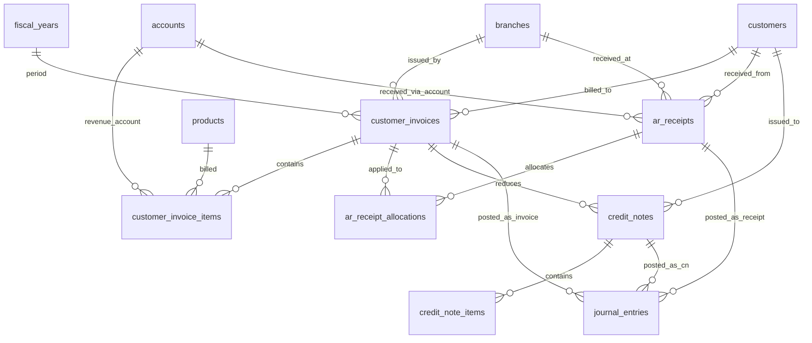
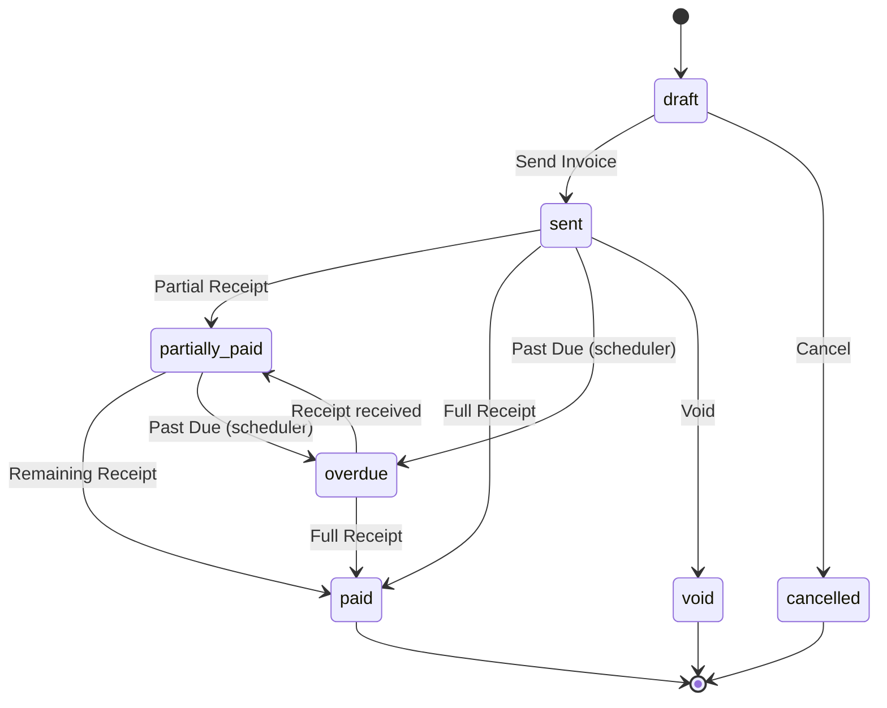

# Desain Database: Accounts Receivable (Piutang Usaha)

Dokumen ini menjelaskan struktur database untuk modul Accounts Receivable (AR) dalam sistem ERP. Fokus utama: pencatatan tagihan ke pelanggan (customer invoices), penerimaan pembayaran, dan integrasi dengan jurnal akuntansi.

## 1. Gambaran Umum

### Filosofi Desain

Modul AR mengelola **siklus piutang lengkap** — dari penerbitan invoice ke pelanggan hingga penerimaan pembayaran. Invoice bisa diterbitkan secara manual atau otomatis dari dokumen penjualan (Sales Order / Delivery Note — future module). Penerimaan pembayaran dicatat terpisah agar mendukung pembayaran parsial, multi-invoice receipt, dan rekonsiliasi bank.

### Alur Proses Piutang

```
Sales Order (future)  →  Customer Invoice  →  Receipt Allocation  →  Bank Receipt
   [pesanan pelanggan]     [faktur pelanggan]    [alokasi ke invoice]   [uang masuk]
```

> [!NOTE]
> Modul Sales Order belum didesain. Saat ini, Customer Invoice bisa dibuat secara manual tanpa referensi Sales Order. Integrasi dengan Sales Order ditambahkan di masa depan.

### Hubungan dengan Modul Lain

| Modul | Referensi Desain | Hubungan |
| :--- | :--- | :--- |
| **Products** | `00_products_design_v2.md` | Produk/jasa yang dijual dan dicantumkan di invoice |
| **Chart of Accounts** | `01_chart_of_accounts_design.md` | Invoice & receipt diposting ke jurnal (AR, revenue, kas/bank) |
| **Pipeline** | `10_pipeline_design.md` | Invoice lifecycle dikelola oleh pipeline |
| **Approval** | `11_approval_design.md` | Opsional: invoice bernilai tinggi atau credit note memerlukan approval |
| **General Ledger** | `17_general_ledger_design.md` | Rekonsiliasi bank memvalidasi penerimaan |
| **Accounts Payable** | `15_accounts_payable_design.md` | Pattern yang konsisten (AP mirror-image dari AR) |

### Komponen Utama
*   **Customer Invoice (Faktur Pelanggan)**: Dokumen tagihan kepada pelanggan yang menciptakan hak tagih (piutang).
*   **Invoice Items**: Rincian item yang ditagihkan (produk/jasa).
*   **AR Receipts (Penerimaan Pembayaran)**: Dokumen penerimaan uang dari pelanggan.
*   **Receipt Allocations**: Alokasi penerimaan ke invoice tertentu (mendukung partial receipt & multi-invoice receipt).
*   **Credit Notes (Nota Kredit)**: Pengurangan tagihan (retur, diskon tambahan, koreksi) yang mengurangi saldo piutang.

### Integrasi dengan Master Data yang Sudah Ada
*   **Pelanggan**: `customers`, `customer_categories` — penerima invoice.
*   **Produk**: `products`, `units` — barang/jasa yang dijual.
*   **Cabang**: `branches` — lokasi operasional.
*   **Akuntansi**: `accounts`, `journal_entries`, `journal_entry_lines` — posting AR, revenue, & receipt.
*   **Tahun Fiskal**: `fiscal_years` — periode akuntansi.

### Prinsip Desain
1.  **Header-Detail Pattern**: Invoice, receipt, dan credit note menggunakan header + items/allocations.
2.  **Partial Receipt**: Satu invoice bisa dibayar bertahap melalui beberapa receipt.
3.  **Multi-Invoice Receipt**: Satu receipt bisa melunasi beberapa invoice sekaligus.
4.  **Credit Note Support**: Pengurangan piutang melalui nota kredit (retur/koreksi).
5.  **Auto Journal Posting**: Invoice, receipt, dan credit note otomatis membuat jurnal.
6.  **Aging Ready**: Status dan tanggal jatuh tempo mendukung laporan aging piutang.
7.  **No Hard Delete**: Dokumen AR **tidak boleh di-delete**. Gunakan status `cancelled` / `void`.

---

## 2. Diagram Hubungan Entitas (ERD)



---

## 3. Detail Tabel

### A. Faktur Pelanggan (Customer Invoices)

#### 1. `customer_invoices`
Header dokumen faktur/tagihan ke pelanggan.

| Kolom | Tipe Data | Keterangan |
| :--- | :--- | :--- |
| `id` | BigInt | Primary Key |
| `invoice_number` | String | Nomor invoice (unique), generated, mis. INV-2026-000001 |
| `customer_id` | BigInt | FK -> `customers` |
| `branch_id` | BigInt | FK -> `branches` |
| `fiscal_year_id` | BigInt | FK -> `fiscal_years` |
| `invoice_date` | Date | Tanggal penerbitan invoice |
| `due_date` | Date | Tanggal jatuh tempo pembayaran |
| `payment_terms` | String | Syarat pembayaran (nullable, mis. "Net 30", "COD") |
| `currency` | String(3) | ISO currency (default: IDR) |
| `subtotal` | Decimal(15,2) | Total sebelum pajak (cache) |
| `tax_amount` | Decimal(15,2) | Total pajak (cache, default 0) |
| `discount_amount` | Decimal(15,2) | Total diskon (cache, default 0) |
| `grand_total` | Decimal(15,2) | Total tagihan (cache) |
| `amount_received` | Decimal(15,2) | Total yang sudah diterima (cache, default 0) |
| `credit_note_amount` | Decimal(15,2) | Total credit note yang sudah diterapkan (cache, default 0) |
| `amount_due` | Decimal(15,2) | Sisa piutang: `grand_total - amount_received - credit_note_amount` (cache) |
| `status` | Enum | `draft`, `sent`, `partially_paid`, `paid`, `overdue`, `cancelled`, `void` |
| `notes` | Text | Catatan (nullable) |
| `journal_entry_id` | BigInt | FK -> `journal_entries` (nullable, jurnal saat invoice sent/confirmed) |
| `created_by` | BigInt | FK -> `users` (nullable) |
| `sent_by` | BigInt | FK -> `users` (nullable) |
| `sent_at` | Timestamp | (nullable) |
| `created_at` | Timestamp | |
| `updated_at` | Timestamp | |

**Index (disarankan):** `invoice_number` (unique), `customer_id`, `status`, `due_date`, `invoice_date`, `fiscal_year_id`

##### Penjelasan Status

| Status | Penjelasan |
| :--- | :--- |
| **`draft`** | Invoice baru dibuat, belum dikirim. Masih bisa diedit. |
| **`sent`** | Invoice dikirim ke pelanggan, jurnal AR dibuat. Menunggu pembayaran. |
| **`partially_paid`** | Sebagian tagihan sudah diterima pembayarannya. |
| **`paid`** | Invoice sudah lunas (`amount_due = 0`). |
| **`overdue`** | Invoice melewati `due_date` dan belum lunas (diupdate otomatis oleh scheduler). |
| **`cancelled`** | Invoice dibatalkan sebelum sent. |
| **`void`** | Invoice yang sudah sent dibatalkan (jurnal reversal dibuat). |

> [!IMPORTANT]
> Saat invoice dikirim (status → `sent`):
> 1. Buat jurnal: **Debit** akun Accounts Receivable, **Kredit** akun Revenue per item.
> 2. Jika ada pajak: **Kredit** akun PPN Keluaran / Tax Payable.
> 3. Kolom `journal_entry_id` diisi dengan jurnal yang dibuat.

#### 2. `customer_invoice_items`
Rincian item pada invoice.

| Kolom | Tipe Data | Keterangan |
| :--- | :--- | :--- |
| `id` | BigInt | Primary Key |
| `customer_invoice_id` | BigInt | FK -> `customer_invoices` |
| `product_id` | BigInt | FK -> `products` (nullable, bisa jasa manual) |
| `account_id` | BigInt | FK -> `accounts` (akun revenue yang di-kredit) |
| `description` | String | Deskripsi item |
| `quantity` | Decimal(15,2) | Jumlah (default 1) |
| `unit_id` | BigInt | FK -> `units` (nullable) |
| `unit_price` | Decimal(15,2) | Harga satuan |
| `discount_percent` | Decimal(5,2) | Diskon per item (%, default 0) |
| `tax_percent` | Decimal(5,2) | Pajak per item (%, default 0) |
| `line_total` | Decimal(15,2) | Subtotal baris (cache) |
| `notes` | Text | Catatan per item (nullable) |
| `created_at` | Timestamp | |
| `updated_at` | Timestamp | |

**Index (disarankan):** `customer_invoice_id`, `product_id`, `account_id`

---

### B. Penerimaan Pembayaran (AR Receipts)

#### 3. `ar_receipts`
Header dokumen penerimaan pembayaran dari pelanggan.

| Kolom | Tipe Data | Keterangan |
| :--- | :--- | :--- |
| `id` | BigInt | Primary Key |
| `receipt_number` | String | Nomor receipt (unique), generated, mis. RCV-2026-000001 |
| `customer_id` | BigInt | FK -> `customers` |
| `branch_id` | BigInt | FK -> `branches` |
| `fiscal_year_id` | BigInt | FK -> `fiscal_years` |
| `receipt_date` | Date | Tanggal penerimaan |
| `payment_method` | Enum | `bank_transfer`, `cash`, `check`, `giro`, `credit_card`, `other` |
| `bank_account_id` | BigInt | FK -> `accounts` (akun kas/bank yang didebit) |
| `currency` | String(3) | ISO currency (default: IDR) |
| `total_amount` | Decimal(15,2) | Total nominal yang diterima |
| `total_allocated` | Decimal(15,2) | Total yang dialokasikan ke invoice (cache, default 0) |
| `total_unallocated` | Decimal(15,2) | Sisa belum dialokasikan (cache) |
| `reference` | String | Nomor referensi pembayaran (nullable, mis. nomor transfer) |
| `status` | Enum | `draft`, `confirmed`, `reconciled`, `cancelled`, `void` |
| `notes` | Text | Catatan (nullable) |
| `journal_entry_id` | BigInt | FK -> `journal_entries` (nullable) |
| `created_by` | BigInt | FK -> `users` (nullable) |
| `confirmed_by` | BigInt | FK -> `users` (nullable) |
| `confirmed_at` | Timestamp | (nullable) |
| `created_at` | Timestamp | |
| `updated_at` | Timestamp | |

**Index (disarankan):** `receipt_number` (unique), `customer_id`, `status`, `receipt_date`, `fiscal_year_id`, `bank_account_id`

##### Penjelasan Status

| Status | Penjelasan |
| :--- | :--- |
| **`draft`** | Receipt baru dibuat, belum dikonfirmasi. |
| **`confirmed`** | Receipt dikonfirmasi, jurnal dibuat, invoice terkait diupdate. |
| **`reconciled`** | Receipt sudah dicocokkan dengan mutasi bank. |
| **`cancelled`** | Receipt dibatalkan sebelum confirmed. |
| **`void`** | Receipt yang sudah confirmed dibatalkan (jurnal reversal, invoice rollback). |

> [!IMPORTANT]
> Saat receipt di-confirm:
> 1. Buat jurnal: **Debit** akun Kas/Bank (`bank_account_id`), **Kredit** akun Accounts Receivable.
> 2. Update `customer_invoices.amount_received` dan `amount_due` untuk setiap invoice yang dialokasikan.
> 3. Jika invoice sudah lunas → `customer_invoices.status = paid`.
> 4. Jika invoice sebagian → `customer_invoices.status = partially_paid`.

#### 4. `ar_receipt_allocations`
Alokasi penerimaan ke invoice tertentu.

| Kolom | Tipe Data | Keterangan |
| :--- | :--- | :--- |
| `id` | BigInt | Primary Key |
| `ar_receipt_id` | BigInt | FK -> `ar_receipts` |
| `customer_invoice_id` | BigInt | FK -> `customer_invoices` |
| `allocated_amount` | Decimal(15,2) | Nominal yang dialokasikan ke invoice ini |
| `discount_given` | Decimal(15,2) | Diskon pembayaran dini (early payment discount), default 0 |
| `notes` | Text | Catatan (nullable) |
| `created_at` | Timestamp | |
| `updated_at` | Timestamp | |

**Unique Constraint (disarankan):** `(ar_receipt_id, customer_invoice_id)`

---

### C. Nota Kredit (Credit Notes)

#### 5. `credit_notes`
Dokumen pengurangan piutang pelanggan (retur barang, diskon tambahan, koreksi).

| Kolom | Tipe Data | Keterangan |
| :--- | :--- | :--- |
| `id` | BigInt | Primary Key |
| `credit_note_number` | String | Nomor CN (unique), generated, mis. CN-2026-000001 |
| `customer_id` | BigInt | FK -> `customers` |
| `customer_invoice_id` | BigInt | FK -> `customer_invoices` (nullable, CN bisa tanpa referensi invoice spesifik) |
| `branch_id` | BigInt | FK -> `branches` |
| `fiscal_year_id` | BigInt | FK -> `fiscal_years` |
| `credit_note_date` | Date | Tanggal penerbitan CN |
| `reason` | Enum | `return`, `discount`, `correction`, `bad_debt`, `other` |
| `subtotal` | Decimal(15,2) | Total sebelum pajak (cache) |
| `tax_amount` | Decimal(15,2) | Total pajak (cache, default 0) |
| `grand_total` | Decimal(15,2) | Total credit note (cache) |
| `status` | Enum | `draft`, `confirmed`, `applied`, `cancelled`, `void` |
| `notes` | Text | Catatan / alasan detail (nullable) |
| `journal_entry_id` | BigInt | FK -> `journal_entries` (nullable) |
| `created_by` | BigInt | FK -> `users` (nullable) |
| `confirmed_by` | BigInt | FK -> `users` (nullable) |
| `confirmed_at` | Timestamp | (nullable) |
| `created_at` | Timestamp | |
| `updated_at` | Timestamp | |

**Index (disarankan):** `credit_note_number` (unique), `customer_id`, `customer_invoice_id`, `status`, `fiscal_year_id`

##### Penjelasan Status

| Status | Penjelasan |
| :--- | :--- |
| **`draft`** | CN baru dibuat, belum dikonfirmasi. |
| **`confirmed`** | CN dikonfirmasi, jurnal dibuat, tapi belum diterapkan ke invoice. |
| **`applied`** | CN sudah diterapkan, saldo piutang invoice berkurang. |
| **`cancelled`** | CN dibatalkan sebelum confirmed. |
| **`void`** | CN yang sudah confirmed/applied dibatalkan. |

##### Penjelasan `reason`

| Reason | Penjelasan |
| :--- | :--- |
| **`return`** | Retur barang dari pelanggan. |
| **`discount`** | Pemberian diskon tambahan setelah invoice terbit. |
| **`correction`** | Koreksi harga / kuantitas yang salah pada invoice. |
| **`bad_debt`** | Penghapusan piutang tak tertagih (write-off). |
| **`other`** | Alasan lainnya. |

> [!IMPORTANT]
> Saat CN di-confirm dan applied ke invoice:
> 1. Buat jurnal: **Debit** akun Revenue / Sales Return, **Kredit** akun Accounts Receivable.
> 2. Update `customer_invoices.credit_note_amount += grand_total`.
> 3. Recalculate `customer_invoices.amount_due`.

#### 6. `credit_note_items`
Rincian item pada credit note.

| Kolom | Tipe Data | Keterangan |
| :--- | :--- | :--- |
| `id` | BigInt | Primary Key |
| `credit_note_id` | BigInt | FK -> `credit_notes` |
| `product_id` | BigInt | FK -> `products` (nullable) |
| `account_id` | BigInt | FK -> `accounts` (akun yang di-debit, mis. Sales Return) |
| `description` | String | Deskripsi item |
| `quantity` | Decimal(15,2) | Jumlah |
| `unit_price` | Decimal(15,2) | Harga satuan |
| `tax_percent` | Decimal(5,2) | Pajak per item (%, default 0) |
| `line_total` | Decimal(15,2) | Subtotal baris (cache) |
| `notes` | Text | Catatan (nullable) |
| `created_at` | Timestamp | |
| `updated_at` | Timestamp | |

**Index (disarankan):** `credit_note_id`, `product_id`, `account_id`

---

## 4. Aturan Bisnis (Ringkas)

### Posting Jurnal

#### Saat Invoice Sent (Diterbitkan)
| Akun | Debit | Kredit |
| :--- | :--- | :--- |
| Accounts Receivable (Piutang Dagang) | ✓ | |
| Revenue / Penjualan (per item `account_id`) | | ✓ |
| PPN Keluaran / Tax Payable (jika ada pajak) | | ✓ |

#### Saat AR Receipt Confirmed
| Akun | Debit | Kredit |
| :--- | :--- | :--- |
| Kas / Bank (`bank_account_id`) | ✓ | |
| Accounts Receivable (Piutang Dagang) | | ✓ |

#### Saat Credit Note Applied
| Akun | Debit | Kredit |
| :--- | :--- | :--- |
| Revenue / Sales Return (per item `account_id`) | ✓ | |
| Accounts Receivable (Piutang Dagang) | | ✓ |

### Overdue Detection (Scheduler)
*   Scheduled job berjalan harian.
*   Query: `customer_invoices WHERE status IN ('sent', 'partially_paid') AND due_date < TODAY`.
*   Update status menjadi `overdue`.

### Nomor Dokumen (Auto-Generate)
*   Customer Invoice: `INV-{YYYY}-{seq:6}` → INV-2026-000001
*   AR Receipt: `RCV-{YYYY}-{seq:6}` → RCV-2026-000001
*   Credit Note: `CN-{YYYY}-{seq:6}` → CN-2026-000001

---

## 5. Rekomendasi Menu & Tabel Terlibat

### A. Operasional Piutang

#### 1) Customer Invoices
Tujuan: membuat dan mengelola faktur pelanggan.

Jenis menu: Complex CRUD
Agent skill: `feature-crud-complex`

Tabel terlibat:
* `customer_invoices`
* `customer_invoice_items`
* `customers`
* `customer_categories`
* `branches`
* `products`
* `units`
* `accounts`
* `fiscal_years`
* `journal_entries`
* `users`

Fitur khusus:
* Auto-pricing dari `product_prices` berdasarkan customer category.
* Aging summary di card atas listing.
* Print/export invoice ke PDF.
* Filter: status, customer, date range, due date, overdue.

#### 2) AR Receipts
Tujuan: mencatat penerimaan pembayaran dari pelanggan.

Jenis menu: Complex CRUD
Agent skill: `feature-crud-complex`

Tabel terlibat:
* `ar_receipts`
* `ar_receipt_allocations`
* `customer_invoices`
* `customers`
* `branches`
* `accounts` (kas/bank)
* `fiscal_years`
* `journal_entries`
* `users`

Fitur khusus:
* Pilih outstanding invoices dari customer → auto-populate allocations.
* Multi-invoice receipt: pilih beberapa invoice sekaligus.
* Filter: status, customer, payment method, date range.

#### 3) Credit Notes
Tujuan: mengelola nota kredit (retur, diskon, koreksi).

Jenis menu: Complex CRUD
Agent skill: `feature-crud-complex`

Tabel terlibat:
* `credit_notes`
* `credit_note_items`
* `customer_invoices`
* `customers`
* `products`
* `accounts`
* `users`

---

### B. Monitoring & Laporan

#### 4) AR Aging Report
Tujuan: laporan umur piutang per pelanggan (current, 30, 60, 90, >90 hari).

Jenis menu: Non-CRUD
Agent skill: `feature-non-crud`

Tabel terlibat:
* `customer_invoices`
* `customers`
* `branches`

#### 5) AR Outstanding Report
Tujuan: daftar invoice yang belum lunas, sortir berdasarkan jatuh tempo.

Jenis menu: Non-CRUD
Agent skill: `feature-non-crud`

Tabel terlibat:
* `customer_invoices`
* `customers`

#### 6) Customer Statement
Tujuan: laporan transaksi per pelanggan (invoice, receipt, CN) dalam periode.

Jenis menu: Non-CRUD
Agent skill: `feature-non-crud`

Tabel terlibat:
* `customer_invoices`
* `ar_receipts`
* `ar_receipt_allocations`
* `credit_notes`
* `customers`

---

## 6. Integrasi dengan Pipeline & Approval System

### Customer Invoice Lifecycle (via Pipeline)



**Pipeline:** `customer_invoice_lifecycle`
- entity_type: `App\Models\CustomerInvoice`

| State (code) | Name | Type | Color |
| :--- | :--- | :--- | :--- |
| `draft` | Draft | initial | `#6B7280` |
| `sent` | Sent | intermediate | `#10B981` |
| `partially_paid` | Partially Paid | intermediate | `#3B82F6` |
| `paid` | Paid | final | `#059669` |
| `overdue` | Overdue | intermediate | `#EF4444` |
| `cancelled` | Cancelled | final | `#9CA3AF` |
| `void` | Void | final | `#DC2626` |

---

## 7. Dampak pada Modul Existing

### Tabel `document_sequences`
Tambahkan prefix baru:

| Prefix | Dokumen |
| :--- | :--- |
| `INV` | Customer Invoice |
| `RCV` | AR Receipt |
| `CN` | Credit Note |

### Tabel `accounts`
Pastikan ada akun:
*   Accounts Receivable (type: `asset`, sub_type: `current_asset`)
*   Revenue / Penjualan (type: `revenue`)
*   Sales Return (type: `revenue`, contra account)
*   PPN Keluaran / Tax Payable (type: `liability`, sub_type: `current_liability`)
