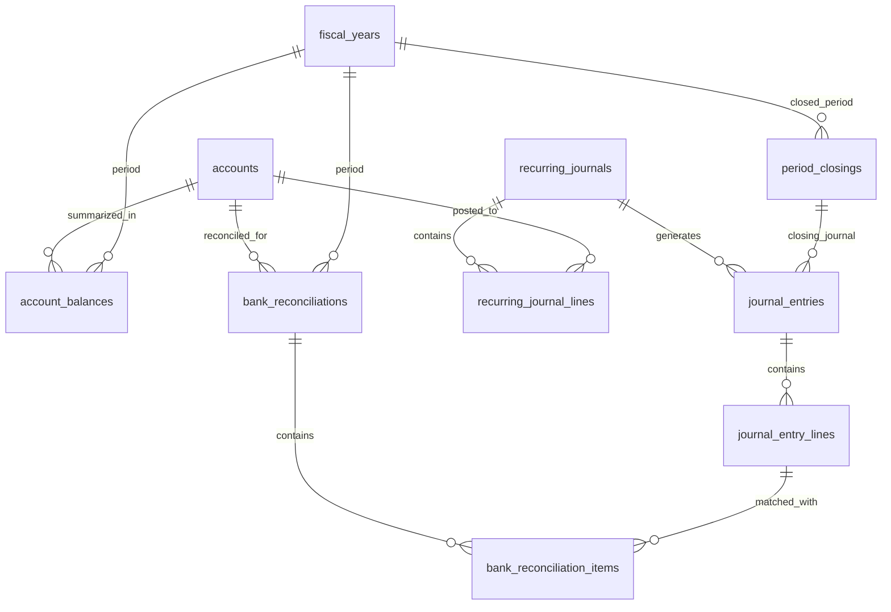
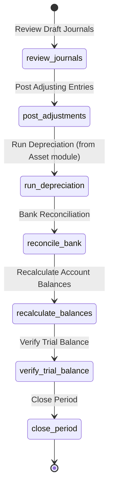

# Desain Database: General Ledger (Buku Besar)

Dokumen ini menjelaskan struktur database tambahan untuk memperluas modul General Ledger (Buku Besar) yang fondasi-nya sudah dibangun di `01_chart_of_accounts_design.md`. Fokus utama: jurnal penyesuaian (adjusting entries), posting penutup (closing entries), rekonsiliasi bank, dan trial balance.

## 1. Gambaran Umum

### Filosofi Desain

Modul GL memperluas jurnal umum yang sudah ada di `01_chart_of_accounts_design.md` dengan menambahkan fitur-fitur akuntansi yang diperlukan untuk **proses akhir bulan/akhir tahun** — jurnal penyesuaian, penutupan buku, rekonsiliasi bank, dan perhitungan saldo buku besar. Tabel-tabel dasar (`fiscal_years`, `coa_versions`, `accounts`, `account_mappings`, `journal_entries`, `journal_entry_lines`) **sudah didefinisikan** dan **tidak diduplikasi** di dokumen ini.

> [!IMPORTANT]
> Dokumen ini **melengkapi** `01_chart_of_accounts_design.md`, bukan menggantikannya. Semua tabel dasar (fiscal years, accounts, journal entries) tetap merujuk ke desain dokumen tersebut.

### Hubungan dengan Modul Lain

| Modul | Referensi Desain | Hubungan |
| :--- | :--- | :--- |
| **COA** | `01_chart_of_accounts_design.md` | Fondasi GL: accounts, journal entries, fiscal years |
| **Accounts Payable** | `15_accounts_payable_design.md` | Jurnal AP posting & pembayaran |
| **Accounts Receivable** | `16_accounts_receivable_design.md` | Jurnal AR posting & penerimaan |
| **Asset Management** | `12_asset_management_design.md` | Jurnal depresiasi |
| **Inventory** | `14_inventory_design.md` | Jurnal adjustment & transfer |
| **Financial Reports** | `18_financial_reports_design.md` | GL menjadi data source utama untuk semua laporan keuangan |

### Komponen Utama yang Ditambahkan
*   **Recurring Journals**: Template jurnal berulang otomatis (mis. beban sewa bulanan, beban asuransi).
*   **Bank Reconciliation**: Proses pencocokan mutasi bank dengan catatan pembukuan.
*   **Period Closing**: Proses penutupan periode akuntansi (closing entries).
*   **Account Balances (Cache)**: Saldo buku besar per akun per periode untuk performa query laporan.

### Prinsip Desain Tambahan
1.  **No Duplicate**: Tabel yang sudah ada di `01_chart_of_accounts_design.md` **tidak diduplikasi**.
2.  **Period-Based Balances**: Saldo per akun per bulan disimpan sebagai cache di `account_balances`.
3.  **Reconciliation Trail**: Setiap pencocokan bank tercatat sebagai audit trail.
4.  **Auto-Closing**: Jurnal penutup bisa di-generate otomatis berdasarkan konfigurasi.
5.  **Recurring Ready**: Jurnal berulang dijalankan otomatis via scheduler.

---

## 2. Diagram Hubungan Entitas (ERD)

---

## 3. Detail Tabel

### A. Saldo Buku Besar (Account Balances)

#### 1. `account_balances`
Cache saldo per akun per bulan. Dihitung ulang dari `journal_entry_lines` yang berstatus `posted`. Digunakan untuk performa query laporan keuangan.

| Kolom | Tipe Data | Keterangan |
| :--- | :--- | :--- |
| `id` | BigInt | Primary Key |
| `account_id` | BigInt | FK -> `accounts` |
| `fiscal_year_id` | BigInt | FK -> `fiscal_years` |
| `period_month` | Integer | Bulan periode (1-12) |
| `period_year` | Integer | Tahun periode (mis. 2026) |
| `opening_balance` | Decimal(15,2) | Saldo awal bulan (debit - credit, signed) |
| `debit_total` | Decimal(15,2) | Total debit di bulan ini |
| `credit_total` | Decimal(15,2) | Total kredit di bulan ini |
| `closing_balance` | Decimal(15,2) | Saldo akhir bulan: `opening_balance + debit_total - credit_total` (untuk akun debit) |
| `movement` | Decimal(15,2) | Net movement: `debit_total - credit_total` (cache) |
| `last_recalculated_at` | Timestamp | Waktu terakhir dihitung ulang |
| `created_at` | Timestamp | |
| `updated_at` | Timestamp | |

**Unique Constraint:** `(account_id, fiscal_year_id, period_month, period_year)`

**Index (disarankan):** `account_id`, `fiscal_year_id`, `(period_year, period_month)`

> [!TIP]
> `closing_balance` dihitung berdasarkan `normal_balance` akun:
> - Akun debit (Asset, Expense): `opening_balance + debit_total - credit_total`
> - Akun kredit (Liability, Equity, Revenue): `opening_balance + credit_total - debit_total`

> [!NOTE]
> Table ini bersifat **cache** — bisa di-rebuild kapan saja dari `journal_entry_lines`. Recalculation bisa dilakukan via scheduled job atau on-demand saat tutup buku. `opening_balance` bulan N = `closing_balance` bulan N-1.

##### Kapan Account Balances Dihitung Ulang
1.  **Saat jurnal di-posting** (real-time update): increment `debit_total` / `credit_total` dan recalculate `closing_balance`.
2.  **Saat jurnal di-void** (real-time update): decrement dan recalculate.
3.  **Saat tutup bulan** (batch recalculation): full recalculate dari `journal_entry_lines` untuk validasi.
4.  **On demand**: admin bisa trigger recalculation manual dari UI.

---

### B. Jurnal Berulang (Recurring Journals)

#### 2. `recurring_journals`
Template jurnal yang dijadwalkan berulang otomatis.

| Kolom | Tipe Data | Keterangan |
| :--- | :--- | :--- |
| `id` | BigInt | Primary Key |
| `name` | String | Nama template (mis. "Beban Sewa Gedung Bulanan") |
| `description` | Text | Deskripsi template (nullable) |
| `fiscal_year_id` | BigInt | FK -> `fiscal_years` (nullable, berlaku di tahun fiskal tertentu) |
| `frequency` | Enum | `monthly`, `quarterly`, `semi_annual`, `annual` |
| `next_run_date` | Date | Tanggal eksekusi berikutnya |
| `last_run_date` | Date | Tanggal eksekusi terakhir (nullable) |
| `end_date` | Date | Tanggal berakhir penjadwalan (nullable, NULL = berlaku selamanya) |
| `total_amount` | Decimal(15,2) | Total amount jurnal (cache, harus balance debit = kredit) |
| `auto_post` | Boolean | Apakah jurnal yang dihasilkan langsung di-post (default: false = draft) |
| `is_active` | Boolean | Apakah template aktif (default: true) |
| `created_by` | BigInt | FK -> `users` (nullable) |
| `created_at` | Timestamp | |
| `updated_at` | Timestamp | |

**Index (disarankan):** `is_active`, `next_run_date`, `frequency`

##### Penjelasan `frequency`

| Frequency | Penjelasan | Contoh |
| :--- | :--- | :--- |
| **`monthly`** | Setiap bulan. | Beban sewa, beban asuransi, beban gaji tetap. |
| **`quarterly`** | Setiap 3 bulan. | Beban pajak triwulanan. |
| **`semi_annual`** | Setiap 6 bulan. | Beban asuransi semesteran. |
| **`annual`** | Setiap tahun. | Beban lisensi tahunan. |

> [!NOTE]
> Saat `next_run_date` tercapai, scheduler membuat `journal_entry` baru (status `draft` atau `posted` berdasarkan `auto_post`), lalu menggeser `next_run_date` ke periode berikutnya. Jurnal yang dihasilkan memiliki `reference` yang menunjuk ke `recurring_journals` (mis. "Auto: Beban Sewa Gedung Bulanan").

#### 3. `recurring_journal_lines`
Detail baris debit/kredit pada template jurnal berulang.

| Kolom | Tipe Data | Keterangan |
| :--- | :--- | :--- |
| `id` | BigInt | Primary Key |
| `recurring_journal_id` | BigInt | FK -> `recurring_journals` |
| `account_id` | BigInt | FK -> `accounts` |
| `debit` | Decimal(15,2) | Jumlah debit (0 jika kredit) |
| `credit` | Decimal(15,2) | Jumlah kredit (0 jika debit) |
| `memo` | String | Keterangan per baris (nullable) |
| `created_at` | Timestamp | |
| `updated_at` | Timestamp | |

**Index (disarankan):** `recurring_journal_id`, `account_id`

---

### C. Rekonsiliasi Bank

#### 4. `bank_reconciliations`
Header dokumen rekonsiliasi bank per akun bank per periode.

| Kolom | Tipe Data | Keterangan |
| :--- | :--- | :--- |
| `id` | BigInt | Primary Key |
| `account_id` | BigInt | FK -> `accounts` (akun bank yang direkonsiliasi) |
| `fiscal_year_id` | BigInt | FK -> `fiscal_years` |
| `reconciliation_date` | Date | Tanggal rekonsiliasi |
| `period_start` | Date | Awal periode yang direkonsiliasi |
| `period_end` | Date | Akhir periode yang direkonsiliasi |
| `statement_balance` | Decimal(15,2) | Saldo menurut rekening koran bank |
| `book_balance` | Decimal(15,2) | Saldo menurut buku besar (calculated) |
| `reconciled_balance` | Decimal(15,2) | Saldo setelah rekonsiliasi — harus sama dengan `statement_balance` |
| `difference` | Decimal(15,2) | Selisih: `statement_balance - reconciled_balance` (harus 0 saat selesai) |
| `status` | Enum | `in_progress`, `completed`, `cancelled` |
| `notes` | Text | Catatan (nullable) |
| `completed_by` | BigInt | FK -> `users` (nullable) |
| `completed_at` | Timestamp | (nullable) |
| `created_by` | BigInt | FK -> `users` (nullable) |
| `created_at` | Timestamp | |
| `updated_at` | Timestamp | |

**Unique Constraint (disarankan):** `(account_id, period_start, period_end)`

**Index (disarankan):** `account_id`, `status`, `fiscal_year_id`, `reconciliation_date`

##### Penjelasan Status

| Status | Penjelasan |
| :--- | :--- |
| **`in_progress`** | Rekonsiliasi sedang berjalan, item sedang dicocokkan. |
| **`completed`** | Rekonsiliasi selesai, selisih = 0. |
| **`cancelled`** | Rekonsiliasi dibatalkan. |

#### 5. `bank_reconciliation_items`
Detail pencocokan per transaksi.

| Kolom | Tipe Data | Keterangan |
| :--- | :--- | :--- |
| `id` | BigInt | Primary Key |
| `bank_reconciliation_id` | BigInt | FK -> `bank_reconciliations` |
| `journal_entry_line_id` | BigInt | FK -> `journal_entry_lines` (nullable, transaksi buku) |
| `transaction_date` | Date | Tanggal transaksi |
| `description` | String | Deskripsi transaksi |
| `debit` | Decimal(15,2) | Jumlah debit (dari mutasi bank) |
| `credit` | Decimal(15,2) | Jumlah kredit (dari mutasi bank) |
| `type` | Enum | `matched`, `outstanding_check`, `deposit_in_transit`, `bank_charge`, `bank_interest`, `error`, `other` |
| `is_reconciled` | Boolean | Sudah dicocokkan (default: false) |
| `reference` | String | Nomor referensi (nullable, mis. nomor cek, referensi transfer) |
| `notes` | Text | Catatan (nullable) |
| `created_at` | Timestamp | |
| `updated_at` | Timestamp | |

**Index (disarankan):** `bank_reconciliation_id`, `journal_entry_line_id`, `type`, `is_reconciled`

##### Penjelasan `type`

| Tipe | Penjelasan | Contoh |
| :--- | :--- | :--- |
| **`matched`** | Transaksi buku cocok dengan mutasi bank. | Transfer keluar tercatat di buku dan di bank. |
| **`outstanding_check`** | Cek yang sudah dicatat di buku tapi belum dicairkan di bank. | Cek #001 belum dicairkan. |
| **`deposit_in_transit`** | Setoran yang sudah dicatat di buku tapi belum masuk di bank. | Setoran tanggal 30 baru masuk tanggal 2 bulan depan. |
| **`bank_charge`** | Biaya bank yang tercatat di bank tapi belum dicatat di buku. | Biaya admin, biaya transfer. |
| **`bank_interest`** | Jasa giro / bunga yang tercatat di bank tapi belum dicatat di buku. | Bunga deposito. |
| **`error`** | Kesalahan pencatatan (baik di buku maupun di bank). | Salah catat nominal transfer. |
| **`other`** | Item lainnya. | — |

> [!IMPORTANT]
> Saat rekonsiliasi di-complete:
> 1. Semua `bank_charge` dan `bank_interest` yang belum ada jurnal-nya → otomatis generate `journal_entry` (adjusting entry) agar buku besar sesuai dengan rekening koran.
> 2. AP Payments dan AR Receipts yang termasuk dalam reconciled items → update status menjadi `reconciled`.
> 3. Selisih harus 0: `statement_balance = book_balance + uncleared items`.

---

### D. Penutupan Periode (Period Closing)

#### 6. `period_closings`
Dokumen penutupan periode akuntansi (bulanan/tahunan).

| Kolom | Tipe Data | Keterangan |
| :--- | :--- | :--- |
| `id` | BigInt | Primary Key |
| `fiscal_year_id` | BigInt | FK -> `fiscal_years` |
| `period_month` | Integer | Bulan yang ditutup (1-12, nullable. NULL = closing tahunan) |
| `period_year` | Integer | Tahun yang ditutup |
| `closing_type` | Enum | `monthly`, `annual` |
| `status` | Enum | `draft`, `closed`, `reopened` |
| `closing_journal_entry_id` | BigInt | FK -> `journal_entries` (nullable, jurnal penutup yang dihasilkan) |
| `retained_earnings_account_id` | BigInt | FK -> `accounts` (akun Laba Ditahan / Retained Earnings) |
| `net_income` | Decimal(15,2) | Laba/Rugi bersih periode ini (Revenue - Expense, cache) |
| `notes` | Text | Catatan (nullable) |
| `closed_by` | BigInt | FK -> `users` (nullable) |
| `closed_at` | Timestamp | (nullable) |
| `reopened_by` | BigInt | FK -> `users` (nullable) |
| `reopened_at` | Timestamp | (nullable) |
| `created_by` | BigInt | FK -> `users` (nullable) |
| `created_at` | Timestamp | |
| `updated_at` | Timestamp | |

**Unique Constraint (disarankan):** `(fiscal_year_id, period_month, period_year, closing_type)`

**Index (disarankan):** `fiscal_year_id`, `status`, `closing_type`

##### Penjelasan `closing_type`

| Tipe | Penjelasan |
| :--- | :--- |
| **`monthly`** | Penutupan bulan — menghitung account balances, membekukan jurnal bulan tersebut. |
| **`annual`** | Penutupan tahun — membuat jurnal penutup (closing entry) yang memindahkan saldo Revenue & Expense ke Retained Earnings. |

##### Penjelasan Status

| Status | Penjelasan |
| :--- | :--- |
| **`draft`** | Proses closing dipersiapkan, belum final. |
| **`closed`** | Periode ditutup. Tidak ada jurnal baru yang boleh masuk ke periode ini. |
| **`reopened`** | Periode dibuka kembali (oleh admin dengan permission khusus). |

> [!IMPORTANT]
> Saat annual closing:
> 1. Hitung total Revenue dan Expense untuk tahun fiskal.
> 2. Buat jurnal penutup:
>    - **Debit** semua akun Revenue (menol-kan saldo revenue)
>    - **Kredit** semua akun Expense (menol-kan saldo expense)
>    - Selisih (net income/loss) diposting ke akun **Retained Earnings** (Laba Ditahan).
> 3. Saldo akun Revenue & Expense menjadi 0 → siap untuk tahun fiskal baru.
> 4. Saldo akun Balance Sheet (Asset, Liability, Equity) → carry forward ke tahun baru.

> [!CAUTION]
> Saat periode sudah `closed`, semua jurnal dalam periode tersebut **tidak boleh diubah**. Jika ada koreksi, periode harus di-`reopen` terlebih dahulu (memerlukan permission `gl.reopen-period`), lalu ditutup kembali setelah koreksi.

---

## 4. Aturan Bisnis (Ringkas)

### Proses Tutup Bulan (Monthly Closing)

1.  **Review draft journals**: Pastikan semua jurnal draft sudah di-review dan di-post.
2.  **Adjusting entries**: Buat jurnal penyesuaian (accrual, prepaid, depreciation).
3.  **Run depreciation**: Jalankan depreciation run dari Asset module → posting ke jurnal.
4.  **Bank reconciliation**: Cocokkan mutasi bank dengan buku besar.
5.  **Recalculate balances**: Hitung ulang `account_balances` untuk bulan ini.
6.  **Verify trial balance**: Pastikan total debit = total kredit.
7.  **Close period**: Buat `period_closing` (status: `closed`). Bulan ini dibekukan.

### Proses Tutup Tahun (Annual Closing)

1.  Pastikan semua bulan sudah di-close (monthly closing 12 bulan).
2.  Buat jurnal penutup (closing entry): Revenue & Expense → Retained Earnings.
3.  Buat `period_closing` tahunan (status: `closed`).
4.  Update `fiscal_years.status = closed`.
5.  Clone COA ke tahun fiskal baru jika diperlukan (lihat `01_chart_of_accounts_design.md`).

### Recurring Journal Execution
*   Scheduler berjalan harian.
*   Query: `WHERE is_active = true AND next_run_date <= TODAY AND (end_date IS NULL OR end_date >= TODAY)`.
*   Untuk setiap template yang eligible:
    1.  Buat `journal_entry` dari `recurring_journal_lines`.
    2.  Set `journal_entry.reference = 'Recurring: {name}'`.
    3.  Jika `auto_post = true`, langsung posting. Jika tidak, biarkan `draft`.
    4.  Update `last_run_date = TODAY`.
    5.  Update `next_run_date` ke periode berikutnya berdasarkan `frequency`.

---

## 5. Rekomendasi Menu & Tabel Terlibat

### A. Operasional GL

#### 1) Journal Entries (sudah ada)
Sudah didesain di `01_chart_of_accounts_design.md` dan sudah ada di module-registry. Ditambahkan fitur:
*   Label/tag untuk membedakan tipe jurnal: `general`, `adjusting`, `closing`, `recurring`, `system`.
*   Filter tambahan: tipe jurnal, source module.

#### 2) Recurring Journals
Tujuan: mengelola template jurnal berulang.

Jenis menu: Complex CRUD
Agent skill: `feature-crud-complex`

Tabel terlibat:
* `recurring_journals`
* `recurring_journal_lines`
* `accounts`
* `fiscal_years`
* `users`

Fitur khusus:
* Inline editing baris debit/kredit.
* Preview jurnal yang akan dihasilkan.
* Aktivasi/deaktivasi template.
* Filter: frequency, is_active, next_run_date.

#### 3) Bank Reconciliation
Tujuan: mencocokkan mutasi bank dengan catatan buku besar.

Jenis menu: Non-CRUD (wizard-style)
Agent skill: `feature-non-crud`

Tabel terlibat:
* `bank_reconciliations`
* `bank_reconciliation_items`
* `journal_entry_lines`
* `journal_entries`
* `accounts`
* `ap_payments` (update status reconciled)
* `ar_receipts` (update status reconciled)
* `users`

Fitur khusus:
* Import mutasi bank (CSV/Excel).
* Auto-match berdasarkan nominal dan tanggal.
* Manual matching untuk item yang tidak auto-match.
* Summary: book balance, outstanding items, adjusted balance, bank balance, difference.
* Filter: akun bank, periode.

#### 4) Period Closing
Tujuan: penutupan periode bulanan atau tahunan.

Jenis menu: Non-CRUD (wizard-style)
Agent skill: `feature-non-crud`

Tabel terlibat:
* `period_closings`
* `account_balances`
* `journal_entries`
* `journal_entry_lines`
* `accounts`
* `fiscal_years`
* `users`

Fitur khusus:
* Checklist pre-closing: draft journals? unreconciled items? depreciation run?
* Preview jurnal penutup sebelum final.
* Reopen period (dengan permission khusus).

---

### B. Monitoring & Query

#### 5) General Ledger (Buku Besar)
Tujuan: melihat buku besar per akun — semua jurnal yang mempengaruhi akun tersebut.

Jenis menu: Non-CRUD
Agent skill: `feature-non-crud`

Tabel terlibat:
* `accounts`
* `journal_entries`
* `journal_entry_lines`
* `account_balances`
* `fiscal_years`

Fitur khusus:
* Running balance per akun.
* Drill-down: klik jurnal → navigasi ke detail journal entry.
* Filter: akun, periode, journal type.
* Export ke CSV/Excel.

#### 6) Trial Balance
Tujuan: menampilkan neraca saldo — semua akun dengan saldo debit dan kredit.

Jenis menu: Non-CRUD
Agent skill: `feature-non-crud`

Tabel terlibat:
* `account_balances`
* `accounts`
* `fiscal_years`

Fitur khusus:
* Pilih periode (bulan/tahun).
* Total debit HARUS = total kredit.
* Filter by account type.
* Export.

---

## 6. Dampak pada Modul Existing

### Tabel `journal_entries`
Pertimbangkan menambahkan kolom opsional:

| Kolom | Tipe Data | Keterangan |
| :--- | :--- | :--- |
| `journal_type` | Enum | `general`, `adjusting`, `closing`, `recurring`, `system` (default: `general`) |
| `source_type` | String | Polymorphic type sumber otomatis (nullable, mis. `App\Models\SupplierBill`, `App\Models\AssetDepreciationRun`) |
| `source_id` | BigInt | Polymorphic ID sumber otomatis (nullable) |

> [!NOTE]
> Kolom `journal_type` membantu filtering dan reporting. Kolom `source_type`/`source_id` memungkinkan tracing jurnal ke dokumen sumber aslinya (bill, payment, depreciation, dsb).

### Tabel `fiscal_years`
Status `closed` dan `locked` sudah didefinisikan. Period closing module men-trigger perubahan status ini.

### Tabel `accounts`
Pastikan seed data COA memiliki akun-akun penting:
*   **Retained Earnings** (Laba Ditahan) — type: `equity`, sub_type: `retained_earnings`
*   **Income Summary** (Ikhtisar Laba/Rugi) — opsional, type: `equity` (hanya digunakan selama closing process)
