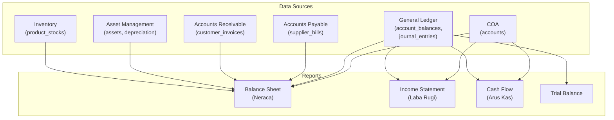

# Desain Database: Laporan Keuangan (Financial Reports)

Dokumen ini menjelaskan struktur dan logika untuk modul Laporan Keuangan dalam sistem ERP. Fokus utama: Neraca (Balance Sheet), Laba Rugi (Income Statement), dan Arus Kas (Cash Flow Statement).

## 1. Gambaran Umum

### Filosofi Desain

Laporan keuangan **tidak memerlukan tabel baru** — semua data bersumber dari tabel yang sudah ada. Modul ini berfokus pada **query, aggregation, dan presentasi** data dari General Ledger (`account_balances`, `journal_entries`, `accounts`) dan modul pendukung lainnya. Konfigurasi tambahan yang diperlukan adalah mapping akun ke komponen laporan (disimpan sebagai konfigurasi).

> [!IMPORTANT]
> Laporan keuangan bersifat **read-only** — tidak ada operasi CRUD pada data. Semua manipulasi data dilakukan melalui jurnal di modul-modul lain.

### Hubungan dengan Modul Lain

| Modul | Referensi Desain | Data Source |
| :--- | :--- | :--- |
| **COA** | `01_chart_of_accounts_design.md` | `accounts` (hierarki akun, type, sub_type) |
| **General Ledger** | `17_general_ledger_design.md` | `account_balances` (saldo per akun per bulan), `journal_entries` |
| **Accounts Payable** | `15_accounts_payable_design.md` | `supplier_bills` (aging hutang) |
| **Accounts Receivable** | `16_accounts_receivable_design.md` | `customer_invoices` (aging piutang) |
| **Asset Management** | `12_asset_management_design.md` | `assets` (nilai buku aset) |
| **Inventory** | `14_inventory_design.md` | `product_stocks` (nilai persediaan) |

### Komponen Utama
*   **Neraca / Balance Sheet**: Posisi keuangan perusahaan pada titik waktu tertentu (Aset = Liabilitas + Ekuitas).
*   **Laporan Laba Rugi / Income Statement**: Kinerja keuangan selama periode tertentu (Pendapatan - Beban = Laba/Rugi).
*   **Laporan Arus Kas / Cash Flow Statement**: Pergerakan kas masuk dan keluar selama periode tertentu (Operating, Investing, Financing).
*   **Konfigurasi Laporan**: Mapping akun ke komponen laporan dan layout presentasi.

### Prinsip Desain
1.  **No New Data Tables**: Laporan keuangan menggunakan data dari tabel existing.
2.  **Configuration-Driven**: Layout dan mapping akun dikonfigurasi melalui tabel konfigurasi.
3.  **Period Flexible**: Semua laporan bisa dihasilkan untuk periode apapun (bulanan, kuartalan, tahunan).
4.  **Comparative**: Mendukung laporan perbandingan (periode ini vs periode sebelumnya / tahun lalu).
5.  **Multi-Format**: Output bisa ditampilkan di browser (HTML), diekspor ke PDF dan Excel.
6.  **Account Hierarchy**: Mengikuti hierarki akun (`accounts.parent_id`) untuk indentasi dan subtotaling.

---

## 2. Tabel Konfigurasi

### 1. `report_configurations`
Konfigurasi meta untuk setiap jenis laporan keuangan.

| Kolom | Tipe Data | Keterangan |
| :--- | :--- | :--- |
| `id` | BigInt | Primary Key |
| `code` | String | Kode laporan (unique, mis. `balance_sheet`, `income_statement`, `cash_flow`) |
| `name` | String | Nama laporan (mis. "Neraca", "Laporan Laba Rugi") |
| `description` | Text | Deskripsi (nullable) |
| `report_type` | Enum | `balance_sheet`, `income_statement`, `cash_flow`, `trial_balance`, `custom` |
| `layout_config` | JSON | Konfigurasi layout/presentasi (nullable) |
| `is_active` | Boolean | Apakah konfigurasi aktif (default: true) |
| `created_by` | BigInt | FK -> `users` (nullable) |
| `created_at` | Timestamp | |
| `updated_at` | Timestamp | |

**Index (disarankan):** `code` (unique), `report_type`, `is_active`

> [!NOTE]
> Seed data default: `balance_sheet`, `income_statement`, `cash_flow`, `trial_balance`. Admin bisa menambahkan custom reports.

### 2. `report_sections`
Bagian/seksi dalam satu laporan (mis. "Aset Lancar", "Aset Tetap", "Aktivitas Operasional").

| Kolom | Tipe Data | Keterangan |
| :--- | :--- | :--- |
| `id` | BigInt | Primary Key |
| `report_configuration_id` | BigInt | FK -> `report_configurations` |
| `parent_id` | BigInt | Self FK -> `report_sections` (nullable, untuk nesting) |
| `code` | String | Kode section (mis. `current_assets`, `operating_activities`) |
| `name` | String | Nama section yang ditampilkan |
| `sort_order` | Integer | Urutan tampilan |
| `section_type` | Enum | `header`, `detail`, `subtotal`, `total`, `separator` |
| `account_type_filter` | String | Filter berdasarkan `accounts.type` (nullable, mis. `asset`) |
| `account_sub_type_filter` | String | Filter berdasarkan `accounts.sub_type` (nullable, mis. `current_asset`) |
| `sign_convention` | Enum | `normal`, `reversed` (default: `normal`) |
| `formula` | String | Formula untuk calculated sections (nullable, mis. `{current_assets} - {current_liabilities}`) |
| `is_active` | Boolean | (default: true) |
| `created_at` | Timestamp | |
| `updated_at` | Timestamp | |

**Unique Constraint:** `(report_configuration_id, code)`

**Index (disarankan):** `report_configuration_id`, `parent_id`, `sort_order`

##### Penjelasan `section_type`

| Tipe | Penjelasan |
| :--- | :--- |
| **`header`** | Judul section (mis. "ASET LANCAR"). Tidak memiliki nilai numerik. |
| **`detail`** | Baris yang menampilkan saldo akun-akun yang cocok dengan filter. |
| **`subtotal`** | Penjumlahan dari detail di atas-nya. |
| **`total`** | Total keseluruhan section (mis. "TOTAL ASET"). |
| **`separator`** | Garis pemisah visual. |

##### Penjelasan `sign_convention`

| Konvensi | Penjelasan |
| :--- | :--- |
| **`normal`** | Menampilkan saldo sesuai normal balance akun. Akun debit positif, akun kredit positif. |
| **`reversed`** | Membalik tanda saldo. Digunakan di Arus Kas dimana expense perlu ditampilkan sebagai positif (menambah kas) jika berkurang. |

---

## 3. Struktur Laporan Keuangan

### A. Neraca (Balance Sheet)

Posisi keuangan pada titik waktu tertentu. Persamaan dasar: **Aset = Liabilitas + Ekuitas**.

#### Data Source
- `account_balances.closing_balance` WHERE `period_month = X` AND `period_year = Y`
- Dikelompokkan berdasarkan `accounts.type` dan `accounts.sub_type`
- Hierarki mengikuti `accounts.parent_id`

#### Struktur Default

```
ASET
├── Aset Lancar                          (type: asset, sub_type: current_asset)
│   ├── Kas & Bank                       (level 3 accounts)
│   ├── Piutang Usaha                    (level 3 accounts)
│   ├── Persediaan                       (level 3 accounts)
│   └── Aset Lancar Lainnya
│   Subtotal Aset Lancar               = SUM
├── Aset Tetap                           (type: asset, sub_type: fixed_asset)
│   ├── Tanah
│   ├── Bangunan
│   ├── Kendaraan
│   ├── Peralatan
│   ├── Akumulasi Penyusutan             (contra account, saldo kredit)
│   Subtotal Aset Tetap               = SUM
├── Aset Lainnya                         (type: asset, sub_type: other_asset)
│   Subtotal Aset Lainnya             = SUM
TOTAL ASET                             = SUM(semua aset)

KEWAJIBAN
├── Kewajiban Lancar                     (type: liability, sub_type: current_liability)
│   ├── Hutang Usaha (AP)
│   ├── Hutang Pajak
│   ├── Hutang Lainnya
│   Subtotal Kewajiban Lancar         = SUM
├── Kewajiban Jangka Panjang             (type: liability, sub_type: long_term_liability)
│   ├── Hutang Bank
│   Subtotal Kewajiban Jangka Panjang = SUM
TOTAL KEWAJIBAN                        = SUM(semua kewajiban)

EKUITAS                                  (type: equity)
├── Modal Disetor
├── Laba Ditahan (Retained Earnings)
├── Laba Bersih Tahun Berjalan          = Revenue - Expense (dari Income Statement)
TOTAL EKUITAS                          = SUM(semua ekuitas)

TOTAL KEWAJIBAN + EKUITAS              = TOTAL KEWAJIBAN + TOTAL EKUITAS
                                        (HARUS = TOTAL ASET)
```

#### Logika Perhitungan

```php
// Untuk setiap akun:
if ($account->normal_balance === 'debit') {
    // Asset & Expense — saldo positif saat debit > kredit
    $balance = $accountBalance->closing_balance;
} else {
    // Liability, Equity, Revenue — saldo positif saat kredit > debit
    $balance = $accountBalance->closing_balance;
}
// Neraca: Total Aset HARUS = Total Kewajiban + Total Ekuitas
```

> [!TIP]
> Laba Bersih Tahun Berjalan di Neraca = `SUM(Revenue closing_balance) - SUM(Expense closing_balance)` untuk tahun fiskal yang sedang berjalan (sebelum closing entry). Setelah annual closing, laba bersih sudah dipindahkan ke Retained Earnings.

---

### B. Laporan Laba Rugi (Income Statement)

Kinerja keuangan selama periode tertentu.

#### Data Source
- `account_balances` WHERE `accounts.type IN ('revenue', 'expense')`
- Untuk laporan bulanan: ambil `debit_total` dan `credit_total` bulan tersebut
- Untuk laporan tahunan: SUM dari bulan 1-12 (atau range bulan yang dipilih)

#### Struktur Default

```
PENDAPATAN                               (type: revenue)
├── Pendapatan Operasional               (sub_type: operating_revenue)
│   ├── Penjualan Barang
│   ├── Penjualan Jasa
│   Subtotal Pendapatan Operasional    = SUM
├── Pendapatan Lain-lain                 (sub_type: non_operating_revenue)
│   ├── Pendapatan Bunga
│   ├── Keuntungan Penjualan Aset
│   Subtotal Pendapatan Lain-lain      = SUM
TOTAL PENDAPATAN                       = SUM(semua revenue)

BEBAN                                    (type: expense)
├── Beban Pokok Penjualan (COGS)         (sub_type: cost_of_goods_sold)
│   ├── Harga Pokok Penjualan
│   Subtotal COGS                      = SUM
LABA KOTOR                             = TOTAL PENDAPATAN - COGS

├── Beban Operasional                    (sub_type: operating_expense)
│   ├── Beban Gaji
│   ├── Beban Sewa
│   ├── Beban Penyusutan (Depreciation)
│   ├── Beban Utilitas
│   ├── Beban Pemasaran
│   Subtotal Beban Operasional         = SUM
LABA OPERASIONAL                       = LABA KOTOR - BEBAN OPERASIONAL

├── Beban Lain-lain                      (sub_type: non_operating_expense)
│   ├── Beban Bunga
│   ├── Kerugian Penjualan Aset
│   Subtotal Beban Lain-lain           = SUM

LABA SEBELUM PAJAK                     = LABA OPERASIONAL - BEBAN LAIN-LAIN + PENDAPATAN LAIN-LAIN

├── Beban Pajak                          (sub_type: tax_expense)
│   ├── Pajak Penghasilan Badan
│   Subtotal Pajak                     = SUM

LABA BERSIH (NET INCOME)              = LABA SEBELUM PAJAK - PAJAK
```

#### Logika Perhitungan

```php
// Revenue: saldo kredit positif (normal balance = credit)
$revenueBalance = $creditTotal - $debitTotal; // positif = pendapatan

// Expense: saldo debit positif (normal balance = debit)
$expenseBalance = $debitTotal - $creditTotal; // positif = beban

$netIncome = $totalRevenue - $totalExpense;
// Positif = Laba, Negatif = Rugi
```

---

### C. Laporan Arus Kas (Cash Flow Statement)

Pergerakan kas masuk dan keluar selama periode tertentu. Menggunakan **metode tidak langsung** (indirect method) yang dimulai dari laba bersih.

#### Data Source
- `account_balances` — saldo akun kas/bank dan akun dengan `is_cash_flow = true`
- `journal_entries` + `journal_entry_lines` — detail transaksi kas
- Neraca komparatif (periode ini vs periode sebelumnya) — untuk menghitung perubahan

#### Struktur Default (Indirect Method)

```
ARUS KAS DARI AKTIVITAS OPERASIONAL
├── Laba Bersih                          = dari Income Statement
├── Penyesuaian:
│   ├── (+) Beban Penyusutan             (non-cash expense)
│   ├── (+) Amortisasi                   (non-cash expense)
│   ├── (+/-) Perubahan Piutang Usaha    (current period - prior period)
│   ├── (+/-) Perubahan Persediaan       (current period - prior period)
│   ├── (+/-) Perubahan Hutang Usaha     (current period - prior period)
│   ├── (+/-) Perubahan Aset/Liabilitas Lancar Lainnya
Arus Kas Bersih dari Operasional       = SUM

ARUS KAS DARI AKTIVITAS INVESTASI
├── (-) Pembelian Aset Tetap
├── (+) Penjualan Aset Tetap
├── (-) Pembelian Investasi
├── (+) Penjualan Investasi
Arus Kas Bersih dari Investasi         = SUM

ARUS KAS DARI AKTIVITAS PENDANAAN
├── (+) Penerimaan Pinjaman Bank
├── (-) Pembayaran Pinjaman Bank
├── (+) Penambahan Modal
├── (-) Pembagian Dividen
Arus Kas Bersih dari Pendanaan         = SUM

KENAIKAN/(PENURUNAN) KAS BERSIH       = Operasional + Investasi + Pendanaan
KAS AWAL PERIODE                       = saldo kas/bank awal periode
KAS AKHIR PERIODE                      = KAS AWAL + KENAIKAN/(PENURUNAN)
                                        (HARUS = saldo kas/bank di Neraca)
```

#### Logika Perhitungan (Indirect Method)

```php
// 1. Mulai dari Laba Bersih (dari Income Statement)
$netIncome = $totalRevenue - $totalExpense;

// 2. Tambahkan kembali beban non-kas
$depreciation = getBalanceChange('depreciation_expense_accounts');
$adjustedIncome = $netIncome + $depreciation;

// 3. Penyesuaian perubahan working capital
// Kenaikan aset lancar = penggunaan kas (negatif)
// Kenaikan liabilitas lancar = sumber kas (positif)
$arChange = getCurrentBalance('accounts_receivable') - getPriorBalance('accounts_receivable');
$inventoryChange = getCurrentBalance('inventory') - getPriorBalance('inventory');
$apChange = getCurrentBalance('accounts_payable') - getPriorBalance('accounts_payable');

$operatingCashFlow = $adjustedIncome - $arChange - $inventoryChange + $apChange;

// 4. Kas akhir harus cocok dengan saldo rekening bank di Neraca
$cashEnd = $cashStart + $operatingCashFlow + $investingCashFlow + $financingCashFlow;
```

> [!TIP]
> Kolom `accounts.is_cash_flow` (dari `01_chart_of_accounts_design.md`) digunakan untuk menandai akun-akun yang termasuk komponen arus kas. Sub-type akun membantu mengklasifikasikan aktivitas (operating, investing, financing).

---

## 4. Aturan Bisnis (Ringkas)

### Validasi Laporan

| Laporan | Validasi |
| :--- | :--- |
| **Neraca** | Total Aset = Total Kewajiban + Total Ekuitas |
| **Laba Rugi** | Laba Bersih = Revenue - Expense (konsisten dengan Neraca) |
| **Arus Kas** | Kas Akhir = Saldo Kas di Neraca akhir periode |
| **Trial Balance** | Total Debit = Total Kredit |

### Periode Fleksibel
Semua laporan mendukung:
*   **Bulanan**: Januari 2026, Februari 2026, dst.
*   **Kuartalan**: Q1 (Jan-Mar), Q2 (Apr-Jun), Q3 (Jul-Sep), Q4 (Okt-Des).
*   **Semesteran**: H1 (Jan-Jun), H2 (Jul-Des).
*   **Tahunan**: Full Year 2026.
*   **Custom range**: Tanggal mulai — tanggal akhir.

### Laporan Komparatif
*   **vs Periode Sebelumnya**: Jan 2026 vs Des 2025.
*   **vs Tahun Lalu (YoY)**: Jan 2026 vs Jan 2025.
*   **Tren**: 12 bulan terakhir / 3 tahun terakhir.
*   Perubahan ditampilkan dalam **nominal** dan **persentase**.

### Catatan sub_type Akun untuk Laporan

Pastikan `accounts.sub_type` dikonfigurasi dengan nilai yang konsisten:

| type | sub_type | Penjelasan | Digunakan di |
| :--- | :--- | :--- | :--- |
| `asset` | `current_asset` | Aset lancar | Neraca, Arus Kas (working capital) |
| `asset` | `fixed_asset` | Aset tetap | Neraca, Arus Kas (investing) |
| `asset` | `other_asset` | Aset lainnya | Neraca |
| `liability` | `current_liability` | Kewajiban lancar | Neraca, Arus Kas (working capital) |
| `liability` | `long_term_liability` | Kewajiban jangka panjang | Neraca, Arus Kas (financing) |
| `equity` | `paid_in_capital` | Modal disetor | Neraca, Arus Kas (financing) |
| `equity` | `retained_earnings` | Laba ditahan | Neraca |
| `revenue` | `operating_revenue` | Pendapatan operasional | Laba Rugi |
| `revenue` | `non_operating_revenue` | Pendapatan lain-lain | Laba Rugi |
| `expense` | `cost_of_goods_sold` | Harga pokok penjualan | Laba Rugi |
| `expense` | `operating_expense` | Beban operasional | Laba Rugi |
| `expense` | `non_operating_expense` | Beban lain-lain | Laba Rugi |
| `expense` | `tax_expense` | Beban pajak | Laba Rugi |
| `expense` | `depreciation_expense` | Beban penyusutan | Laba Rugi, Arus Kas (adjustment) |

---

## 5. Rekomendasi Menu & Tabel Terlibat

### A. Laporan Utama

#### 1) Balance Sheet (Neraca)
Tujuan: menampilkan posisi keuangan perusahaan pada titik waktu tertentu.

Jenis menu: Non-CRUD
Agent skill: `feature-non-crud`

Tabel terlibat:
* `account_balances`
* `accounts`
* `coa_versions`
* `fiscal_years`
* `report_configurations`
* `report_sections`

Fitur khusus:
* Pilih tanggal/periode (default: akhir bulan terakhir).
* Comparative view: current vs prior period / vs prior year.
* Collapse/expand hierarki akun.
* Validasi: Total Aset = Total Kewajiban + Ekuitas (tampilkan warning jika tidak balance).
* Export ke PDF, Excel.

#### 2) Income Statement (Laporan Laba Rugi)
Tujuan: menampilkan kinerja keuangan selama periode tertentu.

Jenis menu: Non-CRUD
Agent skill: `feature-non-crud`

Tabel terlibat:
* `account_balances`
* `accounts`
* `fiscal_years`
* `report_configurations`
* `report_sections`

Fitur khusus:
* Pilih periode (bulan, kuartal, tahun, custom range).
* Comparative view: current period vs prior period / vs prior year.
* Margin analysis: gross margin %, operating margin %, net margin %.
* Export ke PDF, Excel.

#### 3) Cash Flow Statement (Laporan Arus Kas)
Tujuan: menampilkan pergerakan kas masuk dan keluar selama periode tertentu.

Jenis menu: Non-CRUD
Agent skill: `feature-non-crud`

Tabel terlibat:
* `account_balances`
* `accounts`
* `journal_entries`
* `journal_entry_lines`
* `fiscal_years`
* `report_configurations`
* `report_sections`

Fitur khusus:
* Metode indirect (default): dimulai dari laba bersih.
* Validasi: kas akhir = saldo bank di neraca.
* Comparative view.
* Export ke PDF, Excel.

---

### B. Laporan Pendukung

#### 4) Trial Balance (Neraca Saldo)
Sudah didesain di `17_general_ledger_design.md` (bagian 5.B.6).

#### 5) General Ledger (Buku Besar)
Sudah didesain di `17_general_ledger_design.md` (bagian 5.B.5).

#### 6) AP Aging Report (Umur Hutang)
Sudah didesain di `15_accounts_payable_design.md` (bagian 5.B.3).

#### 7) AR Aging Report (Umur Piutang)
Sudah didesain di `16_accounts_receivable_design.md` (bagian 5.B.4).

---

### C. Konfigurasi Laporan

#### 8) Report Configuration
Tujuan: mengelola konfigurasi laporan keuangan (sections, mapping, layout).

Jenis menu: Complex CRUD
Agent skill: `feature-crud-complex`

Tabel terlibat:
* `report_configurations`
* `report_sections`
* `accounts` (referensi untuk mapping)

Fitur khusus:
* Drag-and-drop reorder sections.
* Preview laporan sebelum apply.
* Clone konfigurasi.

---

## 6. Dampak pada Modul Existing

### Tabel `accounts`
Pastikan `sub_type` pada seed data COA konsisten dengan kebutuhan laporan keuangan. Tambahkan sub_type berikut jika belum ada:
*   `cost_of_goods_sold` — untuk COGS di Laba Rugi
*   `depreciation_expense` — untuk penyesuaian di Arus Kas
*   `paid_in_capital` — untuk modal disetor di Neraca
*   `retained_earnings` — untuk laba ditahan di Neraca
*   `tax_expense` — untuk beban pajak di Laba Rugi

### Integration Summary


