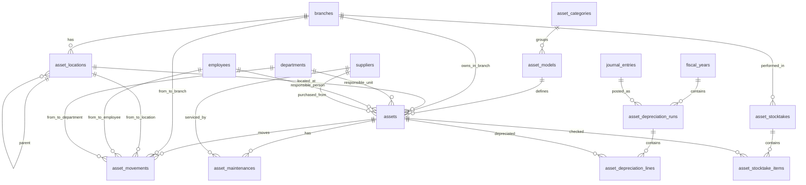

# Desain Database: Manajemen Aset Perusahaan

Dokumen ini menjelaskan struktur database untuk modul Manajemen Aset (Fixed Assets & Asset Tracking) dalam sistem ERP. Fokus utama: pencatatan master aset, lokasi & penanggung jawab, pergerakan aset, pemeliharaan, stocktake, serta depresiasi yang terhubung ke jurnal akuntansi.

## 1. Gambaran Umum

### Komponen Utama
*   **Master Aset**: Identitas aset, kategori, spesifikasi, nomor seri, nilai perolehan, status, dan atribut finansial.
*   **Lokasi & Penugasan**: Lokasi fisik (hierarki) dan penanggung jawab (employee/department).
*   **Pergerakan & Riwayat**: Mutasi aset antar lokasi/penanggung jawab untuk audit trail.
*   **Pemeliharaan**: Jadwal dan histori maintenance termasuk biaya dan vendor (supplier).
*   **Stocktake**: Proses inventarisasi berkala untuk validasi keberadaan aset.
*   **Depresiasi**: Perhitungan depresiasi periodik yang dapat diposting sebagai jurnal.

### Integrasi dengan Master Data yang Sudah Ada
*   **Cabang**: `branches` (untuk lokasi tingkat cabang).
*   **Organisasi**: `departments`, `employees`.
*   **Vendor**: gunakan `suppliers` (bukan `vendors`).
*   **Akuntansi**: `fiscal_years`, `journal_entries`, `journal_entry_lines`, `accounts`.

---

## 2. Diagram Hubungan Entitas (ERD)

---

## 3. Detail Tabel

### A. Master Aset

#### 1. `asset_categories`
Kategori aset untuk pengelompokan (mis. Kendaraan, IT Equipment, Mesin Produksi).

| Kolom | Tipe Data | Keterangan |
| :--- | :--- | :--- |
| `id` | BigInt | Primary Key |
| `code` | String | Kode kategori (unique) |
| `name` | String | Nama kategori |
| `useful_life_months_default` | Integer | Default masa manfaat (opsional) |
| `created_at` | Timestamp | |
| `updated_at` | Timestamp | |

#### 2. `asset_models`
Template/model aset untuk standar spesifikasi (mis. “Laptop Dell Latitude 5xxx”).

| Kolom | Tipe Data | Keterangan |
| :--- | :--- | :--- |
| `id` | BigInt | Primary Key |
| `asset_category_id` | BigInt | FK -> `asset_categories` |
| `manufacturer` | String | Pabrikan (opsional) |
| `model_name` | String | Nama model |
| `specs` | JSON/Text | Spesifikasi ringkas (opsional) |
| `created_at` | Timestamp | |
| `updated_at` | Timestamp | |

#### 3. `asset_locations`
Lokasi fisik yang lebih detail dari `branches`, mendukung hierarki (contoh: Cabang -> Gedung -> Lantai -> Ruang).

| Kolom | Tipe Data | Keterangan |
| :--- | :--- | :--- |
| `id` | BigInt | Primary Key |
| `branch_id` | BigInt | FK -> `branches` |
| `parent_id` | BigInt | Self FK -> `asset_locations` (nullable) |
| `code` | String | Kode lokasi (unique per branch) |
| `name` | String | Nama lokasi |
| `created_at` | Timestamp | |
| `updated_at` | Timestamp | |

**Unique Constraint (disarankan):** `(branch_id, code)`

#### 4. `assets`
Tabel utama aset.

| Kolom | Tipe Data | Keterangan |
| :--- | :--- | :--- |
| `id` | BigInt | Primary Key |
| `asset_code` | String | Kode aset (unique), mis. FA-000123 |
| `name` | String | Nama aset |
| `asset_model_id` | BigInt | FK -> `asset_models` (nullable) |
| `asset_category_id` | BigInt | FK -> `asset_categories` |
| `serial_number` | String | Nomor seri (nullable, index) |
| `barcode` | String | Barcode/QR payload (nullable, unique bila dipakai) |
| `branch_id` | BigInt | FK -> `branches` (lokasi cabang saat ini) |
| `asset_location_id` | BigInt | FK -> `asset_locations` (nullable) |
| `department_id` | BigInt | FK -> `departments` (nullable) |
| `employee_id` | BigInt | FK -> `employees` (nullable) |
| `supplier_id` | BigInt | FK -> `suppliers` (nullable) |
| `purchase_date` | Date | Tanggal perolehan |
| `purchase_cost` | Decimal(15,2) | Nilai perolehan |
| `currency` | String(3) | ISO currency (opsional; default sistem) |
| `warranty_end_date` | Date | Garansi berakhir (nullable) |
| `status` | Enum | `draft`, `active`, `maintenance`, `disposed`, `lost` |
| `condition` | Enum | `good`, `needs_repair`, `damaged` (opsional) |
| `notes` | Text | Catatan (nullable) |
| `created_at` | Timestamp | |
| `updated_at` | Timestamp | |

##### Kolom Depresiasi (disimpan di `assets`)
| Kolom | Tipe Data | Keterangan |
| :--- | :--- | :--- |
| `depreciation_method` | Enum | `straight_line` (opsional: `declining_balance`) |
| `depreciation_start_date` | Date | Mulai depresiasi (biasanya sama dengan `purchase_date`) |
| `useful_life_months` | Integer | Masa manfaat |
| `salvage_value` | Decimal(15,2) | Nilai residu |
| `accumulated_depreciation` | Decimal(15,2) | Akumulasi depresiasi (cache) |
| `book_value` | Decimal(15,2) | Nilai buku saat ini (cache) |
| `depreciation_expense_account_id` | BigInt | FK -> `accounts` (nullable) |
| `accumulated_depr_account_id` | BigInt | FK -> `accounts` (nullable) |

> [!NOTE]
> `accumulated_depreciation` dan `book_value` disarankan sebagai cache yang dihitung dari `asset_depreciation_lines` untuk kebutuhan laporan cepat.

---

### B. Pergerakan & Riwayat

#### 5. `asset_movements`
Audit trail untuk mutasi lokasi & penanggung jawab. Satu record merepresentasikan satu kejadian (transfer/assign/return).

| Kolom | Tipe Data | Keterangan |
| :--- | :--- | :--- |
| `id` | BigInt | Primary Key |
| `asset_id` | BigInt | FK -> `assets` |
| `movement_type` | Enum | `acquired`, `transfer`, `assign`, `return`, `dispose`, `adjustment` |
| `moved_at` | Timestamp | Waktu kejadian |
| `from_branch_id` | BigInt | FK -> `branches` (nullable) |
| `to_branch_id` | BigInt | FK -> `branches` (nullable) |
| `from_location_id` | BigInt | FK -> `asset_locations` (nullable) |
| `to_location_id` | BigInt | FK -> `asset_locations` (nullable) |
| `from_department_id` | BigInt | FK -> `departments` (nullable) |
| `to_department_id` | BigInt | FK -> `departments` (nullable) |
| `from_employee_id` | BigInt | FK -> `employees` (nullable) |
| `to_employee_id` | BigInt | FK -> `employees` (nullable) |
| `reference` | String | No referensi dokumen internal (nullable) |
| `notes` | Text | Catatan (nullable) |
| `created_by` | BigInt | FK -> `users` (nullable) |
| `created_at` | Timestamp | |
| `updated_at` | Timestamp | |

**Index (disarankan):** `(asset_id, moved_at)`, `movement_type`, `to_branch_id`, `to_employee_id`

##### Penjelasan Tipe Pergerakan (`movement_type`)

Setiap pergerakan aset dicatat untuk menjaga *audit trail* yang akurat. Berikut adalah penjelasan dan contoh kasus untuk masing-masing tipe:

| Tipe | Penjelasan | Contoh Kasus |
| :--- | :--- | :--- |
| **`acquired`** | Perolehan aset baru. Digunakan saat aset pertama kali didaftarkan ke sistem. | Pembelian Laptop Dell baru melalui vendor PT. Maju Jaya, diregistrasi dengan lokasi awal di "Gudang IT". |
| **`transfer`** | Mutasi lokasi fisik. Perpindahan aset antar cabang atau antar ruangan/lantai dalam satu cabang. | Memindahkan printer dari "Kantor Pusat" ke "Cabang Surabaya", atau memindahkan meja dari "Ruang Meeting" ke "Ruang Staff". |
| **`assign`** | Penugasan atau serah terima. Perubahan tanggung jawab penggunaan aset kepada karyawan atau departemen tertentu. | Memberikan Laptop (aset perusahaan) kepada karyawan baru (Budi) untuk digunakan selama masa kerjanya di Departemen IT. |
| **`return`** | Pengembalian aset. Penyerahan kembali aset dari penanggung jawab sebelumnya ke gudang atau pool aset. | Karyawan (Budi) mengembalikan laptop ke bagian IT karena sudah tidak bekerja lagi (resign) atau akan mutasi jabatan. |
| **`dispose`** | Pelepasan atau penghapusan. Penghentian penggunaan aset secara permanen dari operasional perusahaan. | Menjual mobil operasional yang sudah melewati masa manfaat, atau menghapus printer rusak yang sudah tidak bisa diperbaiki lagi. |
| **`adjustment`** | Penyesuaian data. Koreksi administratif data lokasi atau PIC, biasanya dilakukan setelah proses *stocktake*. | Mengoreksi data lokasi printer yang di sistem tercatat di "Lantai 1", namun ditemukan secara fisik di "Lantai 2" saat audit. |
| **`test_coverage`** | Semua tipe pergerakan di atas telah dilingkupi oleh *Functional Test* (Pest) dan *E2E Test* (Playwright) untuk memastikan integritas data. | |

---

### C. Pemeliharaan (Maintenance)

#### 6. `asset_maintenances`
Riwayat perawatan/servis aset.

| Kolom | Tipe Data | Keterangan |
| :--- | :--- | :--- |
| `id` | BigInt | Primary Key |
| `asset_id` | BigInt | FK -> `assets` |
| `maintenance_type` | Enum | `preventive`, `corrective`, `calibration`, `other` |
| `status` | Enum | `scheduled`, `in_progress`, `completed`, `cancelled` |
| `scheduled_at` | Timestamp | Jadwal (nullable) |
| `performed_at` | Timestamp | Realisasi (nullable) |
| `supplier_id` | BigInt | FK -> `suppliers` (nullable) |
| `cost` | Decimal(15,2) | Biaya (default 0) |
| `notes` | Text | Catatan (nullable) |
| `created_by` | BigInt | FK -> `users` (nullable) |
| `created_at` | Timestamp | |
| `updated_at` | Timestamp | |

---

### D. Stocktake (Inventarisasi)

#### 7. `asset_stocktakes`
Dokumen stocktake per cabang/per periode.

| Kolom | Tipe Data | Keterangan |
| :--- | :--- | :--- |
| `id` | BigInt | Primary Key |
| `branch_id` | BigInt | FK -> `branches` |
| `reference` | String | No dokumen (unique per branch, disarankan) |
| `planned_at` | Timestamp | Jadwal |
| `performed_at` | Timestamp | Realisasi (nullable) |
| `status` | Enum | `draft`, `in_progress`, `completed`, `cancelled` |
| `created_by` | BigInt | FK -> `users` (nullable) |
| `created_at` | Timestamp | |
| `updated_at` | Timestamp | |

#### 8. `asset_stocktake_items`
Hasil pengecekan aset pada stocktake.

| Kolom | Tipe Data | Keterangan |
| :--- | :--- | :--- |
| `id` | BigInt | Primary Key |
| `asset_stocktake_id` | BigInt | FK -> `asset_stocktakes` |
| `asset_id` | BigInt | FK -> `assets` |
| `expected_branch_id` | BigInt | FK -> `branches` (nullable) |
| `expected_location_id` | BigInt | FK -> `asset_locations` (nullable) |
| `found_branch_id` | BigInt | FK -> `branches` (nullable) |
| `found_location_id` | BigInt | FK -> `asset_locations` (nullable) |
| `result` | Enum | `found`, `missing`, `damaged`, `moved` |
| `notes` | Text | Catatan (nullable) |
| `checked_at` | Timestamp | Waktu cek (nullable) |
| `checked_by` | BigInt | FK -> `users` (nullable) |
| `created_at` | Timestamp | |
| `updated_at` | Timestamp | |

---

### E. Depresiasi & Posting Akuntansi

#### 9. `asset_depreciation_runs`
Header perhitungan depresiasi per periode (biasanya bulanan).

| Kolom | Tipe Data | Keterangan |
| :--- | :--- | :--- |
| `id` | BigInt | Primary Key |
| `fiscal_year_id` | BigInt | FK -> `fiscal_years` |
| `period_start` | Date | Awal periode |
| `period_end` | Date | Akhir periode |
| `status` | Enum | `draft`, `calculated`, `posted`, `void` |
| `journal_entry_id` | BigInt | FK -> `journal_entries` (nullable) |
| `created_by` | BigInt | FK -> `users` (nullable) |
| `posted_by` | BigInt | FK -> `users` (nullable) |
| `posted_at` | Timestamp | (nullable) |
| `created_at` | Timestamp | |
| `updated_at` | Timestamp | |

**Unique Constraint (disarankan):** `(fiscal_year_id, period_start, period_end)`

#### 10. `asset_depreciation_lines`
Detail depresiasi per aset untuk satu periode.

| Kolom | Tipe Data | Keterangan |
| :--- | :--- | :--- |
| `id` | BigInt | Primary Key |
| `asset_depreciation_run_id` | BigInt | FK -> `asset_depreciation_runs` |
| `asset_id` | BigInt | FK -> `assets` |
| `amount` | Decimal(15,2) | Nominal depresiasi periode ini |
| `accumulated_before` | Decimal(15,2) | Akumulasi sebelum periode |
| `accumulated_after` | Decimal(15,2) | Akumulasi sesudah periode |
| `book_value_after` | Decimal(15,2) | Nilai buku setelah periode |
| `created_at` | Timestamp | |
| `updated_at` | Timestamp | |

**Unique Constraint (disarankan):** `(asset_depreciation_run_id, asset_id)`

---

## 4. Aturan Bisnis (Ringkas)

### Status Aset
*   `draft`: belum aktif dipakai (data belum lengkap/menunggu verifikasi).
*   `active`: aset aktif dan dapat ikut depresiasi.
*   `maintenance`: sementara tidak tersedia (tetap bisa depresiasi sesuai kebijakan).
*   `disposed`: dilepas/dijual/dihapus; stop depresiasi setelah tanggal disposal.
*   `lost`: hilang; perlakuan akuntansi mengikuti kebijakan (mis. write-off).

### Depresiasi Bulanan (Straight Line)
Nominal per bulan (dengan pembulatan kebijakan sistem):
`(purchase_cost - salvage_value) / useful_life_months`

### Posting Akuntansi Depresiasi
Saat `asset_depreciation_runs` diposting:
*   Debit: `depreciation_expense_account_id`
*   Kredit: `accumulated_depr_account_id`

> [!NOTE]
> Jika akun depresiasi berbeda per kategori, simpan default account mapping pada `asset_categories` (opsional) dan override per aset di `assets`.

---

## 5. Rekomendasi Menu & Tabel Terlibat

Bagian ini merangkum menu yang umumnya dibutuhkan untuk menjalankan modul manajemen aset end-to-end, beserta tabel yang terlibat pada tiap menu.

### A. Master Data (Setup)

#### 1) Asset Categories
Tujuan: mengelola kategori aset dan default masa manfaat.

Jenis menu: Simple CRUD  
Agent skill: `feature-crud-simple`

Tabel terlibat:
* `asset_categories`

#### 2) Asset Models
Tujuan: mengelola template/model aset (spesifikasi standar).

Jenis menu: Complex CRUD  
Agent skill: `feature-crud-complex`

Tabel terlibat:
* `asset_models`
* `asset_categories`

#### 3) Asset Locations
Tujuan: mengelola lokasi fisik aset per cabang dengan hierarki.

Jenis menu: Complex CRUD  
Agent skill: `feature-crud-complex`

Tabel terlibat:
* `asset_locations`
* `branches`

---

### B. Operasional Aset

#### 4) Assets (List & Form)
Tujuan: registrasi aset baru, edit data aset, dan mengelola “current state” (lokasi, PIC, status).

Jenis menu: Complex CRUD  
Agent skill: `feature-crud-complex`

Tabel terlibat:
* `assets`
* `asset_categories`
* `asset_models`
* `asset_locations`
* `branches`
* `departments`
* `employees`
* `suppliers`
* `accounts` (untuk `depreciation_expense_account_id` dan `accumulated_depr_account_id`)

Catatan proses:
* Saat aset dibuat/diakuisisi, sistem akan menambah histori awal di `asset_movements` dengan `movement_type = acquired`.
* Saat data utama aset (tanggal perolehan, lokasi, atau PIC) diupdate, sistem akan menyelaraskan data pada record `acquired` terkait, atau membuatnya jika belum ada.
* Saat lokasi/PIC berubah, update kolom di `assets` dan simpan histori di `asset_movements`.

#### 5) Asset Detail (Profile)
Tujuan: melihat ringkasan aset + tab histori (movement, maintenance, stocktake, depresiasi).

Jenis menu: Non-CRUD  
Agent skill: `feature-non-crud`

Tabel terlibat:
* `assets`
* `asset_movements`
* `asset_maintenances`
* `asset_stocktake_items` (dan header `asset_stocktakes`)
* `asset_depreciation_lines` (dan header `asset_depreciation_runs`)
* `branches`, `asset_locations`, `departments`, `employees`, `suppliers`, `accounts`

#### 6) Asset Movements (Transfer / Assignment)
Tujuan: membuat dokumen perpindahan aset (mutasi antar cabang/ruang/PIC) dan audit trail.

Jenis menu: Non-CRUD  
Agent skill: `feature-non-crud`

Tabel terlibat:
* `asset_movements`
* `assets`
* `branches`
* `asset_locations`
* `departments`
* `employees`
* `users` (kolom `created_by`)

Contoh kasus:
* Transfer laptop dari Head Office ke Branch 1 dan ganti PIC dari Employee A ke Employee B.

#### 7) Asset Maintenance
Tujuan: mencatat jadwal/riwayat perawatan dan biaya.

Jenis menu: Complex CRUD  
Agent skill: `feature-crud-complex`

Tabel terlibat:
* `asset_maintenances`
* `assets`
* `suppliers`
* `users` (kolom `created_by`)

Contoh kasus:
* Perawatan berkala kendaraan tiap 3 bulan (preventive) dan servis perbaikan (corrective).

---

### C. Kontrol & Audit

#### 8) Asset Stocktake (Header)
Tujuan: membuat event stocktake per cabang/per periode (jadwal & status).

Jenis menu: Complex CRUD  
Agent skill: `feature-crud-complex`

Tabel terlibat:
* `asset_stocktakes`
* `branches`
* `users` (kolom `created_by`)

#### 9) Asset Stocktake (Items)
Tujuan: mengisi hasil cek per aset dan mencatat selisih (expected vs found).

Jenis menu: Non-CRUD  
Agent skill: `feature-non-crud`

Tabel terlibat:
* `asset_stocktake_items`
* `asset_stocktakes`
* `assets`
* `branches`
* `asset_locations`
* `users` (kolom `checked_by`)

Contoh kasus:
* Aset seharusnya berada di “IT Room”, tetapi ditemukan di “Warehouse” → `result = moved`.

---

### D. Akuntansi (Depresiasi)

#### 10) Depreciation Run (Calculate)
Tujuan: memilih periode, menghitung depresiasi untuk aset yang eligible.

Jenis menu: Non-CRUD  
Agent skill: `feature-non-crud`

Tabel terlibat:
* `asset_depreciation_runs`
* `asset_depreciation_lines`
* `assets`
* `fiscal_years`

#### 11) Depreciation Run (Post to Journal)
Tujuan: posting hasil depresiasi menjadi jurnal akuntansi (debit beban, kredit akumulasi).

Jenis menu: Non-CRUD  
Agent skill: `feature-non-crud`

Tabel terlibat:
* `asset_depreciation_runs` (kolom `journal_entry_id`, `posted_by`, `posted_at`)
* `asset_depreciation_lines`
* `assets` (referensi akun depresiasi per aset)
* `accounts`
* `journal_entries`
* `journal_entry_lines`
* `users`

Contoh kasus:
* Periode Jan 2026: total depresiasi seluruh aset Rp 25.000.000, dibuat 1 jurnal header dan line agregat per akun.

---

### E. Laporan (Opsional tapi umum)

#### 12) Asset Register / Asset Listing Report
Tujuan: daftar aset lengkap + filter (kategori, status, cabang, lokasi, PIC).

Jenis menu: Non-CRUD  
Agent skill: `feature-non-crud`

Tabel terlibat:
* `assets`
* `asset_categories`, `asset_models`
* `branches`, `asset_locations`
* `departments`, `employees`
* `suppliers`

#### 13) Book Value & Depreciation Report
Tujuan: laporan nilai buku dan depresiasi per periode/per aset.

Jenis menu: Non-CRUD  
Agent skill: `feature-non-crud`

Tabel terlibat:
* `assets`
* `asset_depreciation_runs`, `asset_depreciation_lines`
* `fiscal_years`
* `accounts` (jika butuh grouping akun)

#### 14) Maintenance Cost Report
Tujuan: biaya maintenance per aset/per periode/per vendor.

Jenis menu: Non-CRUD  
Agent skill: `feature-non-crud`

Tabel terlibat:
* `asset_maintenances`
* `assets`
* `suppliers`

#### 15) Stocktake Variance Report
Tujuan: daftar aset missing/damaged/moved pada suatu stocktake.

Jenis menu: Non-CRUD  
Agent skill: `feature-non-crud`

Tabel terlibat:
* `asset_stocktakes`
* `asset_stocktake_items`
* `assets`
* `branches`, `asset_locations`
