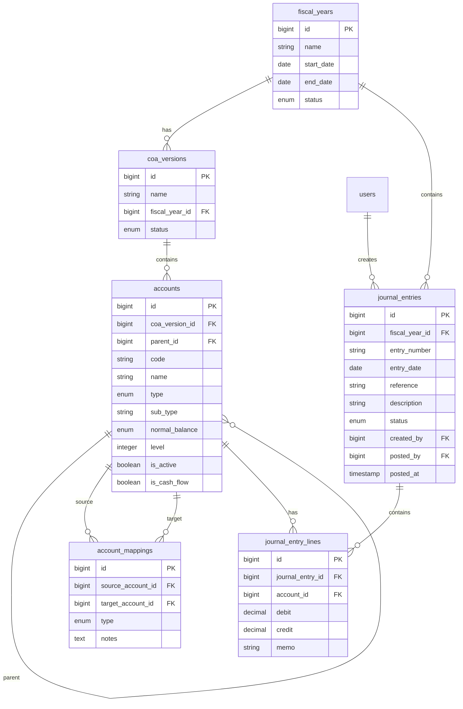

# Desain Database Chart of Accounts (COA) dengan Versioning

Dokumen ini menjelaskan struktur database untuk modul Chart of Accounts (COA) atau Daftar Akun yang mendukung versioning dan jurnal umum. Fitur ini memungkinkan perubahan struktur akun setiap tahunnya namun tetap dapat menyajikan laporan keuangan komparatif antar tahun.

## Strategi Versioning

Setiap tahun fiskal (Fiscal Year) atau periode tertentu dapat memiliki versi COA yang berbeda. Saat tahun fiskal baru dibuat, struktur akun dari tahun sebelumnya akan diduplikasi (cloned) ke versi baru. Ini memastikan bahwa perubahan pada nama akun, hierarki, atau penambahan akun baru di tahun berjalan tidak merusak data historis tahun sebelumnya.

## Diagram Relasi



## Struktur Tabel

Berikut adalah tabel-tabel yang dibuat:

### 1. `fiscal_years` (Tahun Fiskal)

Menyimpan periode akuntansi.

| Kolom | Tipe Data | Keterangan |
| :--- | :--- | :--- |
| `id` | BigInt | Primary Key (Auto Increment) |
| `name` | String | Nama tahun fiskal (misal: "2025") |
| `start_date` | Date | Tanggal mulai (misal: 2025-01-01) |
| `end_date` | Date | Tanggal selesai (misal: 2025-12-31) |
| `status` | Enum | `open`, `closed`, `locked` |
| `created_at` | Timestamp | |
| `updated_at` | Timestamp | |

**Status:**
- `open`: Tahun fiskal aktif, transaksi dapat diinput
- `closed`: Tahun fiskal ditutup, tidak ada transaksi baru
- `locked`: Tahun fiskal dikunci permanen, tidak bisa dibuka kembali

---

### 2. `coa_versions` (Versi COA)

Menyimpan snapshot atau versi dari struktur akun. Biasanya satu tahun fiskal memiliki satu versi aktif.

| Kolom | Tipe Data | Keterangan |
| :--- | :--- | :--- |
| `id` | BigInt | Primary Key (Auto Increment) |
| `name` | String | Nama versi (misal: "COA 2025 Standard") |
| `fiscal_year_id` | BigInt | Foreign Key ke `fiscal_years` (nullable untuk template master) |
| `status` | Enum | `draft`, `active`, `archived` |
| `created_at` | Timestamp | |
| `updated_at` | Timestamp | |

**Status:**
- `draft`: Versi dalam penyusunan
- `active`: Versi yang sedang digunakan
- `archived`: Versi lama yang tidak lagi digunakan

---

### 3. `accounts` (Daftar Akun)

Menyimpan detail akun untuk setiap versi.

| Kolom | Tipe Data | Keterangan |
| :--- | :--- | :--- |
| `id` | BigInt | Primary Key (Auto Increment) |
| `coa_version_id` | BigInt | Foreign Key ke `coa_versions` |
| `parent_id` | BigInt | Self-referencing Foreign Key (untuk hierarki akun) |
| `code` | String | Kode Akun (misal: "110-001"). **Kunci utama untuk perbandingan antar versi.** |
| `name` | String | Nama Akun (misal: "Kas Besar") |
| `type` | Enum | `asset`, `liability`, `equity`, `revenue`, `expense` |
| `sub_type` | String | Kategori lebih detail (misal: `current_asset`, `long_term_liability`) |
| `normal_balance` | Enum | `debit`, `credit` |
| `level` | Integer | Level kedalaman hierarki (untuk kemudahan query) |
| `is_active` | Boolean | Status aktif/tidak |
| `is_cash_flow` | Boolean | Apakah akun ini termasuk dalam laporan arus kas |
| `description` | Text | Deskripsi akun |
| `created_at` | Timestamp | |
| `updated_at` | Timestamp | |

**Unique Constraint:** `(coa_version_id, code)` - Kode akun unik per versi

#### Detail Penjelasan Kolom

Berikut adalah penjelasan detail mengenai fungsi dan penggunaan kolom-kolom penting pada tabel `accounts`:

##### 1. `type`
**Kegunaan:** Mengelompokkan akun ke dalam kategori utama laporan keuangan (Neraca atau Laba Rugi).
**Nilai (Enum):** `asset`, `liability`, `equity`, `revenue`, `expense`.
**Contoh:**
*   **Kas Besar**: Type = `asset` (Harta).
*   **Hutang Dagang**: Type = `liability` (Kewajiban).
*   **Penjualan Barang**: Type = `revenue` (Pendapatan).

##### 2. `sub_type`
**Kegunaan:** Klasifikasi spesifik dari `type` untuk penyajian laporan yang lebih terstruktur.
**Contoh:**
*   **Kas & Bank**: Type `asset`, Sub Type `current_asset` (Aset Lancar).
*   **Gedung Kantor**: Type `asset`, Sub Type `fixed_asset` (Aset Tetap).
*   **Gaji Karyawan**: Type `expense`, Sub Type `operating_expense` (Beban Operasional).

##### 3. `normal_balance`
**Kegunaan:** Menentukan posisi normal saldo akun (Debit atau Kredit) agar bernilai positif.
*   **Debit**: Saldo bertambah di Debit (Aset, Beban).
*   **Kredit**: Saldo bertambah di Kredit (Hutang, Modal, Pendapatan).
**Contoh:**
*   **Kas (Asset)**: Normal Balance `debit`. Uang masuk (Debit) menambah saldo.
*   **Penjualan (Revenue)**: Normal Balance `credit`. Penjualan (Kredit) menambah saldo.

##### 4. `level`
**Kegunaan:** Menunjukkan kedalaman hierarki akun dalam struktur pohon (tree) untuk indentasi laporan.
**Contoh:**
*   **Level 0**: Aset (Header Utama)
    *   **Level 1**: Aset Lancar (Header Kategori)
        *   **Level 2**: Kas & Bank (Header Group)
            *   **Level 3**: **Bank BCA** (Akun Transaksi)

##### 5. `is_active`
**Kegunaan:** Menandai akun yang boleh digunakan untuk transaksi baru. Akun lama dengan saldo tidak boleh dihapus, hanya dinonaktifkan.
**Contoh:**
*   Bank Mandiri (lama) diganti Bank Jago (baru).
*   Set `is_active = false` pada Bank Mandiri agar tidak muncul di pilihan jurnal baru, namun histori tetap terjaga.

##### 6. `is_cash_flow`
**Kegunaan:** Menandai akun yang menjadi komponen Laporan Arus Kas (Operating, Investing, Financing).
**Contoh:**
*   **Penjualan Tunai**: `is_cash_flow = true`. Masuk aktivitas operasional.
*   **Pembelian Mesin**: `is_cash_flow = true`. Masuk aktivitas investasi.
*   **Beban Penyusutan**: `is_cash_flow = false`. Beban non-tunai, diabaikan di metode langsung.

#### Contoh Data Baris (Row Example)

| Column | Akun: Kas Bank BCA | Akun: Hutang Usaha | Akun: Penjualan Jasa |
| :--- | :--- | :--- | :--- |
| **code** | `1110-001` | `2100-001` | `4100-001` |
| **name** | Bank BCA IDR | Hutang Supplier Lokal | Jasa Konsultasi IT |
| **type** | `asset` | `liability` | `revenue` |
| **sub_type** | `current_asset` | `current_liability` | `operating_revenue` |
| **normal_balance** | `debit` | `credit` | `credit` |
| **level** | `3` | `3` | `3` |
| **is_active** | `true` | `true` | `true` |
| **is_cash_flow** | `true` | `false` | `true` |

---

### 4. `account_mappings` (Pemetaan Akun)

Tabel untuk menangani perubahan kode akun yang drastis antar versi. Digunakan jika kode akun berubah total sehingga tidak bisa dicocokkan otomatis by `code`.

| Kolom | Tipe Data | Keterangan |
| :--- | :--- | :--- |
| `id` | BigInt | Primary Key (Auto Increment) |
| `source_account_id` | BigInt | FK ke `accounts` (Akun di Versi Lama) |
| `target_account_id` | BigInt | FK ke `accounts` (Akun di Versi Baru/Tujuan) |
| `type` | Enum | `merge` (gabung), `split` (pecah), `rename` (ganti nama/kode) |
| `notes` | Text | Catatan perubahan |
| `created_at` | Timestamp | |
| `updated_at` | Timestamp | |

**Tipe Mapping:**
- `merge`: Beberapa akun lama digabung menjadi satu akun baru
- `split`: Satu akun lama dipecah menjadi beberapa akun baru
- `rename`: Akun berganti kode atau nama

---

### 5. `journal_entries` (Jurnal Umum - Header)

Menyimpan header jurnal umum.

| Kolom | Tipe Data | Keterangan |
| :--- | :--- | :--- |
| `id` | BigInt | Primary Key (Auto Increment) |
| `fiscal_year_id` | BigInt | FK ke `fiscal_years` |
| `entry_number` | String | Nomor jurnal unik (misal: "JV-2026-00001") |
| `entry_date` | Date | Tanggal jurnal |
| `reference` | String | Nomor bukti eksternal (nullable) |
| `description` | String | Deskripsi transaksi |
| `status` | Enum | `draft`, `posted`, `void` |
| `created_by` | BigInt | FK ke `users` (pembuat jurnal) |
| `posted_by` | BigInt | FK ke `users` (yang memposting) |
| `posted_at` | Timestamp | Waktu posting |
| `created_at` | Timestamp | |
| `updated_at` | Timestamp | |

**Status:**
- `draft`: Jurnal masih dalam penyusunan, belum mempengaruhi saldo
- `posted`: Jurnal sudah diposting, mempengaruhi saldo akun
- `void`: Jurnal dibatalkan

---

### 6. `journal_entry_lines` (Jurnal Umum - Detail)

Menyimpan detail debit/kredit untuk setiap jurnal.

| Kolom | Tipe Data | Keterangan |
| :--- | :--- | :--- |
| `id` | BigInt | Primary Key (Auto Increment) |
| `journal_entry_id` | BigInt | FK ke `journal_entries` |
| `account_id` | BigInt | FK ke `accounts` |
| `debit` | Decimal(15,2) | Jumlah debit (0 jika kredit) |
| `credit` | Decimal(15,2) | Jumlah kredit (0 jika debit) |
| `memo` | String | Keterangan per baris |
| `created_at` | Timestamp | |
| `updated_at` | Timestamp | |

---

## Skema Perhitungan Debit & Kredit

### Normal Balance per Tipe Akun

| Tipe Akun | Normal Balance | Bertambah dengan | Berkurang dengan |
| :--- | :---: | :---: | :---: |
| **Asset** (Aset) | Debit | Debit ➕ | Kredit ➖ |
| **Expense** (Beban) | Debit | Debit ➕ | Kredit ➖ |
| **Liability** (Kewajiban) | Kredit | Kredit ➕ | Debit ➖ |
| **Equity** (Modal) | Kredit | Kredit ➕ | Debit ➖ |
| **Revenue** (Pendapatan) | Kredit | Kredit ➕ | Debit ➖ |

### Rumus Perhitungan Saldo

```php
if ($account->normal_balance === 'debit') {
    $balance = $totalDebit - $totalCredit;
} else {
    $balance = $totalCredit - $totalDebit;
}
```

### Validasi Jurnal

Setiap jurnal **WAJIB** balance:
```
Total Debit = Total Kredit
```

---

## Logika Pelaporan (Reporting Logic)

### Laporan Tahun Berjalan

Query sederhana ke tabel `accounts` dan `journal_entry_lines` berdasarkan `coa_version_id` yang aktif untuk tahun tersebut.

```php
$accounts = Account::where('coa_version_id', $activeVersionId)
    ->with(['journalLines' => function($q) {
        $q->whereHas('journalEntry', fn($je) => $je->where('status', 'posted'));
    }])
    ->get();
```

### Laporan Komparatif (Tahun Ini vs Tahun Lalu)

1. Sistem mengidentifikasi Versi COA Tahun Ini (Target) dan Versi COA Tahun Lalu (Source).
2. Sistem akan mencoba mencocokkan akun berdasarkan kolom `code`.
   - Jika Akun "100-01" ada di kedua versi, nilainya dibandingkan langsung.
3. Jika ada perubahan struktur yang kompleks, sistem akan melihat ke tabel `account_mappings`.
   - Jika ada mapping dari Akun A (Lama) ke Akun B (Baru), maka saldo Akun A di tahun lalu akan ditampilkan sebagai saldo pembanding untuk Akun B di tahun ini.

---

## Contoh Data Seed

Seeder menyediakan data contoh:

### Tahun Fiskal
- **2025** (closed) - COA 2025 Standard (archived)
- **2026** (open) - COA 2026 Enhanced (active)

### Perubahan Struktur 2025 → 2026
1. **Split**: `Cash (11100)` dipecah menjadi:
   - `Cash in Banks (11110)`
   - `Petty Cash (11120)`
2. **Rename**: `Operating Expense (52000)` → `General & Admin Expense (52000)`

### Sample Journal Entries
- JV-2026-00001: Penjualan tunai (Cash ↔ Revenue)
- JV-2026-00002: Pembelian kredit (Inventory ↔ Accounts Payable)
- JV-2026-00003: Pembayaran beban (Expense ↔ Petty Cash) - Draft
