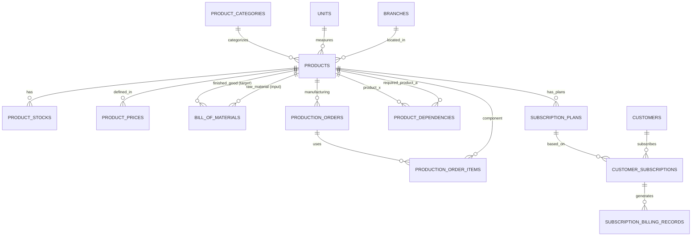

# Desain Database: Produk, Layanan, dan Produksi

Dokumen ini menjelaskan struktur database untuk modul Produk, Layanan, Produksi (Manufacturing), dan Langganan (Subscription) dalam sistem ERP.

## 1. Gambaran Umum (High-Level Overview)

Sistem ini dirancang untuk menangani berbagai tipe produk mulai dari bahan baku, barang jadi, hingga jasa dengan model bisnis penjualan langsung maupun langganan.

### Komponen Utama:
*   **Katalog Produk**: Mengelola master data produk, kategori, dan satuan (units).
*   **Manajemen Stok & Harga**: Mengelola stok per cabang dan skema harga bertingkat (tiered pricing).
*   **Produksi (Manufacturing)**: Mengelola resep barang (BOM) dan proses manufaktur (Production Orders).
*   **Langganan (Subscription)**: Mengelola penagihan berulang (recurring billing) untuk layanan atau produk.

---

## 2. Diagram Hubungan Entitas (ERD)

---

## 3. Detail Tabel

### A. Katalog Produk & Stok

#### 1. `products`
Tabel utama yang menyimpan semua jenis barang dan jasa.
*   **`type`**: Menentukan peran produk (`raw_material`, `work_in_progress`, `finished_good`, `purchased_good`, `service`).
*   **`billing_model`**: Mendukung `one_time` (jual putus), `subscription` (langganan), atau `both`.
*   **`cost` & `selling_price`**: Harga dasar untuk perhitungan margin.

#### 2. `product_stocks`
Mengelola persediaan produk di setiap cabang (`branches`).
*   **`quantity_on_hand`**: Stok fisik saat ini.
*   **`quantity_reserved`**: Stok yang sudah dipesan (untuk produksi atau penjualan) tapi belum keluar gudang.
*   **`average_cost`**: Digunakan untuk perhitungan COGS (HPP) dengan metode rata-rata tertimbang.

#### 3. `product_prices`
Sistem harga fleksibel berdasarkan kategori pelanggan.
*   **`customer_category_id`**: Menghubungkan harga dengan level pelanggan (misal: Retail vs Grosir).
*   **`effective_from/until`**: Memungkinkan pengaturan harga promo atau perubahan harga di masa depan.

### B. Manufaktur (Produksi)

#### 4. `bill_of_materials` (BOM)
Daftar bahan yang dibutuhkan untuk membuat 1 unit produk jadi.
*   Menghubungkan `finished_product_id` dengan satu atau lebih `raw_material_id`.

#### 5. `production_orders`
Instruksi kerja untuk memproduksi barang.
*   Melacak status produksi (`draft`, `in_progress`, `completed`, `cancelled`).
*   Mencatat total biaya produksi yang akumulatif.

#### 6. `production_order_items`
Pencatatan aktual bahan baku yang digunakan dalam satu perintah produksi tertentu beserta biayanya saat itu.

### C. Relasi & Dependensi

#### 7. `product_dependencies`
Mengatur logika keterkaitan antar produk.
*   **`prerequisite`**: Produk A wajib dibeli jika ingin membeli Produk B.
*   **`recommended` & `add_on`**: Saran produk tambahan.
*   **`alternative`**: Pengganti jika stok kosong.

### D. Sistem Langganan (Subscriptions)

#### 8. `subscription_plans`
Definisi paket langganan untuk sebuah produk.
*   **`billing_interval`**: Frekuensi penagihan (`daily`, `weekly`, `monthly`, `annual`, dll).
*   **`setup_fee`**: Biaya aktivasi awal.
*   **`trial_period_days`**: Masa percobaan gratis.

#### 9. `customer_subscriptions`
Kontrak aktif antara pelanggan dan rencana langganan.
*   Melacak siklus hidup langganan (`trial`, `active`, `past_due`, `cancelled`, `expired`).

#### 10. `subscription_billing_records`
Riwayat penagihan dan status pembayaran (Invoicing).
*   Mencatat periode penagihan, pajak, diskon, dan status pembayaran otomatis.

---

## 4. Logika Bisnis Spesifik

### Perhitungan Harga (Pricing Logic)
Sistem akan mencari harga di `product_prices` berdasarkan `customer_category` pembeli. Jika tidak ditemukan, sistem akan menggunakan `selling_price` default di tabel `products`.

### Manajemen Stok (Inventory Logic)
Tersedia stok (`available_quantity`) dihitung dengan rumus:
`quantity_on_hand - quantity_reserved`.

### Siklus Produksi
1. Tentukan BOM untuk Produk Jadi.
2. Buat `Production Order`.
3. Saat dimulai, bahan baku di `product_stocks` akan dipindahkan statusnya ke `quantity_reserved`.
4. Saat selesai, stok bahan baku berkurang dan stok Produk Jadi bertambah.

---

> [!NOTE]
> Seluruh tabel dilengkapi dengan `timestamps` dan beberapa menggunakan `softDeletes` untuk keamanan data. Indeks telah ditambahkan pada kolom-kolom pencarian utama untuk optimasi performa.
