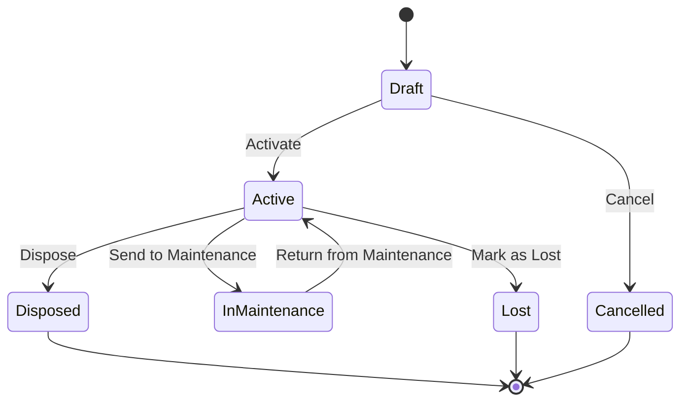

# Panduan Pengguna: Pipeline Management (Asset Module)

Panduan ini menjelaskan cara menyiapkan dan menggunakan fitur **Pipeline** pada sistem ERP, dengan fokus pada modul **Asset**. Pipeline mengatur **lifecycle (siklus hidup)** sebuah entitas — dari status awal saat dibuat, melewati berbagai tahapan, hingga status akhir.

---

## Daftar Isi

1. [Konsep Dasar](#1-konsep-dasar)
2. [Akses Menu Pipeline](#2-akses-menu-pipeline)
3. [Setup Pipeline (Admin)](#3-setup-pipeline-admin)
   - [3.1 Membuat Pipeline Baru](#31-membuat-pipeline-baru)
   - [3.2 Menambahkan States](#32-menambahkan-states)
   - [3.3 Menambahkan Transitions](#33-menambahkan-transitions)
   - [3.4 Menambahkan Actions pada Transition](#34-menambahkan-actions-pada-transition)
4. [Mengelola Pipeline](#4-mengelola-pipeline)
5. [Penggunaan Sehari-hari (User)](#5-penggunaan-sehari-hari-user)
   - [5.1 Melihat Status Pipeline di Asset](#51-melihat-status-pipeline-di-asset)
   - [5.2 Menjalankan Transisi (Aksi)](#52-menjalankan-transisi-aksi)
   - [5.3 Melihat Timeline / Riwayat Status](#53-melihat-timeline--riwayat-status)
6. [Contoh: Setup Asset Lifecycle](#6-contoh-setup-asset-lifecycle)
7. [FAQ & Tips](#7-faq--tips)

---

## 1. Konsep Dasar

### Apa itu Pipeline?

Pipeline adalah **alur kerja (workflow)** yang mengatur urutan status suatu entitas. Bayangkan seperti jalur pipa — data mengalir dari satu tahap ke tahap berikutnya sesuai aturan yang sudah ditetapkan.

### Komponen Pipeline

| Komponen | Penjelasan | Contoh |
|:---|:---|:---|
| **Pipeline** | Template alur kerja untuk satu jenis entitas | "Asset Lifecycle" |
| **State (Status)** | Tahapan/kondisi yang valid dalam pipeline | Draft, Active, Disposed |
| **Transition (Transisi)** | Perpindahan dari satu state ke state lain | Draft → Active ("Activate") |
| **Action (Aksi)** | Efek otomatis saat transisi terjadi | Update field `status`, kirim notifikasi |

### Tipe State

| Tipe | Penjelasan |
|:---|:---|
| **Initial** | Status awal saat entitas pertama kali masuk pipeline. Hanya boleh **satu** per pipeline. |
| **Intermediate** | Status perantara selama lifecycle berlangsung. Bisa ada banyak. |
| **Final** | Status akhir yang menandakan lifecycle selesai. Entitas tidak bisa berpindah lagi dari sini. |

---

## 2. Akses Menu Pipeline

Pipeline Management berada di bawah menu **Settings**:

> **Settings** → **Pipeline**

Untuk mengakses menu ini, user harus memiliki permission `pipeline`.

---

## 3. Setup Pipeline (Admin)

### 3.1 Membuat Pipeline Baru

1. Buka **Settings → Pipeline**.
2. Klik tombol **Add New** (atau tombol ➕) di bagian atas halaman.
3. Isi form berikut:

| Field | Keterangan | Contoh |
|:---|:---|:---|
| **Pipeline Name** | Nama deskriptif pipeline | `Asset Lifecycle` |
| **Code** | Kode unik (lowercase, underscore) | `asset_lifecycle` |
| **Entity Type** | Pilih jenis entitas yang dikelola | `Asset` |
| **Version** | Nomor versi (default: 1) | `1` |
| **Description** | Deskripsi opsional | `Mengelola lifecycle aset dari draft hingga disposed` |
| **Conditions (JSON)** | Kondisi kapan pipeline berlaku (opsional) | `{"asset_type": "vehicle"}` |
| **Status** | Active / Inactive | `Active` |

4. Klik **Save** untuk menyimpan pipeline.

> [!NOTE]
> Kolom **Conditions** bisa dikosongkan jika pipeline berlaku untuk semua entitas dari tipe yang dipilih. Isi dengan format JSON jika ingin pipeline hanya berlaku untuk subset tertentu (misalnya aset kendaraan saja).

### 3.2 Menambahkan States

Setelah pipeline disimpan, klik **Edit** pada pipeline tersebut. Form akan menampilkan 3 tab: **Details**, **States**, dan **Transitions**.

1. Klik tab **States**.
2. Klik tombol **Add State**.
3. Isi baris baru yang muncul di tabel:

| Field | Keterangan | Contoh |
|:---|:---|:---|
| **Code** | Kode state (lowercase) | `draft` |
| **Name** | Nama tampilan | `Draft` |
| **Type** | Pilih: Initial / Intermediate / Final | `Initial` |
| **Order** | Urutan tampilan di UI (angka) | `0` |
| **Color** | Warna HEX untuk badge | `#6B7280` |
| **Icon** | Nama icon dari Lucide Icons | `FileEdit` |

4. Klik ikon ✅ (centang hijau) untuk menyimpan state.
5. Ulangi untuk semua state yang diperlukan.

> [!IMPORTANT]
> - Setiap pipeline **wajib** memiliki tepat **satu state bertipe Initial**.
> - Pipeline harus memiliki **minimal satu state bertipe Final**.
> - Untuk mengedit state yang sudah ada, klik ikon ✏️ (edit) pada baris tersebut.
> - Untuk menghapus state, klik ikon 🗑️ (hapus). **Hati-hati**: jangan hapus state yang sudah digunakan oleh entitas.

#### Referensi Warna yang Disarankan

| Status | Warna | Kode HEX |
|:---|:---|:---|
| Draft / Baru | Abu-abu | `#6B7280` |
| Active / Aktif | Hijau | `#10B981` |
| Maintenance / Perbaikan | Kuning | `#F59E0B` |
| Disposed / Dibuang | Merah | `#EF4444` |
| Lost / Hilang | Merah Tua | `#DC2626` |
| Cancelled / Dibatalkan | Abu-abu Terang | `#9CA3AF` |

#### Referensi Icon yang Tersedia

Icon menggunakan nama dari library [Lucide Icons](https://lucide.dev/icons/). Beberapa contoh:

| Icon | Nama |
|:---|:---|
| 📝 | `FileEdit` |
| ✅ | `CircleCheck` |
| 🔧 | `Wrench` |
| 🗑️ | `Trash2` |
| ❌ | `XCircle` |
| 📦 | `Package` |
| ⚠️ | `AlertTriangle` |

### 3.3 Menambahkan Transitions

Transition mendefinisikan **perpindahan antar state** — tombol aksi apa yang muncul dan kapan.

1. Klik tab **Transitions** pada form Edit Pipeline.
2. Klik tombol **Add Transition**.
3. Akan muncul dialog form dengan dua tab: **Details** dan **Actions**.

#### Tab Details

| Field | Keterangan | Contoh |
|:---|:---|:---|
| **From State** | State asal | `Draft` |
| **To State** | State tujuan | `Active` |
| **Name** | Label tombol aksi yang muncul di UI | `Activate` |
| **Code** | Kode unik transisi | `activate` |
| **Description** | Penjelasan opsional | `Mengaktifkan aset dari draft` |
| **Required Permission** | Permission yang diperlukan untuk menjalankan transisi | `assets.activate` |
| **Sort Order** | Urutan tampilan tombol | `10` |
| **Guard Conditions (JSON)** | Syarat tambahan agar transisi bisa dijalankan | `{"field_checks": [{"field": "purchase_cost", "operator": ">", "value": 0}]}` |

#### Pengaturan Boolean

| Field | Keterangan |
|:---|:---|
| **Confirmation** | Jika `Yes`, user harus konfirmasi melalui dialog sebelum transisi dijalankan |
| **Comment** | Jika `Yes`, user **wajib** mengisi komentar saat menjalankan transisi |
| **Approval** | Jika `Yes`, transisi akan men-trigger proses approval (persetujuan berjenjang) |
| **Active** | Apakah transisi ini aktif atau tidak |

4. Klik **Save Transition** untuk menyimpan.

> [!TIP]
> - **Confirmation** cocok untuk aksi yang berdampak besar (misal: Dispose, Mark as Lost).
> - **Comment** cocok untuk aksi yang memerlukan alasan / catatan audit (misal: Dispose harus ada keterangan mengapa).
> - **Permission** memastikan hanya user tertentu yang bisa menjalankan transisi. Jika dikosongkan, semua user bisa menjalankan transisi.

### 3.4 Menambahkan Actions pada Transition

Action adalah **side-effect otomatis** yang dijalankan saat transisi berhasil. Misalnya: update kolom `status`, kirim notifikasi, atau buat record baru.

1. Pada dialog form transisi, klik tab **Actions**.
2. Klik tombol **Add Action**.
3. Untuk setiap action, isi:

| Field | Keterangan |
|:---|:---|
| **Action Type** | Jenis aksi (lihat tabel di bawah) |
| **Order** | Urutan eksekusi (angka, dijalankan dari yang terkecil) |
| **On Failure** | Apa yang terjadi jika action gagal: `Abort` (hentikan semua), `Continue` (lanjutkan), atau `Log & Continue` |
| **Configuration (JSON)** | Konfigurasi aksi dalam format JSON |

#### Jenis Action Type

| Action Type | Penjelasan | Contoh Configuration |
|:---|:---|:---|
| **Update Field** | Mengubah field di entitas | `{"field": "status", "value": "active"}` |
| **Create Record** | Membuat record baru di tabel lain | `{"model": "AssetMovement", "data": {"movement_type": "dispose"}}` |
| **Send Notification** | Mengirim notifikasi ke user/role | `{"channel": "database", "recipients": {"type": "role", "value": "asset-manager"}}` |
| **Dispatch Job** | Menjalankan background job | `{"job": "App\\Jobs\\CalculateDepreciation"}` |
| **Trigger Approval** | Memulai proses approval | `{"approval_flow_code": "asset_disposal"}` |
| **Webhook** | Kirim HTTP request ke sistem eksternal | `{"url": "https://api.example.com/webhook", "method": "POST"}` |
| **Custom** | Menjalankan kode custom | `{"class": "App\\Actions\\Pipeline\\HandleDisposal", "method": "execute"}` |

> [!IMPORTANT]
> Action yang paling umum digunakan adalah **Update Field** — untuk menjaga agar kolom `status` di tabel entitas tetap sinkron dengan pipeline state. Pastikan setiap transisi memiliki action ini agar data konsisten.

---

## 4. Mengelola Pipeline

### Daftar Pipeline

Halaman **Settings → Pipeline** menampilkan tabel daftar semua pipeline yang sudah dibuat. Kolom yang ditampilkan:

| Kolom | Penjelasan |
|:---|:---|
| **Name** | Nama pipeline |
| **Code** | Kode unik |
| **Entity** | Jenis entitas (Asset, Purchase Order, dll.) |
| **Version** | Nomor versi |
| **Creator** | Nama user yang membuat |
| **Status** | Active / Inactive |

### Aksi yang Tersedia

- **View** 👁️ — Melihat detail pipeline (read-only).
- **Edit** ✏️ — Mengedit pipeline beserta states dan transitions.
- **Delete** 🗑️ — Menghapus pipeline. ⚠️ Hanya bisa dilakukan jika tidak ada entitas yang menggunakannya.
- **Export** — Mengekspor daftar pipeline ke file Excel/CSV.
- **Search** — Mencari pipeline berdasarkan nama atau kode.

### Menonaktifkan Pipeline

Jika pipeline tidak lagi digunakan tetapi masih ada data historis yang merujuk padanya:
1. Edit pipeline → Tab **Details** → ubah **Status** menjadi `Inactive`.
2. Pipeline yang inactive tidak akan di-assign ke entitas baru, tetapi entitas yang sudah menggunakannya tetap berjalan normal.

---

## 5. Penggunaan Sehari-hari (User)

Setelah pipeline di-setup oleh admin, pengguna operasional berinteraksi dengan pipeline secara langsung melalui **halaman detail entitas** — tanpa perlu membuka menu Pipeline Management.

### 5.1 Melihat Status Pipeline di Asset

1. Buka halaman **Asset** dan klik salah satu asset untuk membuka halaman **Asset Profile**.
2. Di bagian header (kanan atas), Anda akan melihat:
   - **Badge Status** — Menampilkan status pipeline saat ini dengan warna dan icon sesuai konfigurasi (contoh: badge hijau bertuliskan "Active").
   - **Tombol Aksi** — Tombol-tombol yang tersedia berdasarkan state saat ini dan permission Anda.

### 5.2 Menjalankan Transisi (Aksi)

Tombol aksi muncul secara dinamis berdasarkan:
- **State saat ini** — Hanya transisi yang valid dari state ini yang ditampilkan.
- **Permission user** — Tombol hanya muncul jika user memiliki permission yang diperlukan.
- **Guard conditions** — Jika syarat belum terpenuhi, tombol ditampilkan dalam keadaan **disabled** (tidak bisa diklik).

#### Menjalankan Aksi Langsung

Jika transisi **tidak memerlukan konfirmasi atau komentar**:
1. Klik tombol aksi (misal: **Activate**).
2. Transisi dijalankan langsung.
3. Badge status akan berubah sesuai state tujuan.

#### Menjalankan Aksi dengan Konfirmasi

Jika transisi **memerlukan konfirmasi** (`requires_confirmation = Yes`):
1. Klik tombol aksi (misal: **Dispose**).
2. Muncul dialog konfirmasi:
   > *"Are you sure you want to execute 'Dispose'? This will change the status to Disposed."*
3. Klik **Confirm** untuk melanjutkan, atau **Cancel** untuk membatalkan.

#### Menjalankan Aksi dengan Komentar Wajib

Jika transisi **memerlukan komentar** (`requires_comment = Yes`):
1. Klik tombol aksi (misal: **Mark as Lost**).
2. Muncul dialog dengan area input teks:
   > *"Please provide a reason or comment for this action. This is required."*
3. Isi komentar (minimal 1 karakter).
4. Klik **Submit** untuk menjalankan transisi.

> [!NOTE]
> Jika tombol aksi berwarna abu-abu (disabled), arahkan kursor ke tombol untuk melihat **tooltip** yang menjelaskan alasan mengapa transisi tidak bisa dijalankan (misal: "Purchase cost harus lebih dari 0").

### 5.3 Melihat Timeline / Riwayat Status

1. Pada halaman **Asset Profile**, klik tab **Timeline**.
2. Timeline menampilkan riwayat lengkap setiap perubahan status secara kronologis (terbaru di atas), termasuk:
   - **Nama transisi** yang dijalankan (misal: "Activate", "Send to Maintenance").
   - **State tujuan** ditampilkan sebagai badge berwarna.
   - **Waktu** perubahan status.
   - **Nama user** yang menjalankan transisi.
   - **Komentar** yang ditulis saat transisi (jika ada).
   - **Previous state** — State sebelumnya.

3. Entry paling bawah adalah **"Assigned Initial State"** — menandakan saat pipeline pertama kali di-assign ke asset.

---

## 6. Contoh: Setup Asset Lifecycle

Berikut contoh langkah lengkap untuk menyiapkan pipeline "Asset Lifecycle" dari awal.

### Langkah 1: Buat Pipeline

| Field | Nilai |
|:---|:---|
| Pipeline Name | `Asset Lifecycle` |
| Code | `asset_lifecycle` |
| Entity Type | `Asset` |
| Version | `1` |
| Status | `Active` |

### Langkah 2: Tambahkan States

| Code | Name | Type | Color | Icon | Order |
|:---|:---|:---|:---|:---|:---|
| `draft` | Draft | **Initial** | `#6B7280` | `FileEdit` | 0 |
| `active` | Active | Intermediate | `#10B981` | `CircleCheck` | 10 |
| `maintenance` | In Maintenance | Intermediate | `#F59E0B` | `Wrench` | 20 |
| `disposed` | Disposed | **Final** | `#EF4444` | `Trash2` | 30 |
| `lost` | Lost | **Final** | `#DC2626` | `AlertTriangle` | 40 |
| `cancelled` | Cancelled | **Final** | `#9CA3AF` | `XCircle` | 50 |

### Langkah 3: Tambahkan Transitions

| Name | From → To | Code | Permission | Confirm | Comment |
|:---|:---|:---|:---|:---|:---|
| Activate | Draft → Active | `activate` | `assets.activate` | No | No |
| Cancel | Draft → Cancelled | `cancel` | `assets.cancel` | Yes | No |
| Send to Maintenance | Active → In Maintenance | `send_maintenance` | `assets.manage` | No | No |
| Return from Maintenance | In Maintenance → Active | `return_maintenance` | `assets.manage` | No | No |
| Dispose | Active → Disposed | `dispose` | `assets.dispose` | Yes | Yes |
| Mark as Lost | Active → Lost | `mark_lost` | `assets.manage` | Yes | Yes |

### Langkah 4: Tambahkan Actions (pada setiap transisi)

Setiap transisi harus memiliki minimal satu action **Update Field** untuk menyinkronkan kolom `status` di tabel asset:

**Contoh action untuk transisi "Activate" (Draft → Active):**

| Field | Nilai |
|:---|:---|
| Action Type | `Update Field` |
| Order | `10` |
| On Failure | `Abort` |
| Configuration | `{"field": "status", "value": "active"}` |

**Contoh action untuk transisi "Dispose" (Active → Disposed):**

Transition "Dispose" memiliki 2 actions:

1. **Update Field:**
   ```json
   {"field": "status", "value": "disposed"}
   ```

2. **Create Record (membuat movement record):**
   ```json
   {"model": "AssetMovement", "data": {"movement_type": "dispose"}}
   ```

### Diagram Alur



---

## 7. FAQ & Tips

### Apa yang terjadi jika pipeline belum di-setup untuk asset?

Jika belum ada pipeline yang aktif untuk entity type `Asset`, maka:
- Komponen **EntityStateActions** tidak akan muncul di halaman asset (tombol aksi tidak ada).
- Tab **Timeline** akan kosong.
- Asset masih bisa digunakan secara normal, hanya lifecycle-nya yang tidak dikelola oleh pipeline.

### Bisakah satu jenis entitas memiliki lebih dari satu pipeline?

Ya. Gunakan kolom **Conditions (JSON)** untuk membedakan kapan pipeline mana yang berlaku. Contoh:
- Pipeline A: `{"category": "vehicle"}` — untuk aset kendaraan.
- Pipeline B: tanpa conditions — untuk aset lainnya.

### Apa bedanya Status di tabel Asset dengan Status di Pipeline?

- **Pipeline State**: Disimpan di tabel `pipeline_entity_states`, dikelola oleh pipeline engine.
- **Asset Status**: Kolom `status` di tabel `assets`, disinkronkan melalui action `Update Field`.

Keduanya harus selalu konsisten. Pastikan setiap transisi memiliki action Update Field yang menyesuaikan kolom `status`.

### Apakah state yang sudah digunakan bisa dihapus?

**Tidak disarankan.** Menghapus state yang sudah direferensi oleh data historis (log, entity state) akan merusak audit trail. Jika state tidak lagi diperlukan, lebih baik hapus transisi dari/ke state tersebut sehingga tidak ada entitas baru yang bisa masuk ke state itu.

### Bagaimana jika tombol aksi muncul tapi tidak bisa diklik (disabled)?

Ini terjadi karena **guard conditions** pada transisi belum terpenuhi. Arahkan kursor ke tombol untuk melihat tooltip yang menjelaskan alasan spesifik. Contoh:
- *"Purchase cost harus lebih dari 0"*
- *"User tidak memiliki permission yang diperlukan"*

### Bagaimana cara mengekspor data pipeline?

Pada halaman **Settings → Pipeline**, gunakan fitur **Export** di toolbar. Data akan diekspor dalam format Excel/CSV.

---

> **Butuh bantuan?** Hubungi administrator sistem jika Anda mengalami masalah dengan konfigurasi pipeline atau memerlukan permission tambahan untuk menjalankan transisi tertentu.
